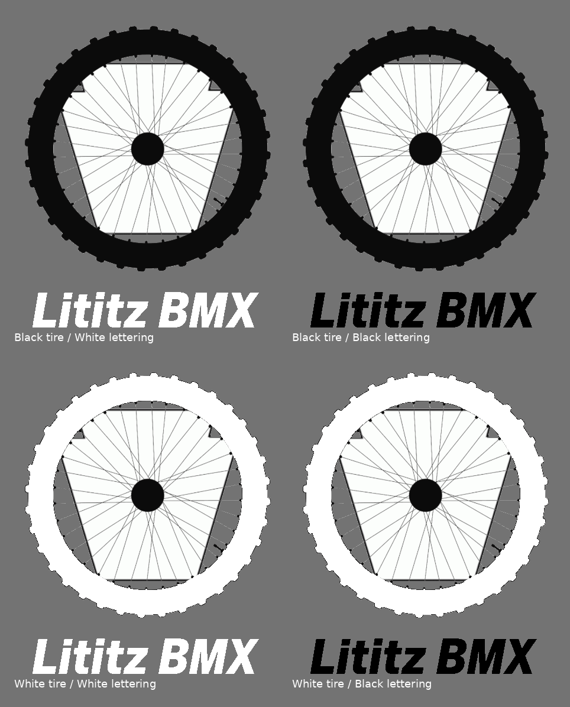

# Lititz BMX Brand Assets

Official public logo assets for Lititz BMX.

**Status:** Active  
**Version:** 1.0  
**Published:** July 2026  
**Format:** Transparent PNG

## Available Logo Files

- [Black tire / black lettering](logos/Lititz-BMX-Logo-Black-Tire-Black-Lettering.png)
- [Black tire / white lettering](logos/Lititz-BMX-Logo-Black-Tire-White-Lettering.png)
- [White tire / black lettering](logos/Lititz-BMX-Logo-White-Tire-Black-Lettering.png)
- [White tire / white lettering](logos/Lititz-BMX-Logo-White-Tire-White-Lettering.png)

Each file uses the same approved Lititz BMX logo composition. The variants are provided so the logo can remain readable across light, dark, photographic, and mixed backgrounds.

## Technical Summary

- File type: PNG
- Canvas size: 446 × 532 pixels
- Background: Transparent
- Spokes and center hub: Black
- Pennsylvania keystone: Solid white
- Effects: None
- Glow: None
- Shadow: None

The open areas between the keystone and the tire remain transparent.

## Choosing a Version

Use the version that provides the strongest contrast against the intended background.

- **Black tire / black lettering:** Best starting point for light backgrounds.
- **Black tire / white lettering:** Useful when the wheel sits over a light area and the lettering sits over a dark area.
- **White tire / black lettering:** Useful when the wheel sits over a dark area and the lettering sits over a light area.
- **White tire / white lettering:** Best starting point for dark backgrounds.

Always test the complete logo at the actual display size before publishing.

## Usage Requirements

Do not:

- distort, stretch, rotate, or skew the logo;
- recolor individual elements;
- add glow, shadow, bevel, texture, or other effects;
- alter the wheel, spokes, center hub, keystone, typography, or spacing;
- crop into the tire or lettering;
- place the logo on a background that makes any major element difficult to read;
- use the logo in a way that implies an endorsement, partnership, or affiliation that does not exist.

See [Logo Usage Guidance](LOGO-USAGE.md) for additional details.

## Official Source

The files in this directory are the current approved public Lititz BMX logo assets. Copies found elsewhere may be outdated, altered, or compressed.

Visit the live archive at [LititzBMX.com](https://lititzbmx.com).

## Public Use

These files are published for identification, editorial reference, education, preservation, and approved promotional use. The Lititz BMX name, logo, branding, archive content, and archive links remain the property of Lititz BMX.

Use of these assets does not imply endorsement, affiliation, sponsorship, or partnership.
