# 10,000 Hours of BMX Inspiration Mixed Tape

## A 23-track visual campaign archive

<a href="source/series-index.png">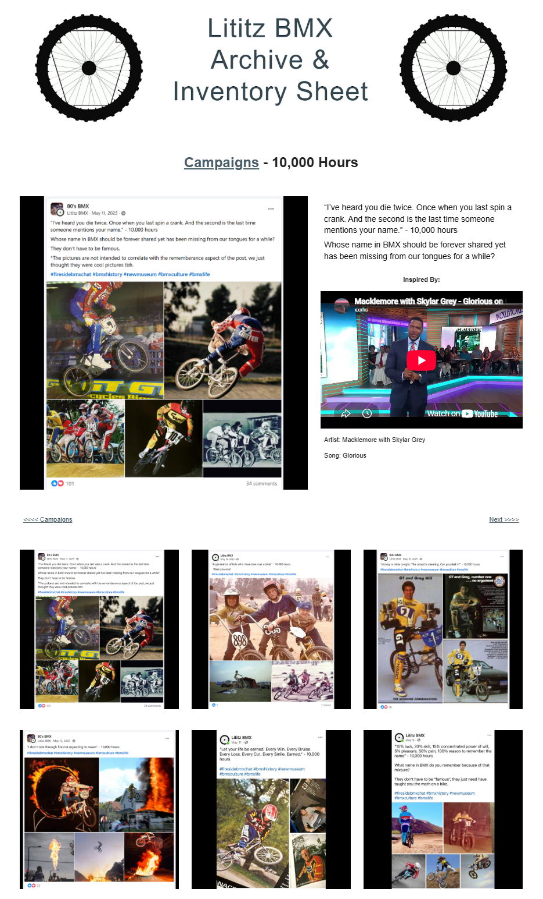</a>

**Press play on a campaign about effort, memory, loss, stubbornness, belonging, recovery, recognition and the people whose names BMX should keep saying.**

The original **10,000 Hours** campaign paired BMX-centered reflections and questions with external musical inspiration. This GitHub edition preserves the campaign as a **mixed tape**: the campaign root becomes the intro, the child pages become tracks, and the published Curtain Call closes the recording.

**Archive status:** Complete 23-record page ledger / 22 supplied full-page captures / four standalone social-post images / 29 preserved visual files / no audio redistributed

[Open the machine-readable tracklist](data/mixtape-register.csv) · [Read the archival notes](docs/ARCHIVAL-NOTES.md) · [Review known inconsistencies](docs/KNOWN-INCONSISTENCIES.md)

---

## Liner notes

- Every campaign page remains its own independent source record.
- The ordering follows the complete page ledger reconstructed from the supplied URLs and campaign navigation.
- Quotes, prompts, capitalization and wording are preserved as published or supplied.
- Inspiration links point to externally hosted videos; this repository contains **no copied music or video files**.
- Visible embed titles are distinguished from artist/song information explicitly written on the page.
- Missing or mismatched material is documented rather than silently repaired.

## Tape map

| Position | Tracks | Theme |
|---|---:|---|
| **Intro** | 01 | Memory and the second death |
| **Side A** | 02–11 | Beginnings, work, victory, pain and the people who made the life possible |
| **Side B** | 12–22 | Recognition, endurance, odds, identity, numbers and refusal to quit |
| **Outro** | 23 | Curtain Call — with room left for an encore |

---

## Intro

<table>
<tr>
<td align="center" valign="top" width="50%"> <strong><a href="records/01-ive-heard-you-die-twice/">Track 01 — I’ve Heard You Die Twice</a></strong> <small>Macklemore with Skylar Grey — Glorious</small></td>
</tr>
</table>

## Side A — Earned

<table>
<tr>
<td align="center" valign="top" width="50%"> <strong><a href="records/02-generation-of-kids/">Track 02 — A Generation of Kids</a></strong> <small>Macklemore & Ryan Lewis — 10000 Hours</small></td>
<td align="center" valign="top" width="50%"> <strong><a href="records/03-victory-is-mine-tonight/">Track 03 — Victory Is Mine Tonight</a></strong> <small>Macklemore — Ain’t Gonna Die</small></td>
</tr>
<tr>
<td align="center" valign="top" width="50%"> <strong><a href="records/04-ride-through-fire/">Track 04 — Ride Through Fire</a></strong> <small>Eminem — No Love</small></td>
<td align="center" valign="top" width="50%"><a href="records/05-life-earned/">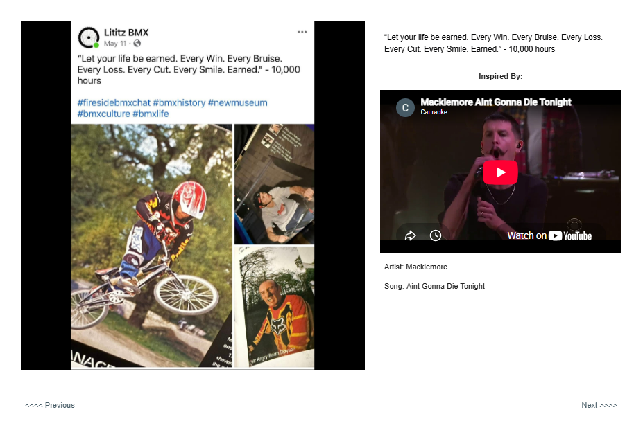</a> <strong><a href="records/05-life-earned/">Track 05 — Life Earned</a></strong> <small>Macklemore — Aint Gonna Die Tonight</small></td>
</tr>
<tr>
<td align="center" valign="top" width="50%"><a href="records/06-10-percent-luck/">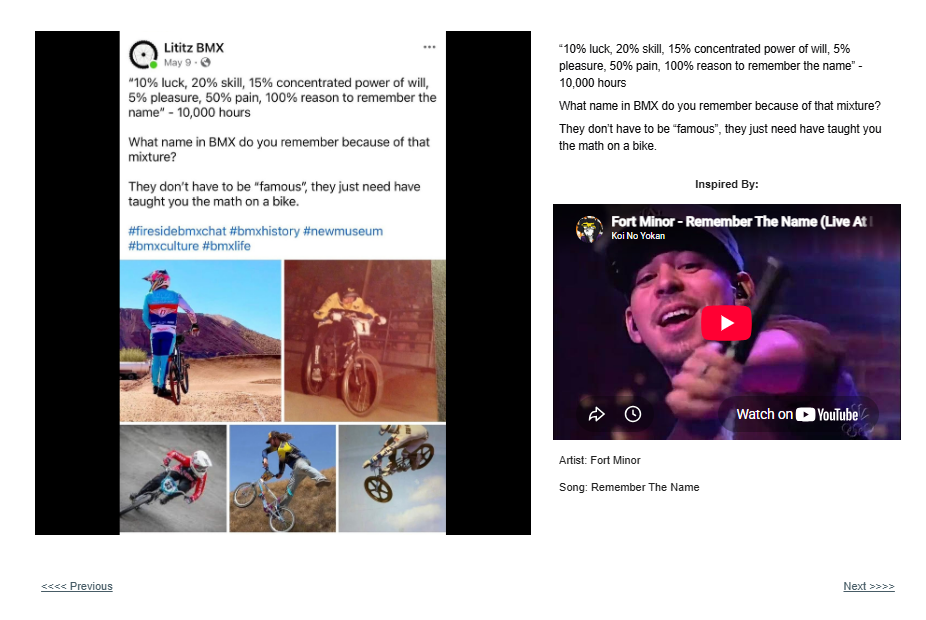</a> <strong><a href="records/06-10-percent-luck/">Track 06 — 10% Luck</a></strong> <small>Fort Minor — Remember The Name</small></td>
<td align="center" valign="top" width="50%"> <strong><a href="records/07-life-lived-for/">Track 07 — A Life Lived for BMX</a></strong> <small>Macklemore & Ryan Lewis — 10000 Hours</small></td>
</tr>
<tr>
<td align="center" valign="top" width="50%"><a href="records/08-none-to-blame/">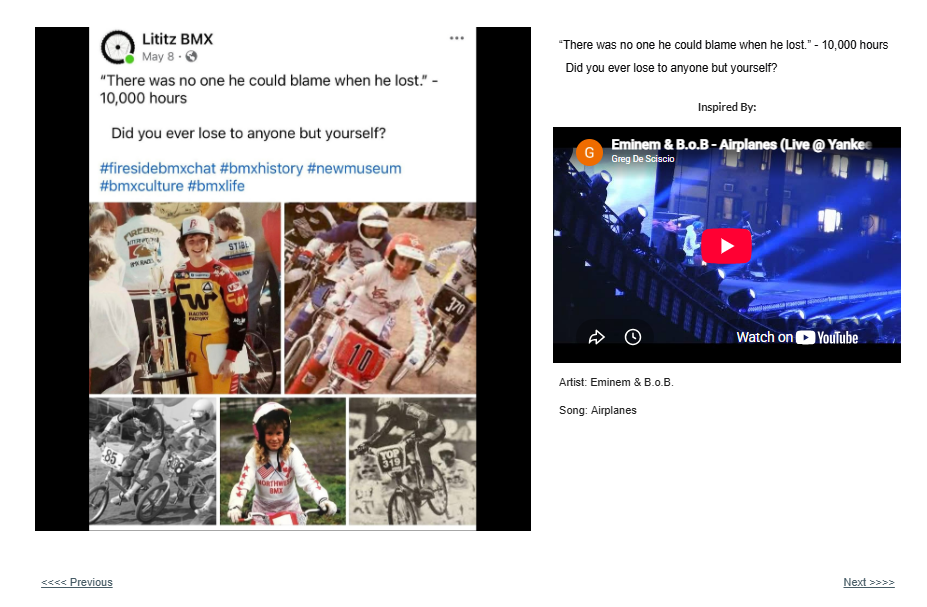</a> <strong><a href="records/08-none-to-blame/">Track 08 — None to Blame</a></strong> <small>Eminem & B.o.B. — Airplanes</small></td>
<td align="center" valign="top" width="50%"> <strong><a href="records/09-blood-sweat-tears/">Track 09 — Blood, Sweat and Tears</a></strong> <small>Macklemore & Ryan Lewis — 10000 Hours</small></td>
</tr>
<tr>
<td align="center" valign="top" width="50%"><a href="records/10-all-my-life/">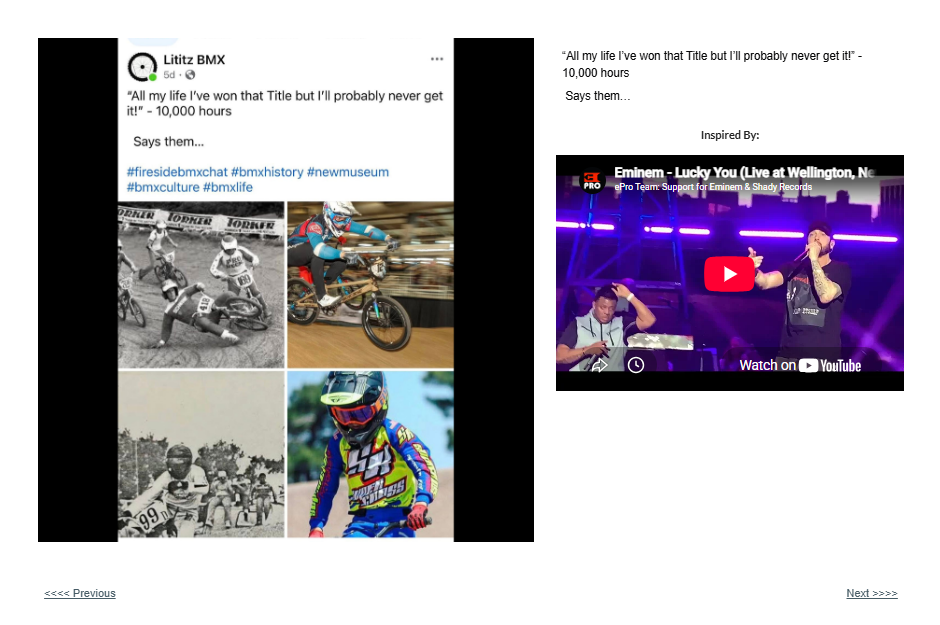</a> <strong><a href="records/10-all-my-life/">Track 10 — All My Life</a></strong> <small>Eminem — Lucky You</small></td>
<td align="center" valign="top" width="50%"> <strong><a href="records/11-great-because/">Track 11 — The Greats Rode a Lot</a></strong> <small>Macklemore & Ryan Lewis — 10000 Hours</small></td>
</tr>
</table>

## Side B — Remember the Name

<table>
<tr>
<td align="center" valign="top" width="50%"><a href="records/12-who-is-he/">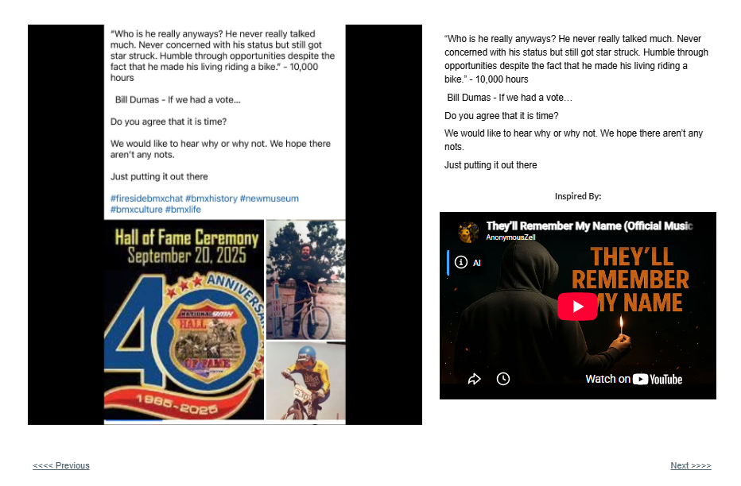</a> <strong><a href="records/12-who-is-he/">Track 12 — Who Is He Really?</a></strong> <small>Artist not stated — They’ll Remember My Name</small></td>
<td align="center" valign="top" width="50%"> <strong><a href="records/13-11-years-old/">Track 13 — Once I Was 11 Years Old</a></strong> <small>Lukas Graham — 7 Years</small></td>
</tr>
<tr>
<td align="center" valign="top" width="50%"> <strong><a href="records/14-when-i-die/">Track 14 — The Underdog Who Never Lost Hope</a></strong> <small>Artist not stated — Lucky You — performance link as published</small></td>
<td align="center" valign="top" width="50%"> <strong><a href="records/15-sometimes-you-feel-tired/">Track 15 — Sometimes You Feel Tired</a></strong> <small>Eminem — Lose Yourself</small></td>
</tr>
<tr>
<td align="center" valign="top" width="50%"><a href="records/16-crunching-numbers/">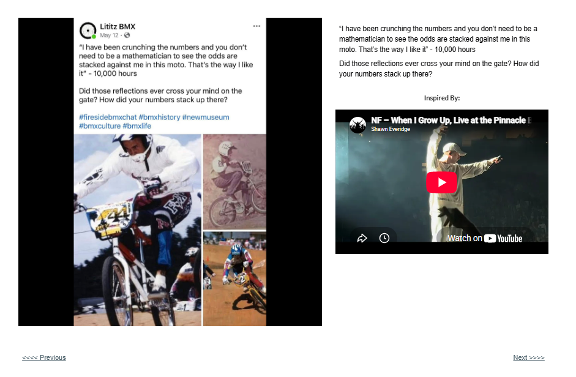</a> <strong><a href="records/16-crunching-numbers/">Track 16 — Crunching the Numbers</a></strong> <small>NF — When I Grow Up</small></td>
<td align="center" valign="top" width="50%"> <strong><a href="records/17-friends-with-the-monster/">Track 17 — Friends with the Monster</a></strong> <small>Macklemore — Ten Thousand Hours — live performance as embedded</small></td>
</tr>
<tr>
<td align="center" valign="top" width="50%"><a href="records/18-in-this-lane/">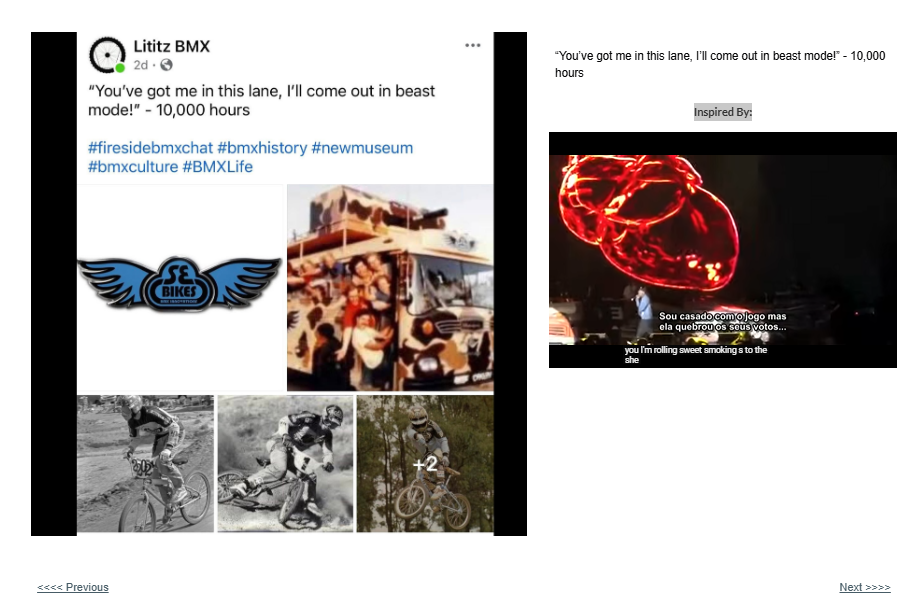</a> <strong><a href="records/18-in-this-lane/">Track 18 — In This Lane</a></strong> <small>Artist not stated — Inspiration link as published</small></td>
<td align="center" valign="top" width="50%"> <strong><a href="records/19-moment-is-now/">Track 19 — Your Moment Is Now</a></strong> <small>Macklemore — Ten Thousand Hours — live performance as embedded</small></td>
</tr>
<tr>
<td align="center" valign="top" width="50%"><a href="records/20-no-name-in-lights/">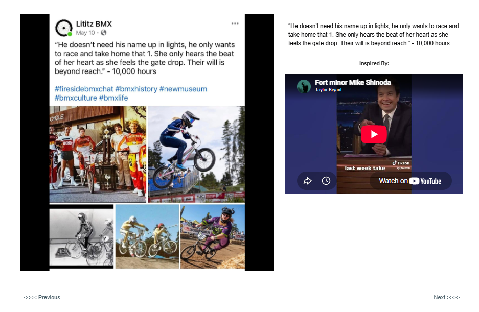</a> <strong><a href="records/20-no-name-in-lights/">Track 20 — No Name in Lights</a></strong> <small>Fort Minor / Mike Shinoda — as visible in embed — Video link as published</small></td>
<td align="center" valign="top" width="50%"> <strong><a href="records/21-my-number/">Track 21 — My Number</a></strong> <small>Toots & the Maytals — 54-46 That’s My Number</small></td>
</tr>
<tr>
<td align="center" valign="top" width="50%"> <strong><a href="records/22-watch-me/">Track 22 — Watch Me</a></strong> <small>NF — When I Grow Up</small></td>
<td align="center" valign="top" width="50%"></td>
</tr>
</table>

## Outro

<table>
<tr>
<td align="center" valign="top" width="50%"><a href="records/23-curtain-call/">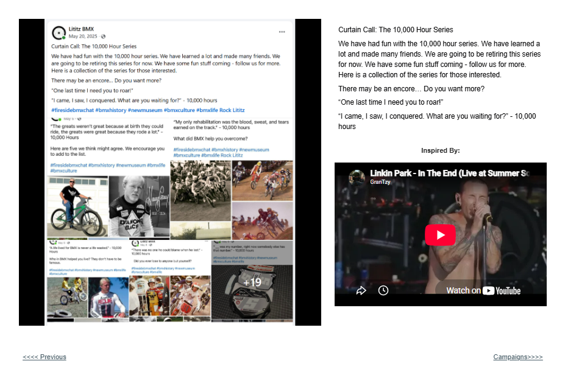</a> <strong><a href="records/23-curtain-call/">Track 23 — Curtain Call</a></strong> <small>Linkin Park — In the End — live performance as embedded</small></td>
</tr>
</table>

---

## Complete text tracklist

### [01. I’ve Heard You Die Twice](records/01-ive-heard-you-die-twice/)

> “I’ve heard you die twice. Once when you last spin a crank. And the second is the last time someone mentions your name.” - 10,000 hours

**Prompt:** Whose name in BMX should be forever shared yet has been missing from our tongues for a while?

**Inspired by:** Macklemore with Skylar Grey — Glorious · [External video](https://www.youtube.com/watch?v=MNKFtvRrs3A)

### [02. A Generation of Kids](records/02-generation-of-kids/)

> “A generation of kids who chose love over a desk.” - 10,000 hours

**Prompt:** Were you one?

**Inspired by:** Macklemore & Ryan Lewis — 10000 Hours · [External video](https://www.youtube.com/watch?v=P83kj1Oe45o&t=1s)

### [03. Victory Is Mine Tonight](records/03-victory-is-mine-tonight/)

> “Victory is mine tonight. The crowd is cheering. Can you feel it?” - 10,000 hours

**Inspired by:** Macklemore — Ain’t Gonna Die · [External video](https://www.youtube.com/watch?v=ktq4kUXCIhA&t=22s)

### [04. Ride Through Fire](records/04-ride-through-fire/)

> “I don’t ride through fire not expecting to sweat” - 10,000 hours

**Inspired by:** Eminem — No Love · [External video](https://www.youtube.com/watch?v=4brOBA-vYzE)

### [05. Life Earned](records/05-life-earned/)

> “Let your life be earned. Every Win. Every Bruise. Every Loss. Every Cut. Every Smile. Earned.” - 10,000 hours

**Inspired by:** Macklemore — Aint Gonna Die Tonight · [External video](https://www.youtube.com/watch?v=MEdKPEG3bTY)

### [06. 10% Luck](records/06-10-percent-luck/)

> “10% luck, 20% skill, 15% concentrated power of will, 5% pleasure, 50% pain, 100% reason to remember the name” - 10,000 hours

**Prompt:** What name in BMX do you remember because of that mixture? They don’t have to be “famous”; they just need to have taught you the math on a bike.

**Inspired by:** Fort Minor — Remember The Name · [External video](https://www.youtube.com/watch?v=PAeZvmwSY3k)

### [07. A Life Lived for BMX](records/07-life-lived-for/)

> “A life lived for BMX is never a life wasted.” - 10,000 Hours

**Prompt:** Who in BMX helped you live? They don’t have to be famous.

**Inspired by:** Macklemore & Ryan Lewis — 10000 Hours · [External video](https://www.youtube.com/watch?v=kgCnOcnciGo)

### [08. None to Blame](records/08-none-to-blame/)

> “There was no one he could blame when he lost.” - 10,000 hours

**Prompt:** Did you ever lose to anyone but yourself?

**Inspired by:** Eminem & B.o.B. — Airplanes · [External video](https://www.youtube.com/watch?v=JpoC73LSX64)

### [09. Blood, Sweat and Tears](records/09-blood-sweat-tears/)

> “My only rehabilitation was the blood, sweat, and tears earned on the track.” - 10,000 hours

**Prompt:** What did BMX help you overcome?

**Inspired by:** Macklemore & Ryan Lewis — 10000 Hours · [External video](https://www.youtube.com/watch?v=l6_xJyfBQsQ)

### [10. All My Life](records/10-all-my-life/)

> “All my life I’ve won that Title but I’ll probably never get it!” - 10,000 hours

**Prompt:** Says them…

**Inspired by:** Eminem — Lucky You · [External video](https://www.youtube.com/watch?v=5a8myFLyadw)

### [11. The Greats Rode a Lot](records/11-great-because/)

> “The greats weren’t great because at birth they could ride, the greats were great because they rode a lot.” - 10,000 Hours

**Prompt:** Here are five we think might agree. We encourage you to add to the list.

**Inspired by:** Macklemore & Ryan Lewis — 10000 Hours · [External video](https://www.youtube.com/watch?v=yYTmHi0kagU)

### [12. Who Is He Really?](records/12-who-is-he/)

> “Who is he really anyways? He never really talked much. Never concerned with his status but still got star struck. Humble through opportunities despite the fact that he made his living riding a bike.” - 10,000 hours

**Prompt:** Bill Dumas - If we had a vote… Do you agree that it is time? We would like to hear why or why not. We hope there aren’t any nots. Just putting it out there.

**Inspired by:** Not identified in supplied page text — They’ll Remember My Name · [External video](https://www.youtube.com/watch?v=5WomT-0ncQ0)

### [13. Once I Was 11 Years Old](records/13-11-years-old/)

> “Once I was 11 years old my Daddy told me Son, go get yourself a bike or you will be lonely.” - 10,000 hours

**Inspired by:** Lukas Graham — 7 Years · [External video](https://www.youtube.com/watch?v=eCq3G6LGhe8)

### [14. The Underdog Who Never Lost Hope](records/14-when-i-die/)

> “When I die, I am going down as the underdog who never lost hope!” - 10,000 hours

**Inspired by:** Not identified in supplied page text — Lucky You — performance link as published · [External video](https://www.youtube.com/watch?v=6OqtJJAWSXc)

### [15. Sometimes You Feel Tired](records/15-sometimes-you-feel-tired/)

> “Sometimes you feel tired. You feel weak. When you feel weak, you just want to give up. You’ve got to find the motivation within you. That inner strength. To not give up. To not give in. It is within you!” - 10,000 hours

**Inspired by:** Eminem — Lose Yourself · [External video](https://www.youtube.com/watch?v=Cbtgk20s6wA)

### [16. Crunching the Numbers](records/16-crunching-numbers/)

> “I have been crunching the numbers and you don’t need to be a mathematician to see the odds are stacked against me in this moto. That’s the way I like it” - 10,000 hours

**Prompt:** Did those reflections ever cross your mind on the gate? How did your numbers stack up there?

**Inspired by:** NF — When I Grow Up · [External video](https://www.youtube.com/watch?v=4Ib5VeoIjXk)

### [17. Friends with the Monster](records/17-friends-with-the-monster/)

> Visible source-post excerpt: “I am friends with the monster that sits at my gate. Get along with the taunting that spews from hi…”

**Inspired by:** Macklemore — Ten Thousand Hours — live performance as embedded · [External video](https://www.youtube.com/watch?v=qMgrBgvQdNI)

### [18. In This Lane](records/18-in-this-lane/)

> “You’ve got me in this lane, I’ll come out in beast mode!” - 10,000 hours

**Inspired by:** Not identified in supplied page text — Inspiration link as published · [External video](https://www.youtube.com/watch?v=7CtK8g532E0&t=1s)

### [19. Your Moment Is Now](records/19-moment-is-now/)

> “Your moment is now. You can’t get it back from the grave.” - 10,000 hours

**Inspired by:** Macklemore — Ten Thousand Hours — live performance as embedded · [External video](https://www.youtube.com/watch?v=K6P3PsOfy4s)

### [20. No Name in Lights](records/20-no-name-in-lights/)

> “He doesn’t need his name up in lights, he only wants to race and take home that 1. She only hears the beat of her heart as she feels the gate drop. Their will is beyond reach.” - 10,000 hours

**Inspired by:** Fort Minor / Mike Shinoda — as visible in embed — Video link as published · [External video](https://www.youtube.com/watch?v=gteotBdcx5g&t=1s)

### [21. My Number](records/21-my-number/)

> “__ was my number, right now somebody else has that number.” - 10,000 hours

**Inspired by:** Toots & the Maytals — 54-46 That’s My Number · [External video](https://www.youtube.com/watch?v=lwdtds4blQ0)

### [22. Watch Me](records/22-watch-me/)

> “Anyone want to watch me ride?”
>
> No!
>
> “Anyone want to see me spin these wheels?”
>
> No!
>
> “Should I just give up?”
>
> No!
>
> “Ha ha tricked you! Like I would ever give up anyway.” - 10,000 hours

**Inspired by:** NF — When I Grow Up · [External video](https://www.youtube.com/watch?v=Y1LBZqs67ng)

### [23. Curtain Call](records/23-curtain-call/)

> Curtain Call: The 10,000 Hour Series

**Prompt:** There may be an encore… Do you want more?

**Inspired by:** Linkin Park — In the End — live performance as embedded · [External video](https://www.youtube.com/watch?v=SXUsN5cru0s)

---

## Collection context

<a href="source/series-source-collage.png">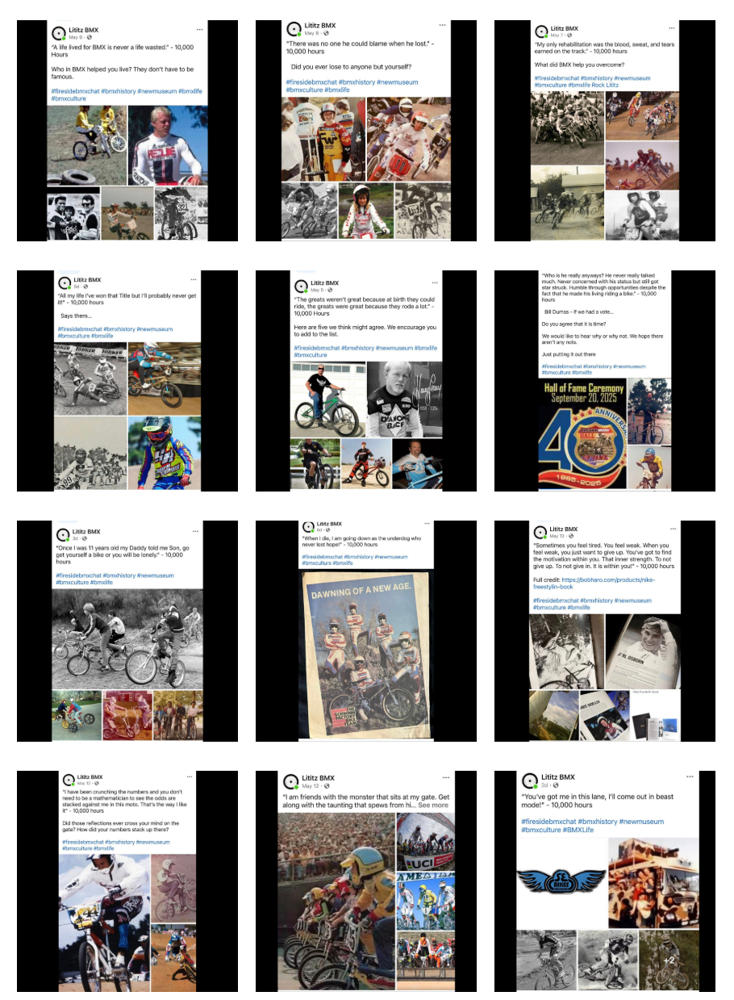</a>

The collage and navigation captures document how the campaign was presented as a connected series rather than a set of unrelated social posts.

- [View the published series index capture](source/series-index.png)
- [View the source-post collage](source/series-source-collage.png)
- [View the supplied navigation grid](source/series-navigation-grid.png)
- [Browse the image manifest](data/image-manifest.csv)

## Research and preservation files

- [JSON track register](data/mixtape-register.json)
- [CSV track register](data/mixtape-register.csv)
- [Image manifest with SHA-256 values](data/image-manifest.csv)
- [Known inconsistencies](docs/KNOWN-INCONSISTENCIES.md)
- [Archival notes](docs/ARCHIVAL-NOTES.md)
- [Music and external-link policy](docs/MUSIC-AND-LINKS.md)
- [Metadata schema](schema/mixtape-track.schema.json)
- [Collection metadata](metadata.json)
- [Citation information](CITATION.cff)
- [Changelog](CHANGELOG.md)
- [Fixity ledger](SHA256SUMS.txt)

## Source campaign

[Open the original 10,000 Hours campaign on the Lititz BMX Archive](https://sites.google.com/view/lititzbmxinventorylist/campaigns/10000-hours-campaigns)

---

[Return to Campaign Archives](../README.md) · [Return to repository home](../../README.md)
