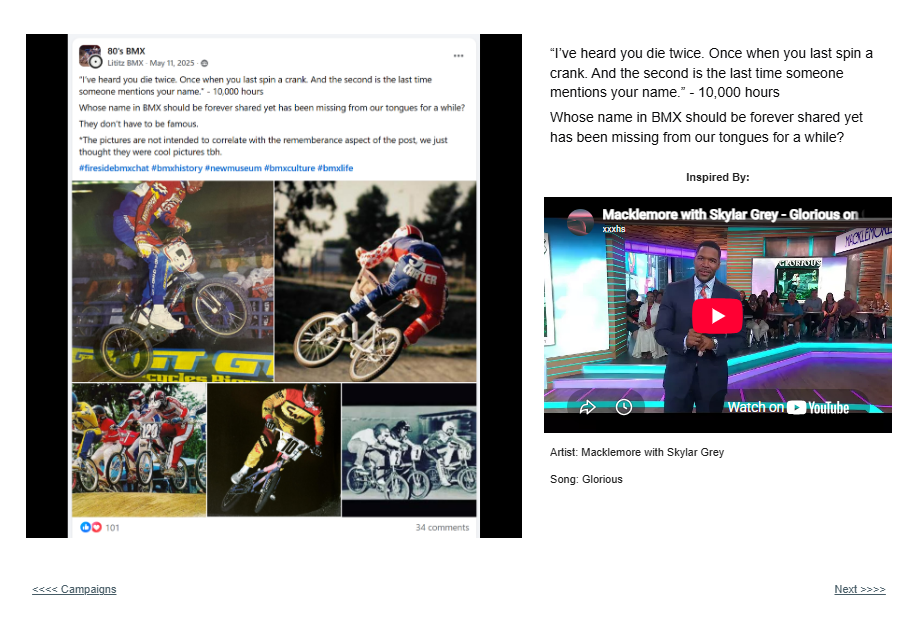
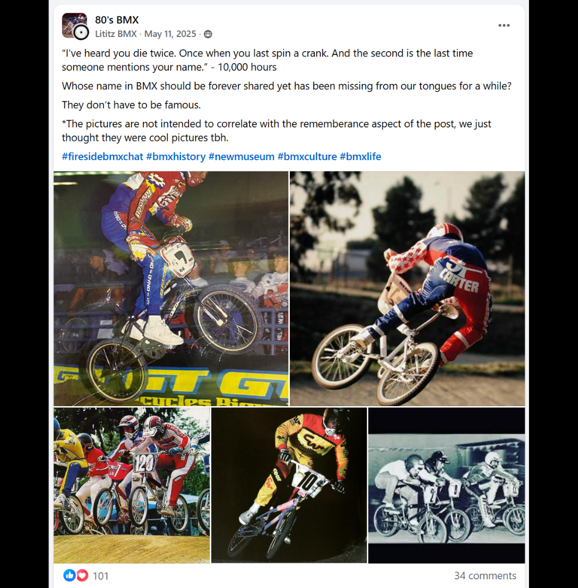

# Track 01 — I’ve Heard You Die Twice

**Tape position:** Intro  
**Campaign:** 10,000 Hours  
**Record status:** Source preserved

[Return to the mixtape](../../README.md) · [Track 02: A Generation of Kids →](../02-generation-of-kids/)

---

### Standalone source image

## Campaign text

“I’ve heard you die twice. Once when you last spin a crank. And the second is the last time someone mentions your name.” - 10,000 hours

## Listener prompt

Whose name in BMX should be forever shared yet has been missing from our tongues for a while?

## Inspiration reference

- **Artist:** Macklemore with Skylar Grey
- **Song/video:** Glorious
- **Published link:** https://www.youtube.com/watch?v=MNKFtvRrs3A
- **Attribution status:** `stated_on_page`

No audio file or music video is redistributed in this archive. The external link is preserved as part of the campaign record.

## Archival notes

The published social post adds that the person does not have to be famous and that its selected photographs were not intended to identify the people being remembered.

## Source

- [Open the original Lititz BMX campaign page](https://sites.google.com/view/lititzbmxinventorylist/campaigns/10000-hours-campaigns)
- [View structured metadata](metadata.json)

---

[Return to the mixtape](../../README.md) · [Track 02: A Generation of Kids →](../02-generation-of-kids/)
