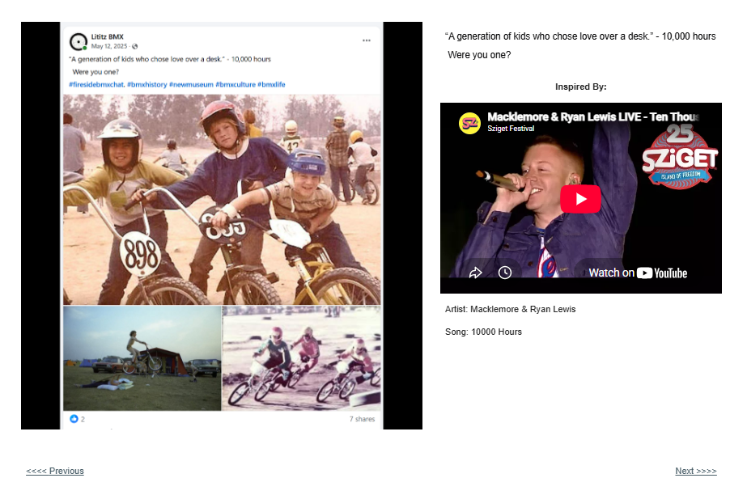
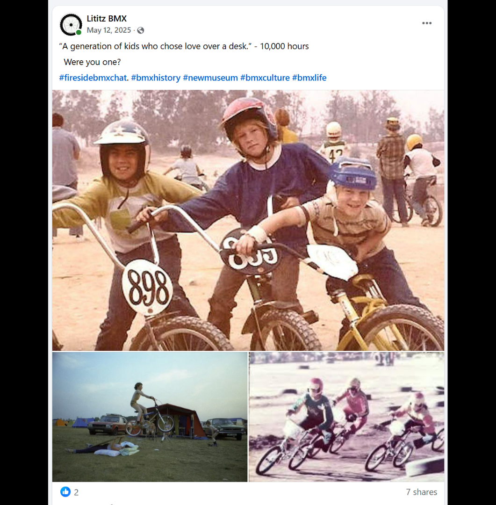

# Track 02 — A Generation of Kids

**Tape position:** Side A  
**Campaign:** 10,000 Hours  
**Record status:** Source preserved

[← Track 01: I’ve Heard You Die Twice](../01-ive-heard-you-die-twice/) · [Return to the mixtape](../../README.md) · [Track 03: Victory Is Mine Tonight →](../03-victory-is-mine-tonight/)

---

### Standalone source image

## Campaign text

“A generation of kids who chose love over a desk.” - 10,000 hours

## Listener prompt

Were you one?

## Inspiration reference

- **Artist:** Macklemore & Ryan Lewis
- **Song/video:** 10000 Hours
- **Published link:** https://www.youtube.com/watch?v=P83kj1Oe45o&t=1s
- **Attribution status:** `stated_on_page`

No audio file or music video is redistributed in this archive. The external link is preserved as part of the campaign record.

## Source

- [Open the original Lititz BMX campaign page](https://sites.google.com/view/lititzbmxinventorylist/campaigns/10000-hours-campaigns/generation-of-kids-10000-hours-campaigns)
- [View structured metadata](metadata.json)

---

[← Track 01: I’ve Heard You Die Twice](../01-ive-heard-you-die-twice/) · [Return to the mixtape](../../README.md) · [Track 03: Victory Is Mine Tonight →](../03-victory-is-mine-tonight/)
