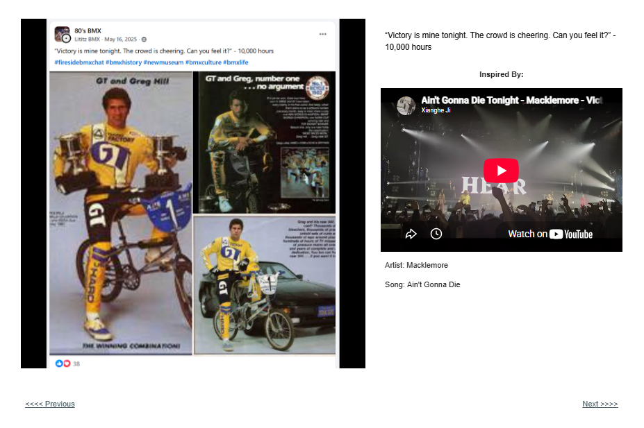
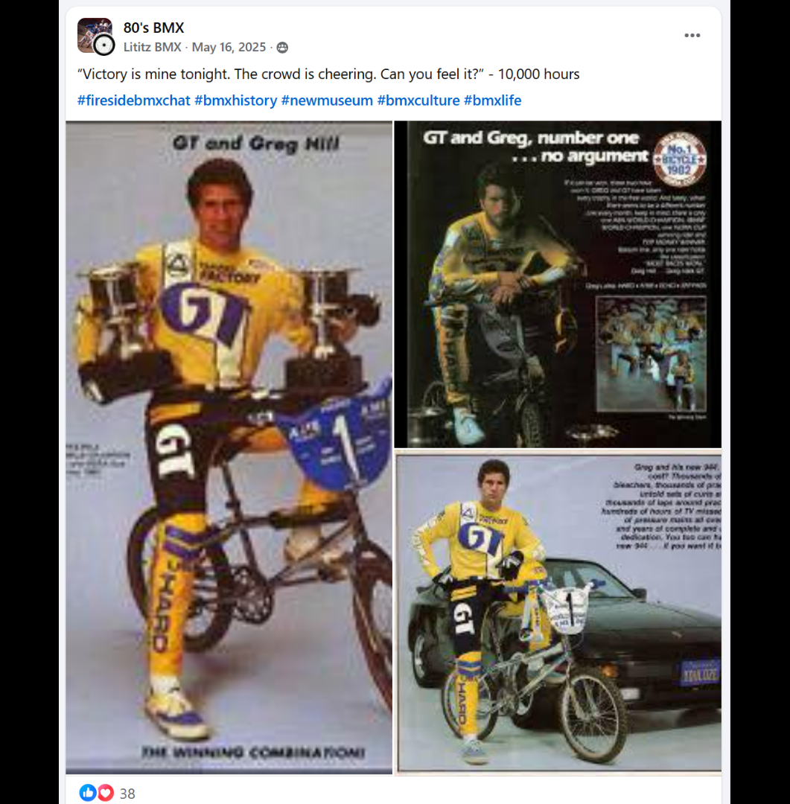

# Track 03 — Victory Is Mine Tonight

**Tape position:** Side A  
**Campaign:** 10,000 Hours  
**Record status:** Source preserved

[← Track 02: A Generation of Kids](../02-generation-of-kids/) · [Return to the mixtape](../../README.md) · [Track 04: Ride Through Fire →](../04-ride-through-fire/)

---

### Standalone source image

## Campaign text

“Victory is mine tonight. The crowd is cheering. Can you feel it?” - 10,000 hours

## Inspiration reference

- **Artist:** Macklemore
- **Song/video:** Ain’t Gonna Die
- **Published link:** https://www.youtube.com/watch?v=ktq4kUXCIhA&t=22s
- **Attribution status:** `stated_on_page`

No audio file or music video is redistributed in this archive. The external link is preserved as part of the campaign record.

## Source

- [Open the original Lititz BMX campaign page](https://sites.google.com/view/lititzbmxinventorylist/campaigns/10000-hours-campaigns/victory-is-mine-tonight-10000-hours-campaigns)
- [View structured metadata](metadata.json)

---

[← Track 02: A Generation of Kids](../02-generation-of-kids/) · [Return to the mixtape](../../README.md) · [Track 04: Ride Through Fire →](../04-ride-through-fire/)
