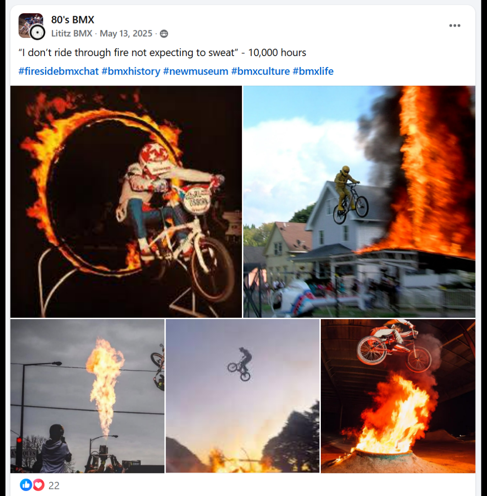

# Track 04 — Ride Through Fire

**Tape position:** Side A  
**Campaign:** 10,000 Hours  
**Record status:** Source preserved

[← Track 03: Victory Is Mine Tonight](../03-victory-is-mine-tonight/) · [Return to the mixtape](../../README.md) · [Track 05: Life Earned →](../05-life-earned/)

---

> **Capture status:** A dedicated full-page Google Sites capture was not supplied. The available standalone source image is preserved below.

### Standalone source image

## Campaign text

“I don’t ride through fire not expecting to sweat” - 10,000 hours

## Inspiration reference

- **Artist:** Eminem
- **Song/video:** No Love
- **Published link:** https://www.youtube.com/watch?v=4brOBA-vYzE
- **Attribution status:** `stated_on_page`

No audio file or music video is redistributed in this archive. The external link is preserved as part of the campaign record.

## Archival notes

A standalone social-post image was supplied. A dedicated full-page Google Sites capture was not supplied with this package.

## Source

- [Open the original Lititz BMX campaign page](https://sites.google.com/view/lititzbmxinventorylist/campaigns/10000-hours-campaigns/ride-through-fire-10000-hours-campaigns)
- [View structured metadata](metadata.json)

---

[← Track 03: Victory Is Mine Tonight](../03-victory-is-mine-tonight/) · [Return to the mixtape](../../README.md) · [Track 05: Life Earned →](../05-life-earned/)
