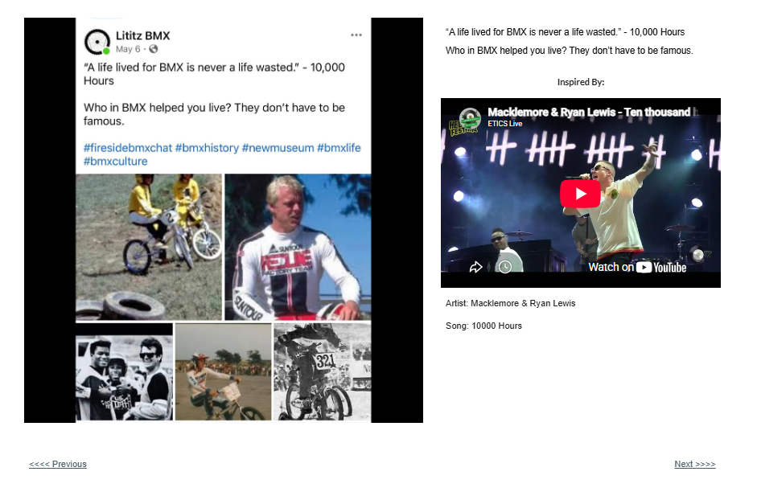

# Track 07 — A Life Lived for BMX

**Tape position:** Side A  
**Campaign:** 10,000 Hours  
**Record status:** Source preserved

[← Track 06: 10% Luck](../06-10-percent-luck/) · [Return to the mixtape](../../README.md) · [Track 08: None to Blame →](../08-none-to-blame/)

---

## Campaign text

“A life lived for BMX is never a life wasted.” - 10,000 Hours

## Listener prompt

Who in BMX helped you live? They don’t have to be famous.

## Inspiration reference

- **Artist:** Macklemore & Ryan Lewis
- **Song/video:** 10000 Hours
- **Published link:** https://www.youtube.com/watch?v=kgCnOcnciGo
- **Attribution status:** `stated_on_page`

No audio file or music video is redistributed in this archive. The external link is preserved as part of the campaign record.

## Source

- [Open the original Lititz BMX campaign page](https://sites.google.com/view/lititzbmxinventorylist/campaigns/10000-hours-campaigns/life-lived-for-10000-hours-campaigns)
- [View structured metadata](metadata.json)

---

[← Track 06: 10% Luck](../06-10-percent-luck/) · [Return to the mixtape](../../README.md) · [Track 08: None to Blame →](../08-none-to-blame/)
