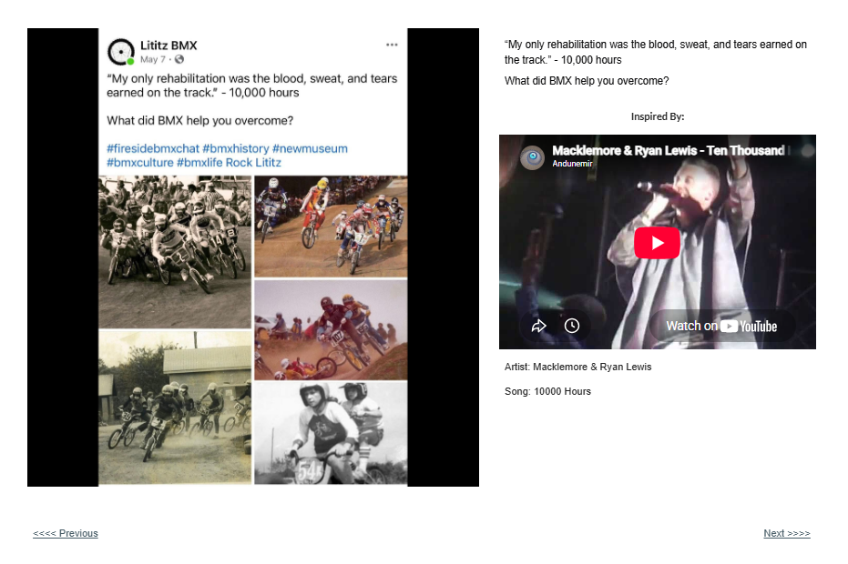

# Track 09 — Blood, Sweat and Tears

**Tape position:** Side A  
**Campaign:** 10,000 Hours  
**Record status:** Source preserved

[← Track 08: None to Blame](../08-none-to-blame/) · [Return to the mixtape](../../README.md) · [Track 10: All My Life →](../10-all-my-life/)

---

## Campaign text

“My only rehabilitation was the blood, sweat, and tears earned on the track.” - 10,000 hours

## Listener prompt

What did BMX help you overcome?

## Inspiration reference

- **Artist:** Macklemore & Ryan Lewis
- **Song/video:** 10000 Hours
- **Published link:** https://www.youtube.com/watch?v=l6_xJyfBQsQ
- **Attribution status:** `stated_on_page`

No audio file or music video is redistributed in this archive. The external link is preserved as part of the campaign record.

## Source

- [Open the original Lititz BMX campaign page](https://sites.google.com/view/lititzbmxinventorylist/campaigns/10000-hours-campaigns/blood-sweat-tears-10000-hours-campaigns)
- [View structured metadata](metadata.json)

---

[← Track 08: None to Blame](../08-none-to-blame/) · [Return to the mixtape](../../README.md) · [Track 10: All My Life →](../10-all-my-life/)
