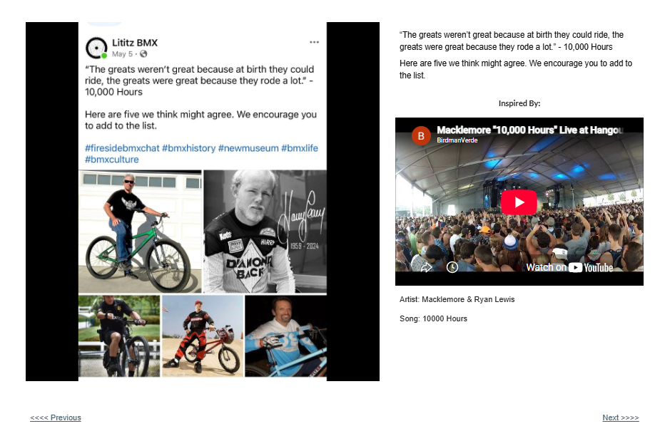

# Track 11 — The Greats Rode a Lot

**Tape position:** Side A  
**Campaign:** 10,000 Hours  
**Record status:** Source preserved

[← Track 10: All My Life](../10-all-my-life/) · [Return to the mixtape](../../README.md) · [Track 12: Who Is He Really? →](../12-who-is-he/)

---

## Campaign text

“The greats weren’t great because at birth they could ride, the greats were great because they rode a lot.” - 10,000 Hours

## Listener prompt

Here are five we think might agree. We encourage you to add to the list.

## Inspiration reference

- **Artist:** Macklemore & Ryan Lewis
- **Song/video:** 10000 Hours
- **Published link:** https://www.youtube.com/watch?v=yYTmHi0kagU
- **Attribution status:** `stated_on_page`

No audio file or music video is redistributed in this archive. The external link is preserved as part of the campaign record.

## Source

- [Open the original Lititz BMX campaign page](https://sites.google.com/view/lititzbmxinventorylist/campaigns/10000-hours-campaigns/great-because-10000-hours-campaigns)
- [View structured metadata](metadata.json)

---

[← Track 10: All My Life](../10-all-my-life/) · [Return to the mixtape](../../README.md) · [Track 12: Who Is He Really? →](../12-who-is-he/)
