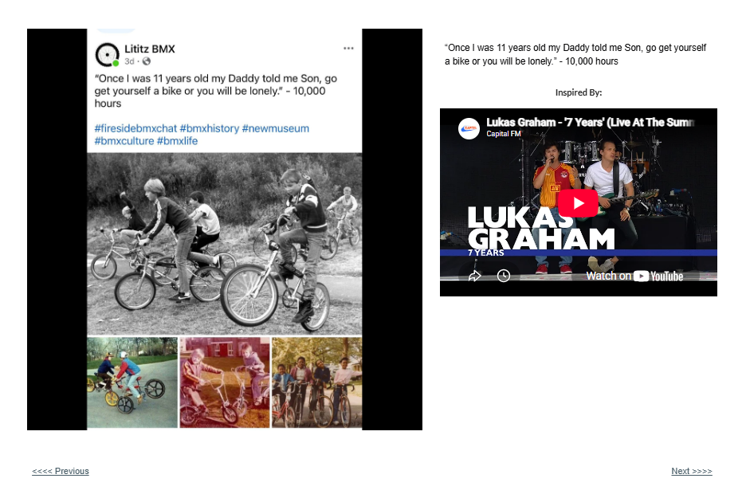

# Track 13 — Once I Was 11 Years Old

**Tape position:** Side B  
**Campaign:** 10,000 Hours  
**Record status:** Source preserved

[← Track 12: Who Is He Really?](../12-who-is-he/) · [Return to the mixtape](../../README.md) · [Track 14: The Underdog Who Never Lost Hope →](../14-when-i-die/)

---

## Campaign text

“Once I was 11 years old my Daddy told me Son, go get yourself a bike or you will be lonely.” - 10,000 hours

## Inspiration reference

- **Artist:** Lukas Graham
- **Song/video:** 7 Years
- **Published link:** https://www.youtube.com/watch?v=eCq3G6LGhe8
- **Attribution status:** `visible_in_embed_not_stated_in_page_text`

No audio file or music video is redistributed in this archive. The external link is preserved as part of the campaign record.

## Archival notes

The page text supplied no artist or song label. The visible embed identifies Lukas Graham’s “7 Years.”

## Source

- [Open the original Lititz BMX campaign page](https://sites.google.com/view/lititzbmxinventorylist/campaigns/10000-hours-campaigns/11-years-old-10000-hours-campaigns)
- [View structured metadata](metadata.json)

---

[← Track 12: Who Is He Really?](../12-who-is-he/) · [Return to the mixtape](../../README.md) · [Track 14: The Underdog Who Never Lost Hope →](../14-when-i-die/)
