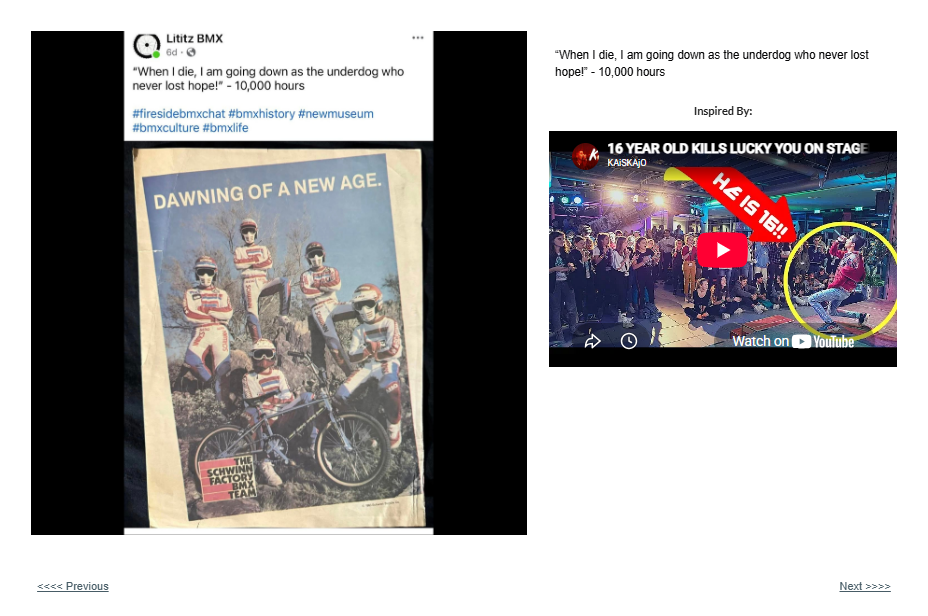

# Track 14 — The Underdog Who Never Lost Hope

**Tape position:** Side B  
**Campaign:** 10,000 Hours  
**Record status:** Source preserved

[← Track 13: Once I Was 11 Years Old](../13-11-years-old/) · [Return to the mixtape](../../README.md) · [Track 15: Sometimes You Feel Tired →](../15-sometimes-you-feel-tired/)

---

## Campaign text

“When I die, I am going down as the underdog who never lost hope!” - 10,000 hours

## Inspiration reference

- **Artist:** Not identified in the supplied page text
- **Song/video:** Lucky You — performance link as published
- **Published link:** https://www.youtube.com/watch?v=6OqtJJAWSXc
- **Attribution status:** `visible_in_embed_not_stated_in_page_text`

No audio file or music video is redistributed in this archive. The external link is preserved as part of the campaign record.

## Archival notes

The page text supplied no artist or song label. The visible embedded-video title indicates a live performance built around “Lucky You,” but the performer is not identified by the page text.

## Source

- [Open the original Lititz BMX campaign page](https://sites.google.com/view/lititzbmxinventorylist/campaigns/10000-hours-campaigns/when-i-die-10000-hours-campaigns)
- [View structured metadata](metadata.json)

---

[← Track 13: Once I Was 11 Years Old](../13-11-years-old/) · [Return to the mixtape](../../README.md) · [Track 15: Sometimes You Feel Tired →](../15-sometimes-you-feel-tired/)
