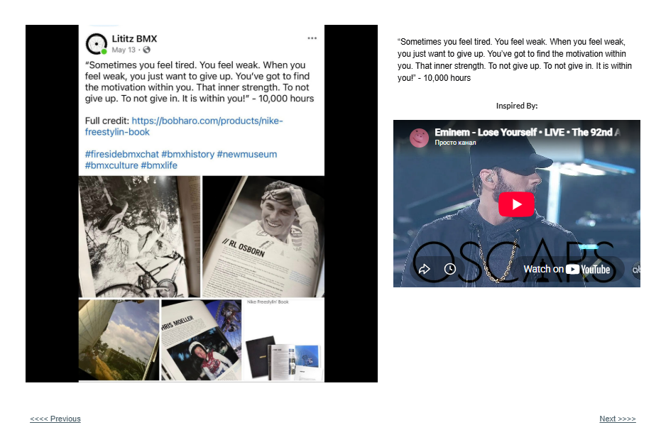

# Track 15 — Sometimes You Feel Tired

**Tape position:** Side B  
**Campaign:** 10,000 Hours  
**Record status:** Source preserved

[← Track 14: The Underdog Who Never Lost Hope](../14-when-i-die/) · [Return to the mixtape](../../README.md) · [Track 16: Crunching the Numbers →](../16-crunching-numbers/)

---

## Campaign text

“Sometimes you feel tired. You feel weak. When you feel weak, you just want to give up. You’ve got to find the motivation within you. That inner strength. To not give up. To not give in. It is within you!” - 10,000 hours

## Inspiration reference

- **Artist:** Eminem
- **Song/video:** Lose Yourself
- **Published link:** https://www.youtube.com/watch?v=Cbtgk20s6wA
- **Attribution status:** `visible_in_embed_not_stated_in_page_text`

No audio file or music video is redistributed in this archive. The external link is preserved as part of the campaign record.

## Archival notes

The page text supplied no artist or song label. The visible embed identifies Eminem’s “Lose Yourself.”

## Source

- [Open the original Lititz BMX campaign page](https://sites.google.com/view/lititzbmxinventorylist/campaigns/10000-hours-campaigns/sometimes-you-feel-tired-10000-hours-campaigns)
- [View structured metadata](metadata.json)

---

[← Track 14: The Underdog Who Never Lost Hope](../14-when-i-die/) · [Return to the mixtape](../../README.md) · [Track 16: Crunching the Numbers →](../16-crunching-numbers/)
