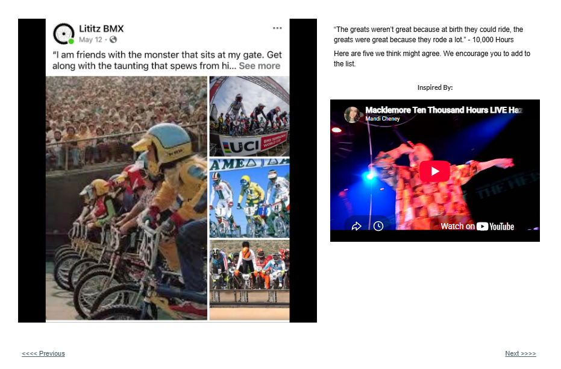

# Track 17 — Friends with the Monster

**Tape position:** Side B  
**Campaign:** 10,000 Hours  
**Record status:** Source preserved

[← Track 16: Crunching the Numbers](../16-crunching-numbers/) · [Return to the mixtape](../../README.md) · [Track 18: In This Lane →](../18-in-this-lane/)

---

## Campaign text

Visible source-post excerpt: “I am friends with the monster that sits at my gate. Get along with the taunting that spews from hi…”

## Inspiration reference

- **Artist:** Macklemore
- **Song/video:** Ten Thousand Hours — live performance as embedded
- **Published link:** https://www.youtube.com/watch?v=qMgrBgvQdNI
- **Attribution status:** `visible_in_embed; page_text_mismatch`

No audio file or music video is redistributed in this archive. The external link is preserved as part of the campaign record.

## Published page text

“The greats weren’t great because at birth they could ride, the greats were great because they rode a lot.” - 10,000 Hours

Here are five we think might agree. We encourage you to add to the list.

## Archival notes

Known source inconsistency: the left-side source card supports the “friends with the monster” entry, while the published right-side page text repeats the wording from “The Greats Rode a Lot.” The visible page embed is also a Macklemore “Ten Thousand Hours” performance. All elements are preserved without silent correction.

## Source

- [Open the original Lititz BMX campaign page](https://sites.google.com/view/lititzbmxinventorylist/campaigns/10000-hours-campaigns/friends-with-the-monster-10000-hours-campaigns)
- [View structured metadata](metadata.json)

---

[← Track 16: Crunching the Numbers](../16-crunching-numbers/) · [Return to the mixtape](../../README.md) · [Track 18: In This Lane →](../18-in-this-lane/)
