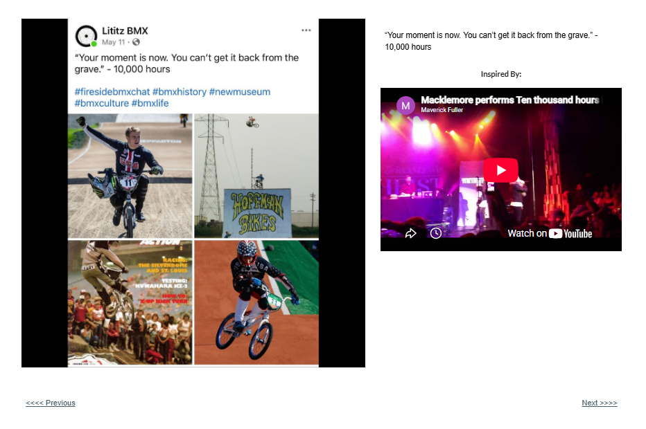

# Track 19 — Your Moment Is Now

**Tape position:** Side B  
**Campaign:** 10,000 Hours  
**Record status:** Source preserved

[← Track 18: In This Lane](../18-in-this-lane/) · [Return to the mixtape](../../README.md) · [Track 20: No Name in Lights →](../20-no-name-in-lights/)

---

## Campaign text

“Your moment is now. You can’t get it back from the grave.” - 10,000 hours

## Inspiration reference

- **Artist:** Macklemore
- **Song/video:** Ten Thousand Hours — live performance as embedded
- **Published link:** https://www.youtube.com/watch?v=K6P3PsOfy4s
- **Attribution status:** `visible_in_embed_not_stated_in_page_text`

No audio file or music video is redistributed in this archive. The external link is preserved as part of the campaign record.

## Archival notes

The page text supplied no artist or song label. The visible embed identifies a Macklemore “Ten Thousand Hours” performance.

## Source

- [Open the original Lititz BMX campaign page](https://sites.google.com/view/lititzbmxinventorylist/campaigns/10000-hours-campaigns/moment-is-now-10000-hours-campaigns)
- [View structured metadata](metadata.json)

---

[← Track 18: In This Lane](../18-in-this-lane/) · [Return to the mixtape](../../README.md) · [Track 20: No Name in Lights →](../20-no-name-in-lights/)
