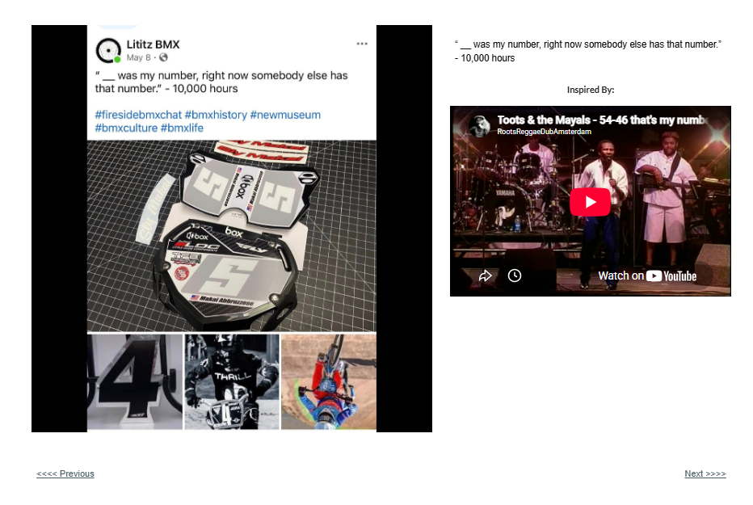

# Track 21 — My Number

**Tape position:** Side B  
**Campaign:** 10,000 Hours  
**Record status:** Source preserved

[← Track 20: No Name in Lights](../20-no-name-in-lights/) · [Return to the mixtape](../../README.md) · [Track 22: Watch Me →](../22-watch-me/)

---

## Campaign text

“__ was my number, right now somebody else has that number.” - 10,000 hours

## Inspiration reference

- **Artist:** Toots & the Maytals
- **Song/video:** 54-46 That’s My Number
- **Published link:** https://www.youtube.com/watch?v=lwdtds4blQ0
- **Attribution status:** `visible_in_embed_not_stated_in_page_text`

No audio file or music video is redistributed in this archive. The external link is preserved as part of the campaign record.

## Archival notes

The page text supplied no artist or song label. The visible embed identifies Toots & the Maytals’ “54-46 That’s My Number.”

## Source

- [Open the original Lititz BMX campaign page](https://sites.google.com/view/lititzbmxinventorylist/campaigns/10000-hours-campaigns/my-number-10000-hours-campaigns)
- [View structured metadata](metadata.json)

---

[← Track 20: No Name in Lights](../20-no-name-in-lights/) · [Return to the mixtape](../../README.md) · [Track 22: Watch Me →](../22-watch-me/)
