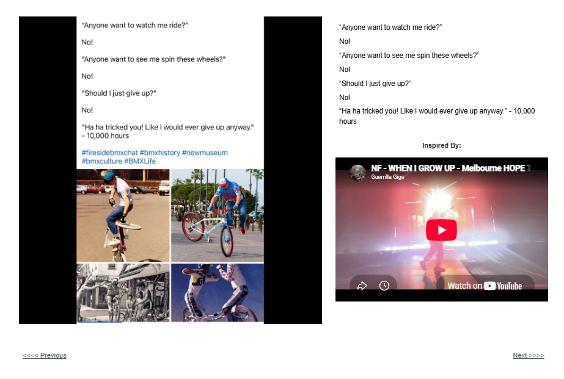

# Track 22 — Watch Me

**Tape position:** Side B  
**Campaign:** 10,000 Hours  
**Record status:** Source preserved

[← Track 21: My Number](../21-my-number/) · [Return to the mixtape](../../README.md) · [Track 23: Curtain Call →](../23-curtain-call/)

---

## Campaign text

“Anyone want to watch me ride?”

No!

“Anyone want to see me spin these wheels?”

No!

“Should I just give up?”

No!

“Ha ha tricked you! Like I would ever give up anyway.” - 10,000 hours

## Inspiration reference

- **Artist:** NF
- **Song/video:** When I Grow Up
- **Published link:** https://www.youtube.com/watch?v=Y1LBZqs67ng
- **Attribution status:** `visible_in_embed_not_stated_in_page_text`

No audio file or music video is redistributed in this archive. The external link is preserved as part of the campaign record.

## Archival notes

The page text supplied no artist or song label. The visible embed identifies NF’s “When I Grow Up.”

## Source

- [Open the original Lititz BMX campaign page](https://sites.google.com/view/lititzbmxinventorylist/campaigns/10000-hours-campaigns/watch-me-10000-hours-campaigns)
- [View structured metadata](metadata.json)

---

[← Track 21: My Number](../21-my-number/) · [Return to the mixtape](../../README.md) · [Track 23: Curtain Call →](../23-curtain-call/)
