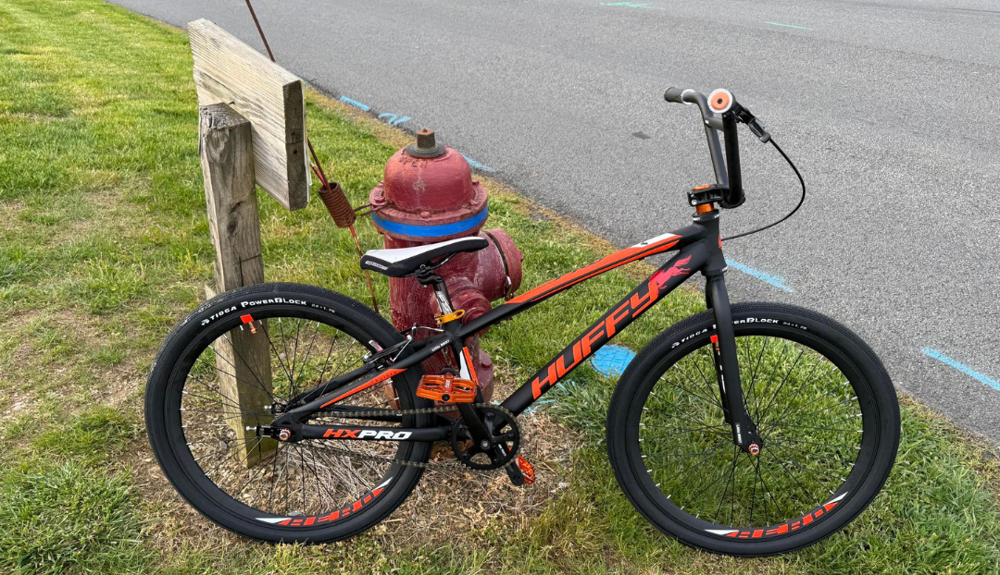

# Lititz BMX Campaign Archives

Long-form preservation, restoration, educational, and storytelling campaigns produced by Lititz BMX.

[Return to the repository home](../README.md)

---

## 10,000 Hours of BMX Inspiration Mixed Tape

A 23-track visual campaign archive pairing BMX reflections, questions and source imagery with the externally hosted music that inspired each entry. The campaign root opens the tape, 22 child pages form the track sequence, and Curtain Call closes the recording—with room left for an encore.

[Play the complete 10,000 Hours of BMX Inspiration Mixed Tape](10000-hours/)

---

## #myHuffyBMXBuild — The Journey

A ten-chapter digital book following an underestimated Huffy HX Pro Cruiser from acquisition through practical learning, Harry Leary provenance, #OperationDIRTWERX continuity, archive identity, pump-track advocacy, public publication, and continuing use.

[Read the complete #myHuffyBMXBuild campaign book](my-huffy-bmx-build/)

---

## #OperationDIRTWERX — The Story

The recovery, evaluation, preservation, and return of a DIRTWERX bicycle connected to BMX pioneer Harry Leary and the Leary family.

[Explore the complete #OperationDIRTWERX archive](operation-dirtwerx/)

---

## #RebuildRadicalRick

A nineteen-position visual campaign archive preserving the build, clues, creator history, community engagement, finale, and documented lost Episode 15.

[Explore the complete #RebuildRadicalRick archive](rebuild-radical-rick/)

---

## Preservation approach

Campaign archives separate original visual evidence, source wording, public-page presentation, later archival explanation, structured data, and verification notes. Missing material is documented rather than recreated through assumption.
