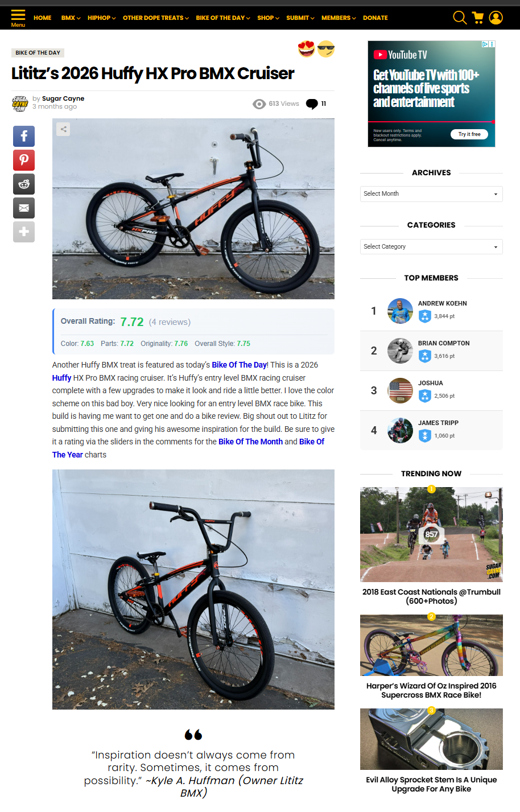
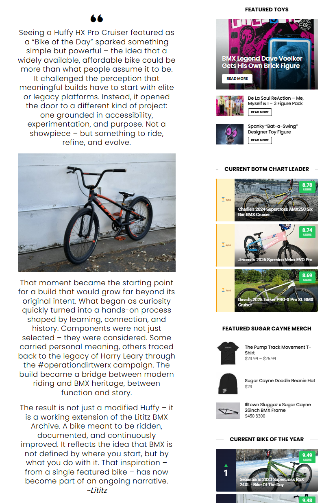
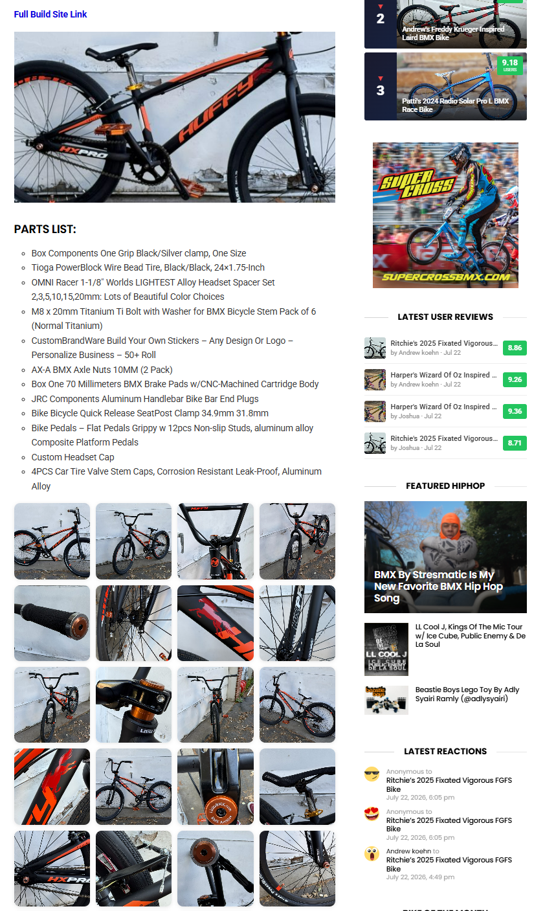
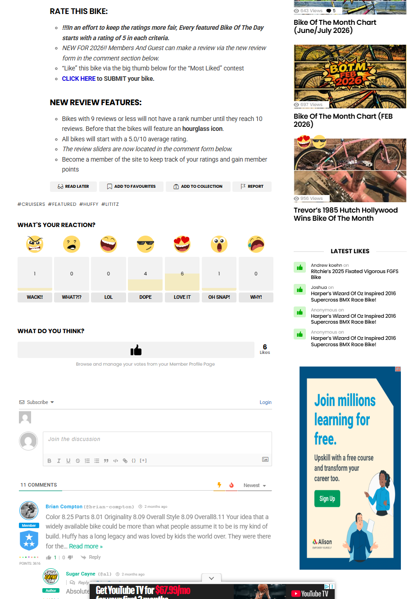
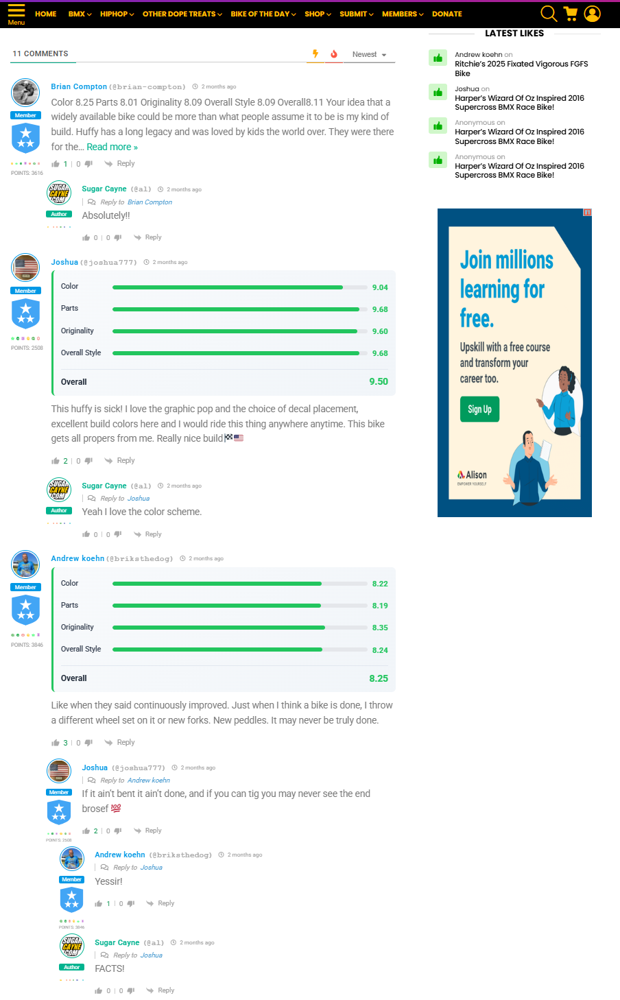
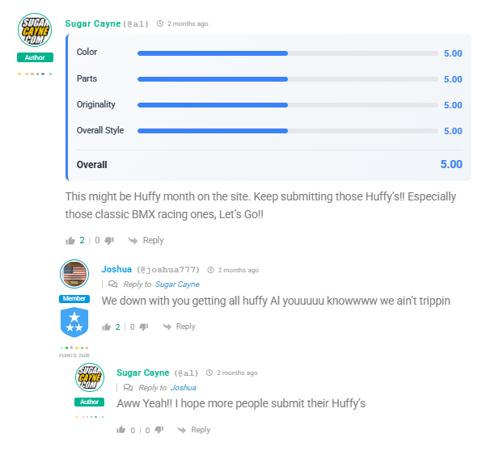
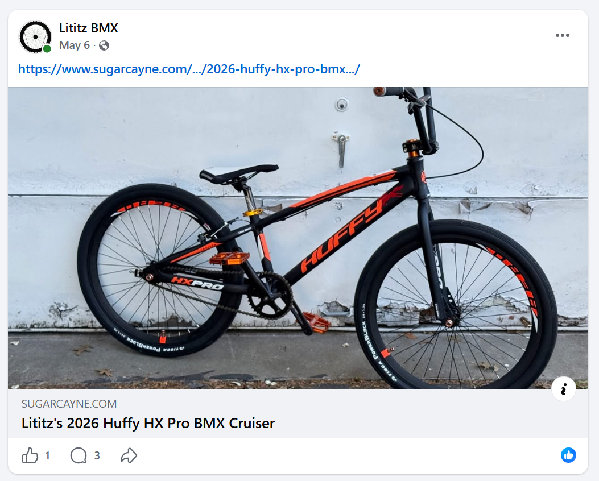

# Afterword
## From Possibility to Publication
### Sugar Cayne — *Bike of the Day*

[← Chapter 10](../../chapters/10-keep-rollin-on/) · [Table of Contents](../../README.md#table-of-contents) · [Postscript →](../../postscript/coleman-bike-park/)

---

The ten-chapter story closes with the decision to submit the Huffy. The Afterword documents what happened next: Sugar Cayne accepted the submission and published **“Lititz’s 2026 Huffy HX Pro BMX Cruiser”** as a featured *Bike of the Day*.

[Read the live Sugar Cayne article](https://www.sugarcayne.com/2026/05/2026-huffy-hx-pro-bmx-cruiser/)

The publication closes the narrative circle. A Sugar Cayne Huffy feature helped begin the project; the completed Lititz BMX build later returned to Sugar Cayne as its own public feature.

> **“Inspiration doesn’t always come from rarity. Sometimes, it comes from possibility.”**

## Published campaign statement

The article preserves the Lititz BMX explanation that a widely available, affordable bicycle can support a meaningful build; that the project grew through learning, connection, and history; that some components traced back to Harry Leary through #OperationDIRTWERX; and that the completed Huffy became a working extension of the Lititz BMX Archive.

## Parts and finished-bike record

The published parts list records Box Components grips, Tioga PowerBlock tires, OMNI headset spacers, titanium stem bolts, custom stickers, axle nuts, Box One brake pads, JRC bar-end plugs, a quick-release seat-post clamp, platform pedals, the custom headset cap, and valve-stem caps.

## Public reception snapshot

**Snapshot captured:** July 22, 2026  
**Visible page figures:** 613 views; 11 comments; 6 likes; overall rating 7.72; 4 reviews.  
**Category averages:** Color 7.63; Parts 7.72; Originality 7.76; Overall Style 7.75.

The captured figures are dynamic publication evidence. Sugar Cayne’s page explains that each featured bike begins with a 5.0 rating in each category and that bikes with fewer than ten reviews do not receive a formal rank. The 7.72 snapshot is therefore not presented as a Bike of the Month or Bike of the Year win.

## Publication-sharing record

## Archival conclusion

The outside audience understood the premise. Visible comments praised the accessible Huffy foundation, color scheme, decal placement, evolving nature of the build, and the idea that a widely available bike could become more than people assume.

The article did not create the bike’s meaning. It extended the documented story outward.

---

[← Chapter 10](../../chapters/10-keep-rollin-on/) · [Table of Contents](../../README.md#table-of-contents) · [Postscript →](../../postscript/coleman-bike-park/)
