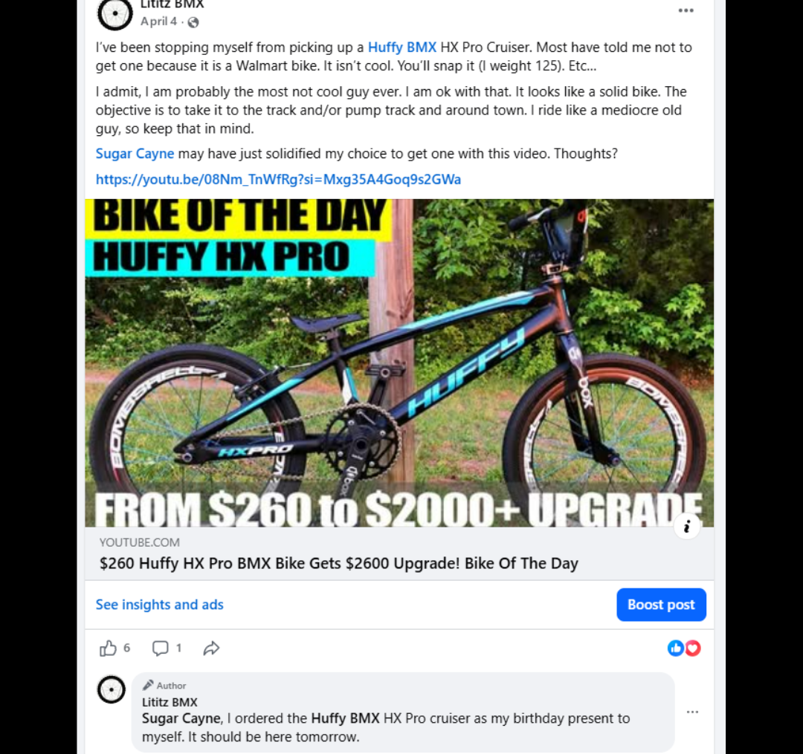
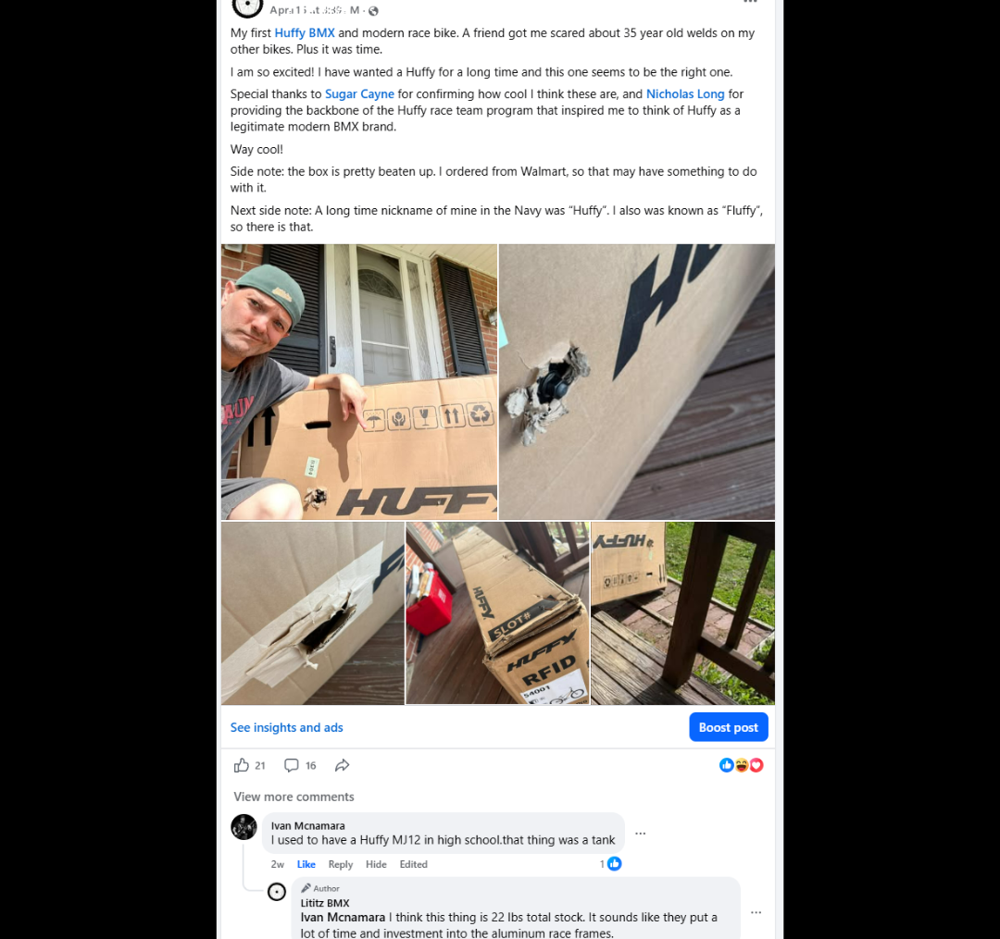
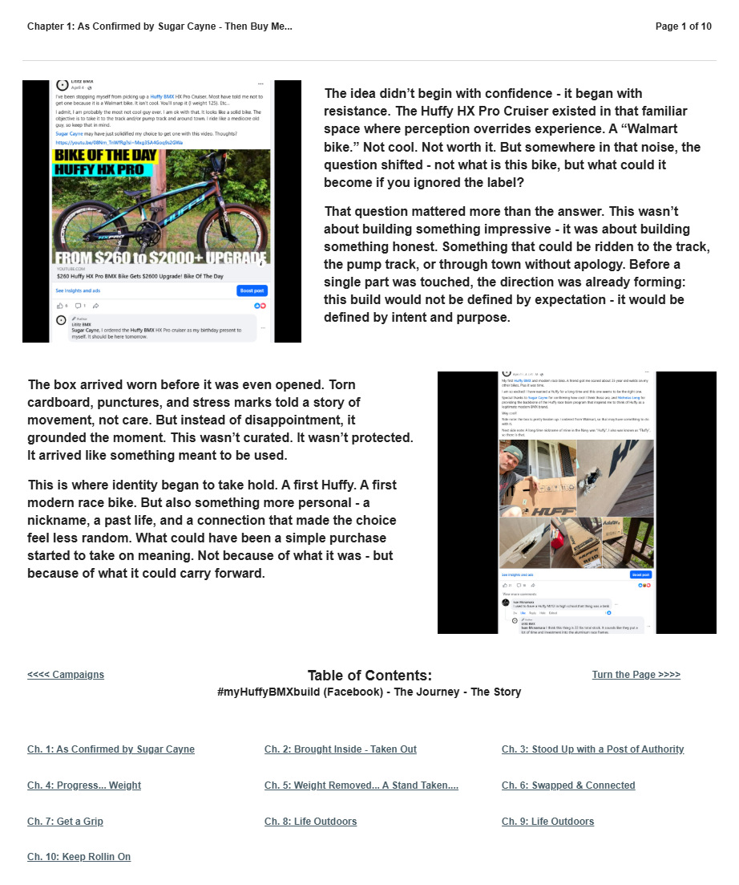

# Chapter 1 of 10
## As Confirmed by Sugar Cayne - Then Buy Me...

> **What could it become if you ignored the label?**

[← Book cover](../../README.md) · [Table of Contents](../../README.md#table-of-contents) · [Chapter 2 →](../02-brought-inside-taken-out/)

---

## The Story

<table>
<tr>
<td width="42%" valign="top"></td>
<td valign="top">
The idea didn’t begin with confidence - it began with resistance. The Huffy HX Pro Cruiser existed in that familiar space where perception overrides experience. A “Walmart bike.” Not cool. Not worth it. But somewhere in that noise, the question shifted - not what is this bike, but what could it become if you ignored the label?

That question mattered more than the answer. This wasn’t about building something impressive - it was about building something honest. Something that could be ridden to the track, the pump track, or through town without apology. Before a single part was touched, the direction was already forming: this build would not be defined by expectation - it would be defined by intent and purpose.
</td>
</tr>
</table>

<table>
<tr>
<td width="42%" valign="top"></td>
<td valign="top">
The box arrived worn before it was even opened. Torn cardboard, punctures, and stress marks told a story of movement, not care. But instead of disappointment, it grounded the moment. This wasn’t curated. It wasn’t protected. It arrived like something meant to be used.

This is where identity began to take hold. A first Huffy. A first modern race bike. But also something more personal - a nickname, a past life, and a connection that made the choice feel less random. What could have been a simple purchase started to take on meaning. Not because of what it was - but because of what it could carry forward.
</td>
</tr>
</table>

---

## Archival record

**Stable record:** `HUFFY-CH-01`  
**Published page title:** Chapter 1: As Confirmed by Sugar Cayne - Then Buy Me...  
**Primary source date(s):** 2026-04-04; 2026-04-11  
**Narrative role:** Resistance becomes possibility  
**Original Google Sites page:** [https://sites.google.com/view/lititzbmxinventorylist/campaigns/huffybmx-build-campaigns](https://sites.google.com/view/lititzbmxinventorylist/campaigns/huffybmx-build-campaigns)

> **Evidence qualification:** Sugar Cayne influenced the decision to consider the platform; the later complimentary Chapter 1 sponsorship was a Lititz BMX gift and not payment for editorial coverage.

<strong>Preserved public-page capture</strong>

[← Book cover](../../README.md) · [Table of Contents](../../README.md#table-of-contents) · [Chapter 2 →](../02-brought-inside-taken-out/)
