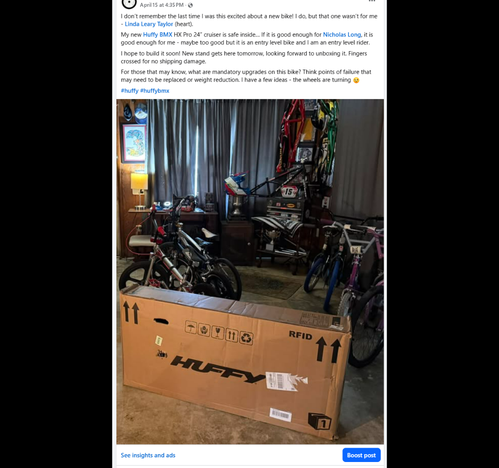
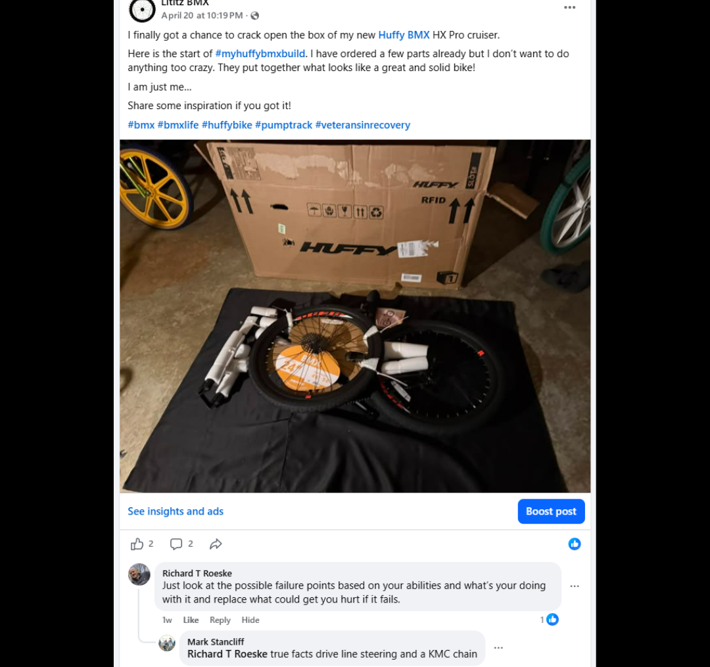
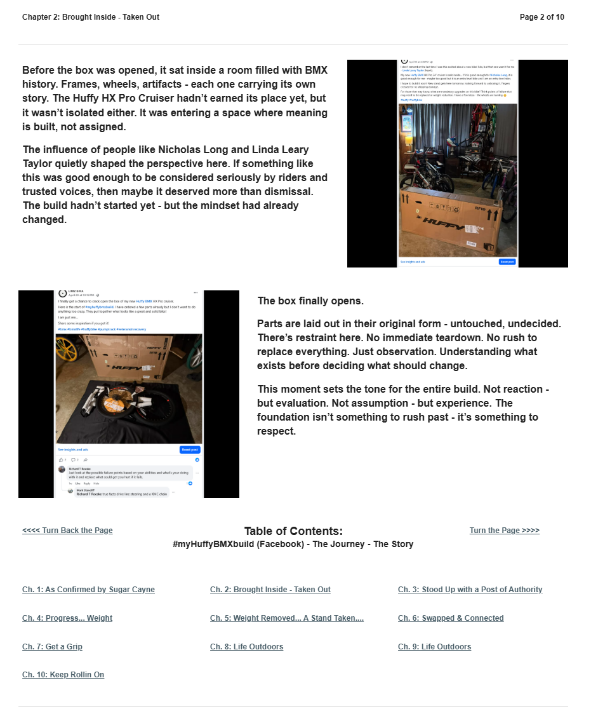

# Chapter 2 of 10
## Brought Inside - Taken Out

> **Understanding what exists before deciding what should change.**

[← Chapter 1](../01-as-confirmed-by-sugar-cayne-then-buy-me/) · [Table of Contents](../../README.md#table-of-contents) · [Chapter 3 →](../03-stood-up-with-a-post-of-authority/)

---

## The Story

<table>
<tr>
<td width="42%" valign="top"></td>
<td valign="top">
Before the box was opened, it sat inside a room filled with BMX history. Frames, wheels, artifacts - each one carrying its own story. The Huffy HX Pro Cruiser hadn’t earned its place yet, but it wasn’t isolated either. It was entering a space where meaning is built, not assigned.

The influence of people like Nicholas Long and Linda Leary Taylor quietly shaped the perspective here. If something like this was good enough to be considered seriously by riders and trusted voices, then maybe it deserved more than dismissal. The build hadn’t started yet - but the mindset had already changed.
</td>
</tr>
</table>

<table>
<tr>
<td width="42%" valign="top"></td>
<td valign="top">
The box finally opens.

Parts are laid out in their original form - untouched, undecided. There’s restraint here. No immediate teardown. No rush to replace everything. Just observation. Understanding what exists before deciding what should change.

This moment sets the tone for the entire build. Not reaction - but evaluation. Not assumption - but experience. The foundation isn’t something to rush past - it’s something to respect.
</td>
</tr>
</table>

---

## Archival record

**Stable record:** `HUFFY-CH-02`  
**Published page title:** Chapter 2: Brought Inside - Taken Out  
**Primary source date(s):** 2026-04-15; 2026-04-20  
**Narrative role:** Evaluation before modification  
**Original Google Sites page:** [https://sites.google.com/view/lititzbmxinventorylist/campaigns/huffybmx-build-campaigns/ch-2-huffy-bmx-build-campaigns](https://sites.google.com/view/lititzbmxinventorylist/campaigns/huffybmx-build-campaigns/ch-2-huffy-bmx-build-campaigns)

> **Evidence qualification:** Nicholas Long and Linda Leary Taylor are documented as influences on the decision to consider the bike seriously, not as formal endorsers of every later component choice.

<strong>Preserved public-page capture</strong>

[← Chapter 1](../01-as-confirmed-by-sugar-cayne-then-buy-me/) · [Table of Contents](../../README.md#table-of-contents) · [Chapter 3 →](../03-stood-up-with-a-post-of-authority/)
