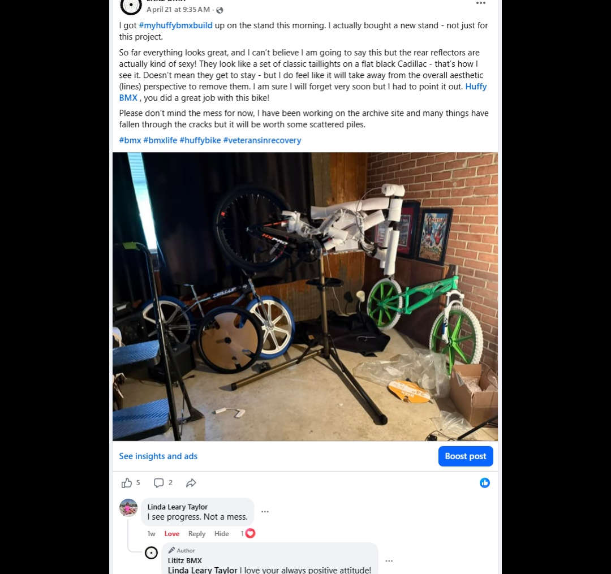
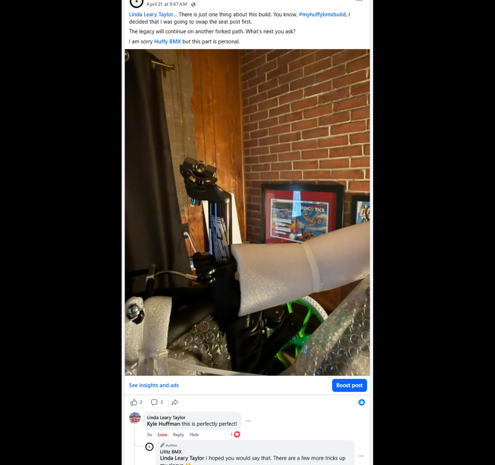
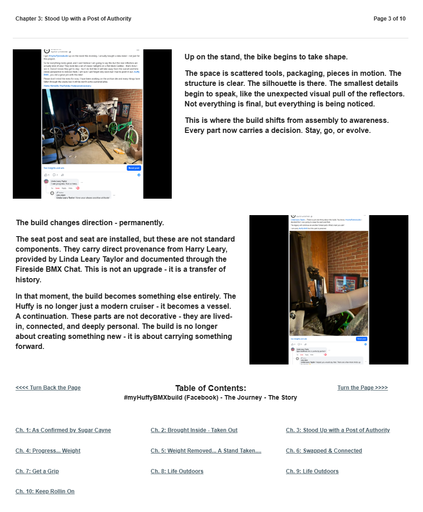

# Chapter 3 of 10
## Stood Up with a Post of Authority

> **This is not an upgrade - it is a transfer of history.**

[← Chapter 2](../02-brought-inside-taken-out/) · [Table of Contents](../../README.md#table-of-contents) · [Chapter 4 →](../04-progress-weight/)

---

## The Story

<table>
<tr>
<td width="42%" valign="top"></td>
<td valign="top">
Up on the stand, the bike begins to take shape.

The space is scattered tools, packaging, pieces in motion. The structure is clear. The silhouette is there. The smallest details begin to speak, like the unexpected visual pull of the reflectors. Not everything is final, but everything is being noticed.

This is where the build shifts from assembly to awareness. Every part now carries a decision. Stay, go, or evolve.
</td>
</tr>
</table>

<table>
<tr>
<td width="42%" valign="top"></td>
<td valign="top">
The build changes direction - permanently.

The seat post and seat are installed, but these are not standard components. They carry direct provenance from Harry Leary, provided by Linda Leary Taylor and documented through the Fireside BMX Chat. This is not an upgrade - it is a transfer of history.

In that moment, the build becomes something else entirely. The Huffy is no longer just a modern cruiser - it becomes a vessel. A continuation. These parts are not decorative - they are lived-in, connected, and deeply personal. The build is no longer about creating something new - it is about carrying something forward.
</td>
</tr>
</table>

---

## Archival record

**Stable record:** `HUFFY-CH-03`  
**Published page title:** Chapter 3: Stood Up with a Post of Authority  
**Primary source date(s):** 2026-04-21  
**Narrative role:** Harry Leary provenance changes the project  
**Original Google Sites page:** [https://sites.google.com/view/lititzbmxinventorylist/campaigns/huffybmx-build-campaigns/ch-3-huffy-bmx-build-campaigns](https://sites.google.com/view/lititzbmxinventorylist/campaigns/huffybmx-build-campaigns/ch-3-huffy-bmx-build-campaigns)

> **Evidence qualification:** The seat and seat post are documented as Harry Leary provenance through Linda Leary Taylor. Their installation does not make the Huffy a bicycle owned or ridden by Harry Leary.

<strong>Preserved public-page capture</strong>

[← Chapter 2](../02-brought-inside-taken-out/) · [Table of Contents](../../README.md#table-of-contents) · [Chapter 4 →](../04-progress-weight/)
