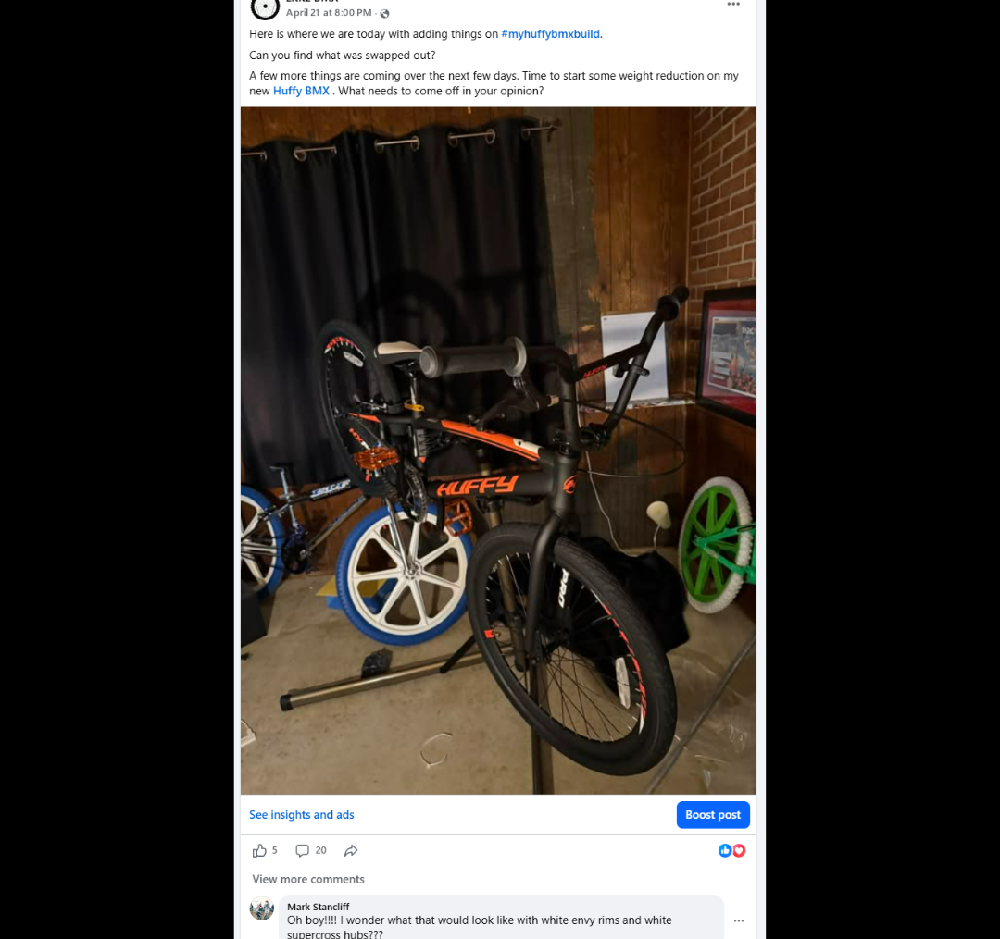
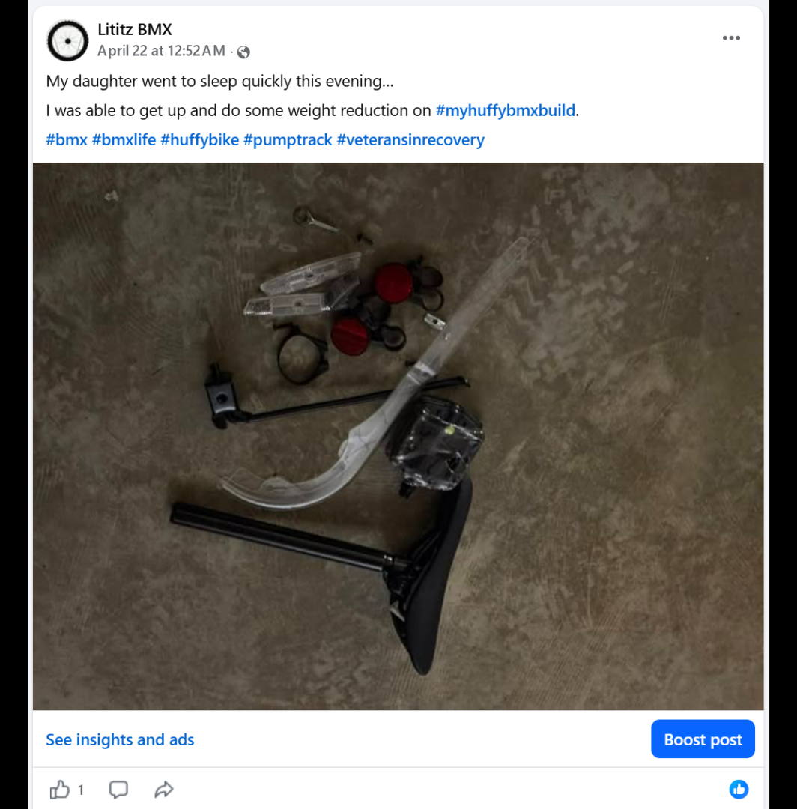
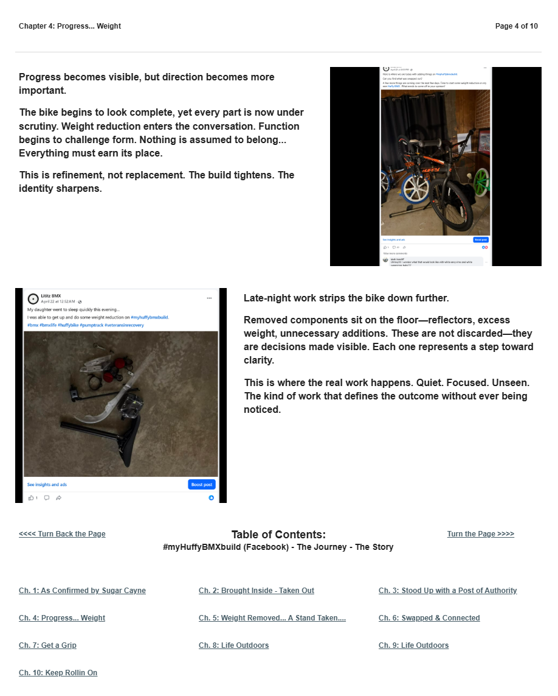

# Chapter 4 of 10
## Progress... Weight

> **Nothing is assumed to belong... Everything must earn its place.**

[← Chapter 3](../03-stood-up-with-a-post-of-authority/) · [Table of Contents](../../README.md#table-of-contents) · [Chapter 5 →](../05-weight-removed-a-stand-taken-purpose-shared/)

---

## The Story

<table>
<tr>
<td width="42%" valign="top"></td>
<td valign="top">
Progress becomes visible, but direction becomes more important.

The bike begins to look complete, yet every part is now under scrutiny. Weight reduction enters the conversation. Function begins to challenge form. Nothing is assumed to belong...  Everything must earn its place.

This is refinement, not replacement. The build tightens. The identity sharpens.
</td>
</tr>
</table>

<table>
<tr>
<td width="42%" valign="top"></td>
<td valign="top">
Late-night work strips the bike down further.

Removed components sit on the floor—reflectors, excess weight, unnecessary additions. These are not discarded—they are decisions made visible. Each one represents a step toward clarity.

This is where the real work happens. Quiet. Focused. Unseen. The kind of work that defines the outcome without ever being noticed.
</td>
</tr>
</table>

---

## Archival record

**Stable record:** `HUFFY-CH-04`  
**Published page title:** Chapter 4: Progress... Weight  
**Primary source date(s):** 2026-04-21; 2026-04-22  
**Narrative role:** Refinement and removal  
**Original Google Sites page:** [https://sites.google.com/view/lititzbmxinventorylist/campaigns/huffybmx-build-campaigns/ch-4-huffy-bmx-build-campaigns](https://sites.google.com/view/lititzbmxinventorylist/campaigns/huffybmx-build-campaigns/ch-4-huffy-bmx-build-campaigns)

> **Evidence qualification:** The images establish removal and documentation. Permanent physical retention or later disposal of every removed component is not established.

<strong>Preserved public-page capture</strong>

[← Chapter 3](../03-stood-up-with-a-post-of-authority/) · [Table of Contents](../../README.md#table-of-contents) · [Chapter 5 →](../05-weight-removed-a-stand-taken-purpose-shared/)
