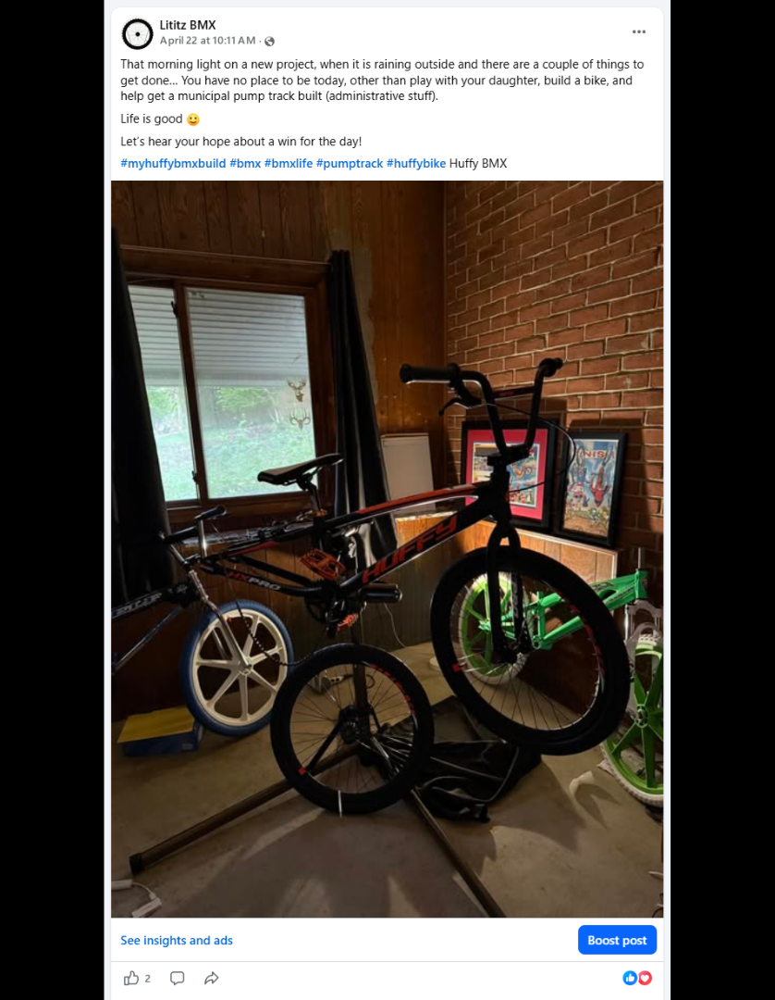
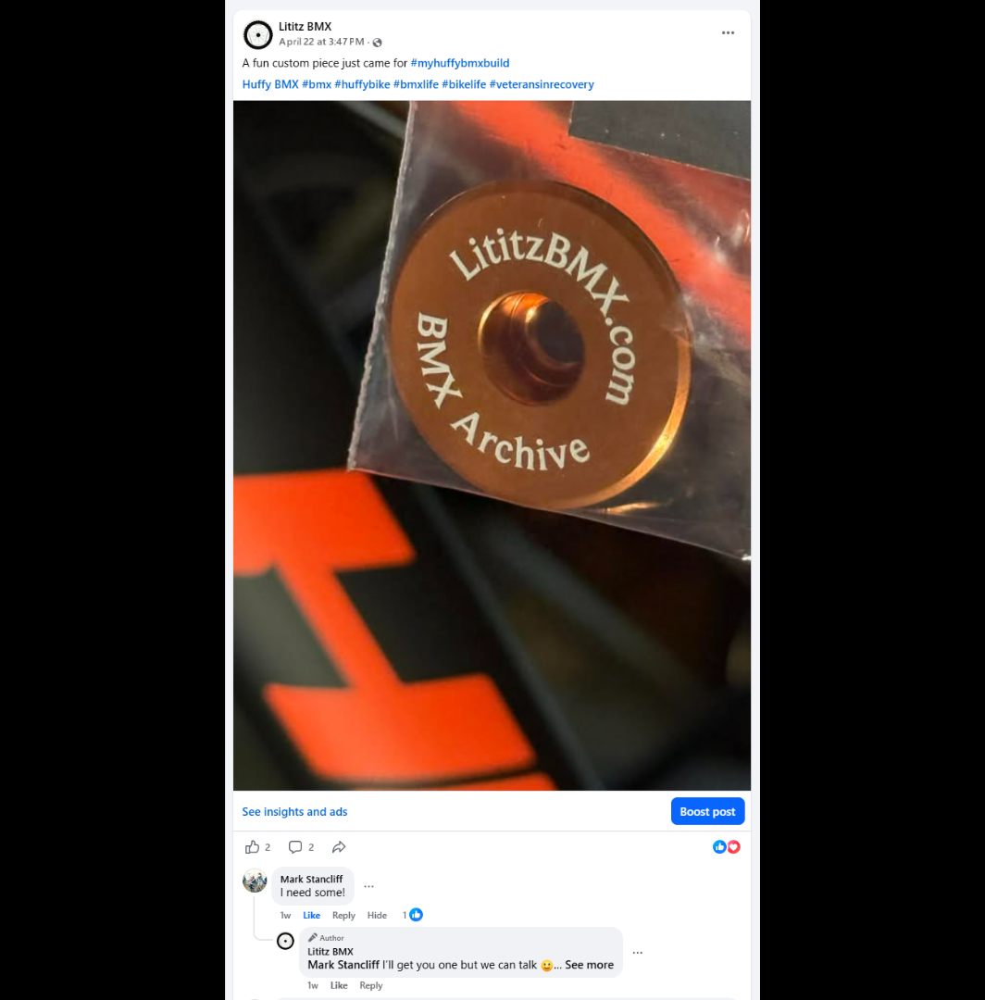
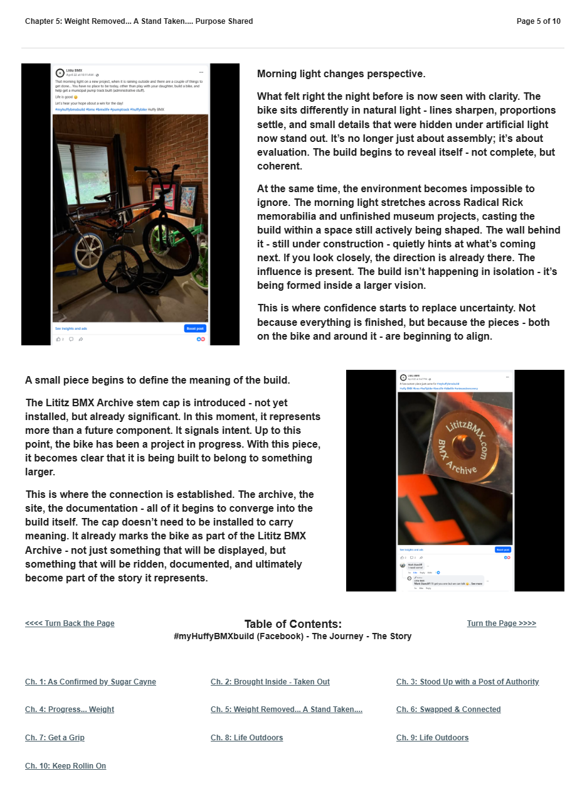

# Chapter 5 of 10
## Weight Removed... A Stand Taken.... Purpose Shared

> **The pieces - both on the bike and around it - are beginning to align.**

[← Chapter 4](../04-progress-weight/) · [Table of Contents](../../README.md#table-of-contents) · [Chapter 6 →](../06-swapped-and-connected/)

---

## The Story

<table>
<tr>
<td width="42%" valign="top"></td>
<td valign="top">
Morning light changes perspective.

What felt right the night before is now seen with clarity. The bike sits differently in natural light - lines sharpen, proportions settle, and small details that were hidden under artificial light now stand out. It’s no longer just about assembly; it’s about evaluation. The build begins to reveal itself - not complete, but coherent.

At the same time, the environment becomes impossible to ignore. The morning light stretches across Radical Rick memorabilia and unfinished museum projects, casting the build within a space still actively being shaped. The wall behind it - still under construction - quietly hints at what’s coming next. If you look closely, the direction is already there. The influence is present. The build isn’t happening in isolation - it’s being formed inside a larger vision.

This is where confidence starts to replace uncertainty. Not because everything is finished, but because the pieces - both on the bike and around it - are beginning to align.
</td>
</tr>
</table>

<table>
<tr>
<td width="42%" valign="top"></td>
<td valign="top">
A small piece begins to define the meaning of the build.

The Lititz BMX Archive stem cap is introduced - not yet installed, but already significant. In this moment, it represents more than a future component. It signals intent. Up to this point, the bike has been a project in progress. With this piece, it becomes clear that it is being built to belong to something larger.

This is where the connection is established. The archive, the site, the documentation - all of it begins to converge into the build itself. The cap doesn’t need to be installed to carry meaning. It already marks the bike as part of the Lititz BMX Archive - not just something that will be displayed, but something that will be ridden, documented, and ultimately become part of the story it represents.
</td>
</tr>
</table>

---

## Archival record

**Stable record:** `HUFFY-CH-05`  
**Published page title:** Chapter 5: Weight Removed... A Stand Taken.... Purpose Shared  
**Primary source date(s):** 2026-04-22  
**Narrative role:** Archive identity and stated purpose  
**Original Google Sites page:** [https://sites.google.com/view/lititzbmxinventorylist/campaigns/huffybmx-build-campaigns/ch-5-huffy-bmx-build-campaigns](https://sites.google.com/view/lititzbmxinventorylist/campaigns/huffybmx-build-campaigns/ch-5-huffy-bmx-build-campaigns)

> **Evidence qualification:** The stem cap is introduced in this chapter and installed in Chapter 6; the sequence is preserved.

<strong>Preserved public-page capture</strong>

[← Chapter 4](../04-progress-weight/) · [Table of Contents](../../README.md#table-of-contents) · [Chapter 6 →](../06-swapped-and-connected/)
