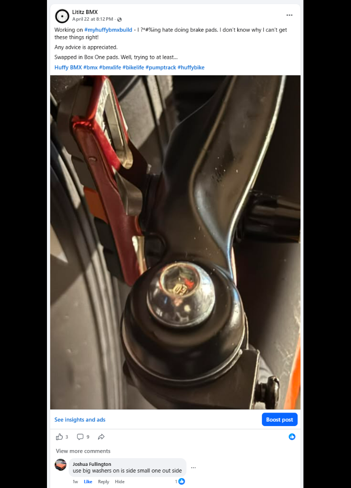
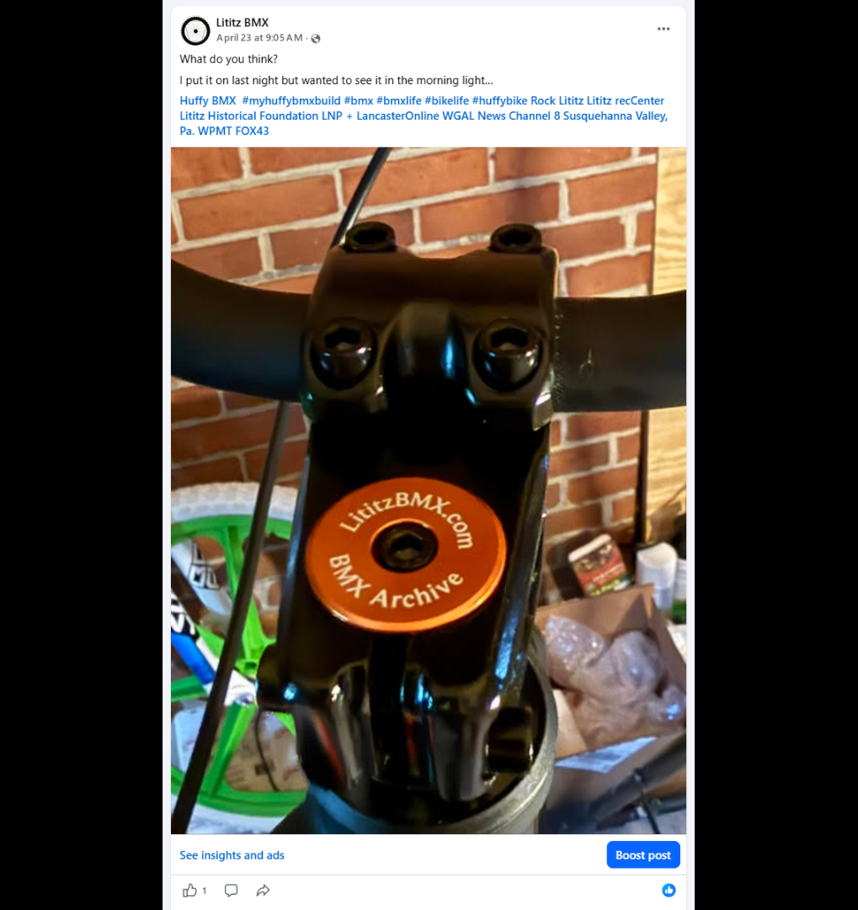
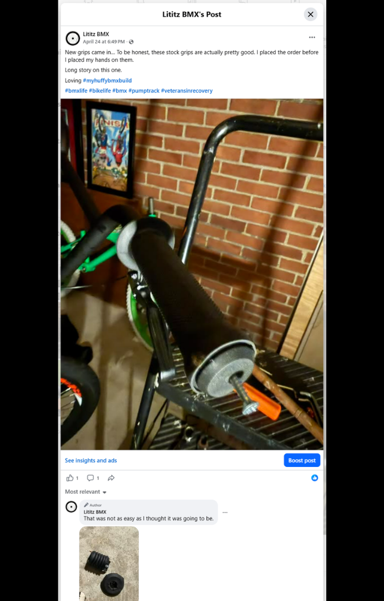
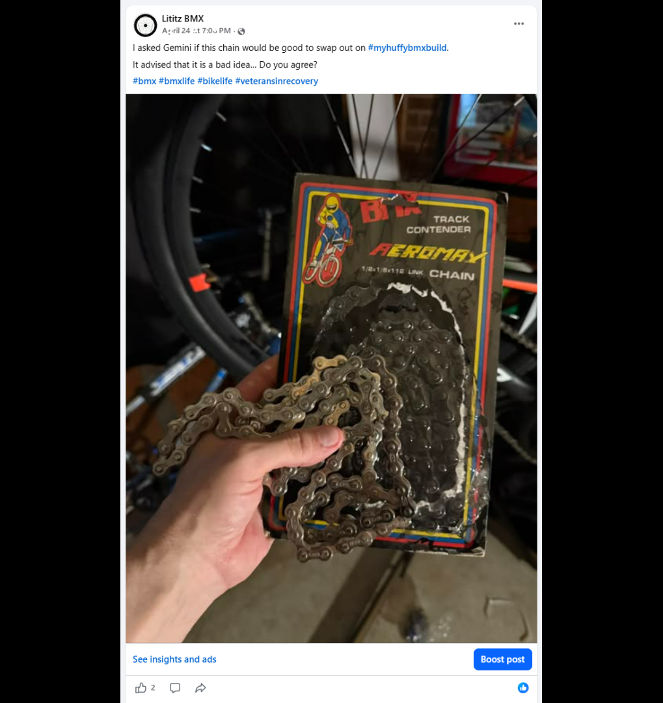
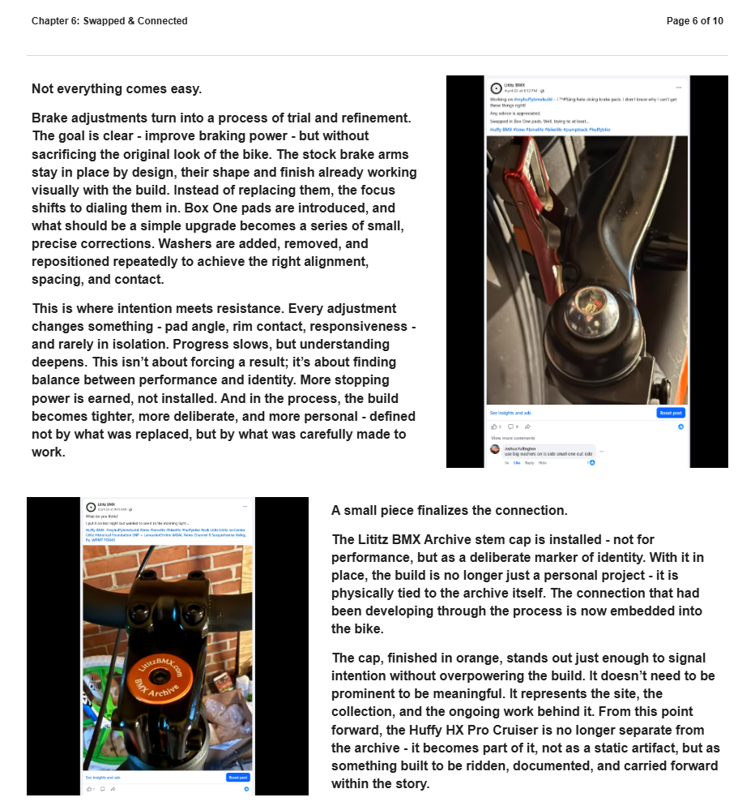
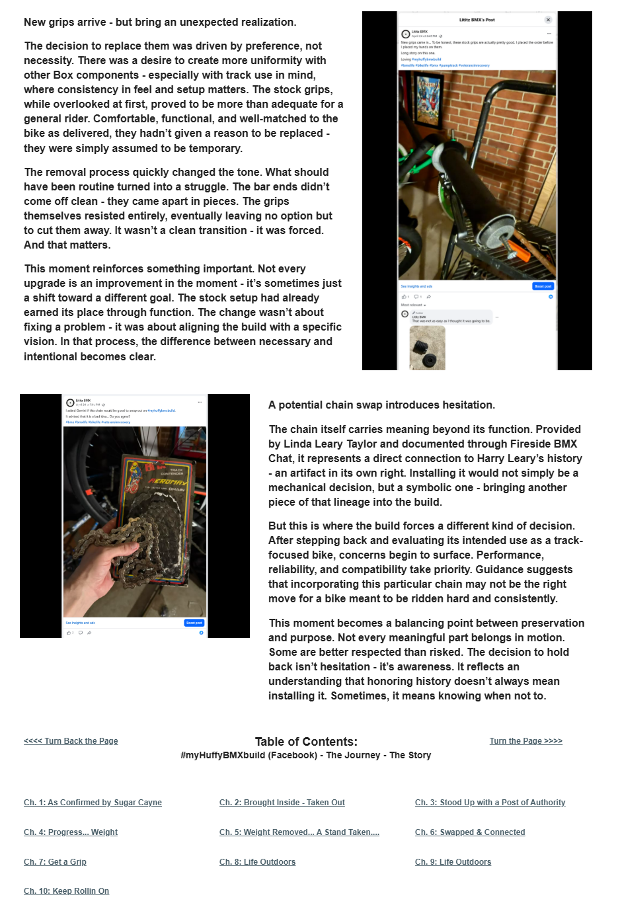

# Chapter 6 of 10
## Swapped & Connected

> **Honoring history does not always mean installing it.**

[← Chapter 5](../05-weight-removed-a-stand-taken-purpose-shared/) · [Table of Contents](../../README.md#table-of-contents) · [Chapter 7 →](../07-get-a-grip/)

---

## The Story

<table>
<tr>
<td width="42%" valign="top"></td>
<td valign="top">
Not everything comes easy.

Brake adjustments turn into a process of trial and refinement. The goal is clear - improve braking power - but without sacrificing the original look of the bike. The stock brake arms stay in place by design, their shape and finish already working visually with the build. Instead of replacing them, the focus shifts to dialing them in. Box One pads are introduced, and what should be a simple upgrade becomes a series of small, precise corrections. Washers are added, removed, and repositioned repeatedly to achieve the right alignment, spacing, and contact.

This is where intention meets resistance. Every adjustment changes something - pad angle, rim contact, responsiveness - and rarely in isolation. Progress slows, but understanding deepens. This isn’t about forcing a result; it’s about finding balance between performance and identity. More stopping power is earned, not installed. And in the process, the build becomes tighter, more deliberate, and more personal - defined not by what was replaced, but by what was carefully made to work.

A small piece finalizes the connection.
</td>
</tr>
</table>

<table>
<tr>
<td width="42%" valign="top"></td>
<td valign="top">
The Lititz BMX Archive stem cap is installed - not for performance, but as a deliberate marker of identity. With it in place, the build is no longer just a personal project - it is physically tied to the archive itself. The connection that had been developing through the process is now embedded into the bike.

The cap, finished in orange, stands out just enough to signal intention without overpowering the build. It doesn’t need to be prominent to be meaningful. It represents the site, the collection, and the ongoing work behind it. From this point forward, the Huffy HX Pro Cruiser is no longer separate from the archive - it becomes part of it, not as a static artifact, but as something built to be ridden, documented, and carried forward within the story.

New grips arrive - but bring an unexpected realization.
</td>
</tr>
</table>

<table>
<tr>
<td width="42%" valign="top"></td>
<td valign="top">
The decision to replace them was driven by preference, not necessity. There was a desire to create more uniformity with other Box components - especially with track use in mind, where consistency in feel and setup matters. The stock grips, while overlooked at first, proved to be more than adequate for a general rider. Comfortable, functional, and well-matched to the bike as delivered, they hadn’t given a reason to be replaced - they were simply assumed to be temporary.

The removal process quickly changed the tone. What should have been routine turned into a struggle. The bar ends didn’t come off clean - they came apart in pieces. The grips themselves resisted entirely, eventually leaving no option but to cut them away. It wasn’t a clean transition - it was forced. And that matters.

This moment reinforces something important. Not every upgrade is an improvement in the moment - it’s sometimes just a shift toward a different goal. The stock setup had already earned its place through function. The change wasn’t about fixing a problem - it was about aligning the build with a specific vision. In that process, the difference between necessary and intentional becomes clear.
</td>
</tr>
</table>

<table>
<tr>
<td width="42%" valign="top"></td>
<td valign="top">
A potential chain swap introduces hesitation.

The chain itself carries meaning beyond its function. Provided by Linda Leary Taylor and documented through Fireside BMX Chat, it represents a direct connection to Harry Leary’s history - an artifact in its own right. Installing it would not simply be a mechanical decision, but a symbolic one - bringing another piece of that lineage into the build.

But this is where the build forces a different kind of decision. After stepping back and evaluating its intended use as a track-focused bike, concerns begin to surface. Performance, reliability, and compatibility take priority. Guidance suggests that incorporating this particular chain may not be the right move for a bike meant to be ridden hard and consistently.

This moment becomes a balancing point between preservation and purpose. Not every meaningful part belongs in motion. Some are better respected than risked. The decision to hold back isn’t hesitation - it’s awareness. It reflects an understanding that honoring history doesn’t always mean installing it. Sometimes, it means knowing when not to.
</td>
</tr>
</table>

---

## Archival record

**Stable record:** `HUFFY-CH-06`  
**Published page title:** Chapter 6: Swapped & Connected  
**Primary source date(s):** 2026-04-22; 2026-04-23; 2026-04-24  
**Narrative role:** Performance, preservation and discernment  
**Original Google Sites page:** [https://sites.google.com/view/lititzbmxinventorylist/campaigns/huffybmx-build-campaigns/ch-6-huffy-bmx-build-campaigns](https://sites.google.com/view/lititzbmxinventorylist/campaigns/huffybmx-build-campaigns/ch-6-huffy-bmx-build-campaigns)

> **Evidence qualification:** The Harry-linked chain was considered and not installed. The brake observations are a record of the builder’s adjustment process, not a controlled performance guarantee.

<strong>Preserved public-page capture</strong>

[← Chapter 5](../05-weight-removed-a-stand-taken-purpose-shared/) · [Table of Contents](../../README.md#table-of-contents) · [Chapter 7 →](../07-get-a-grip/)
