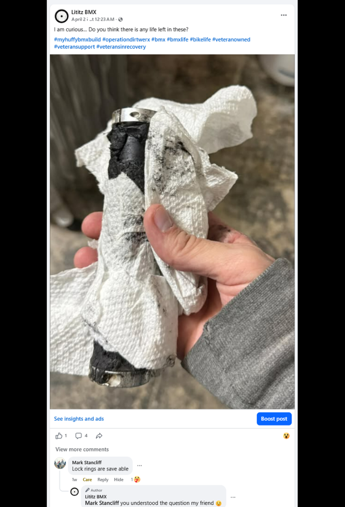
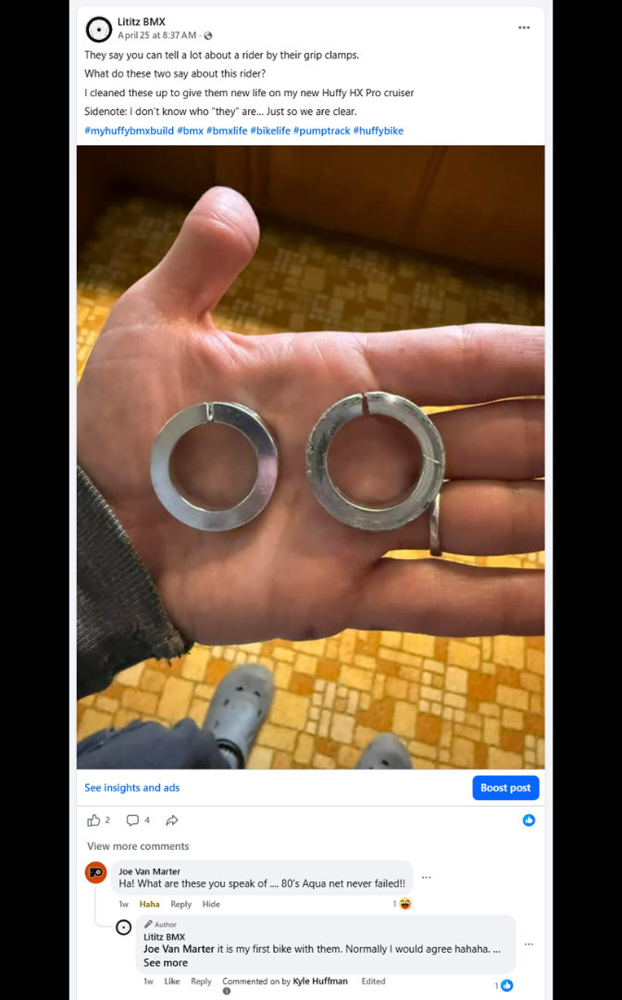
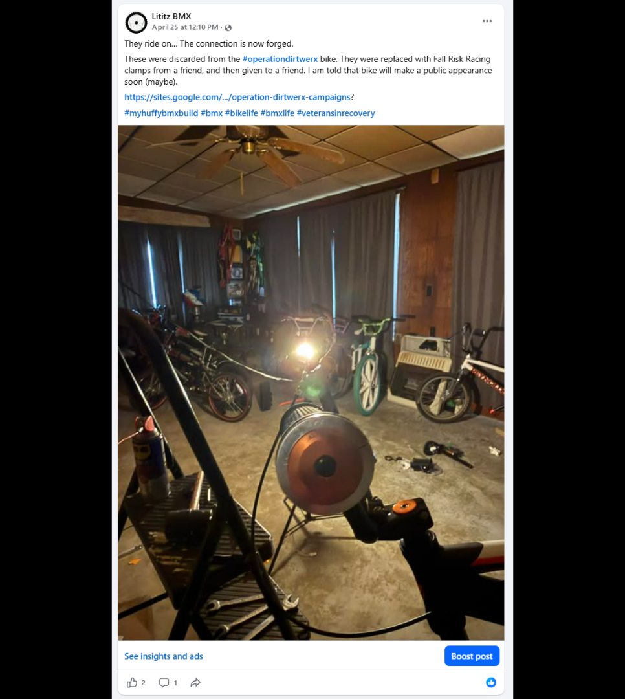
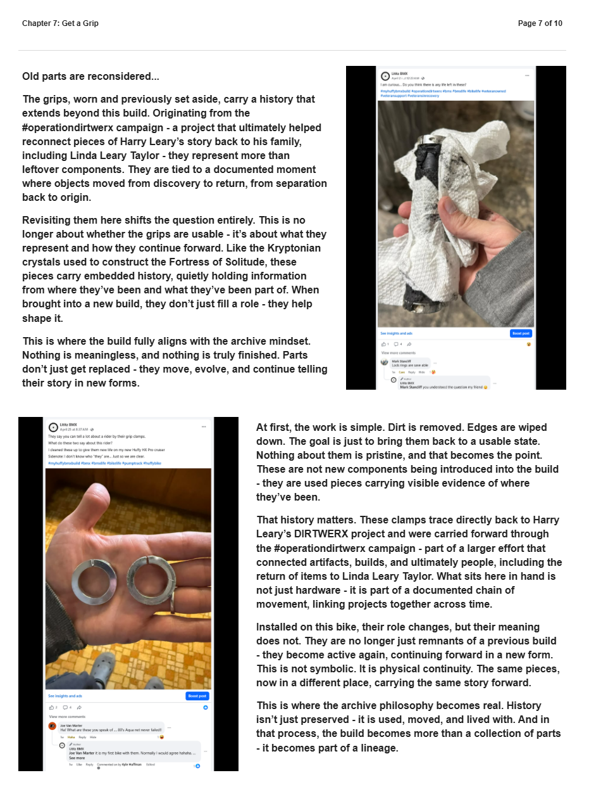
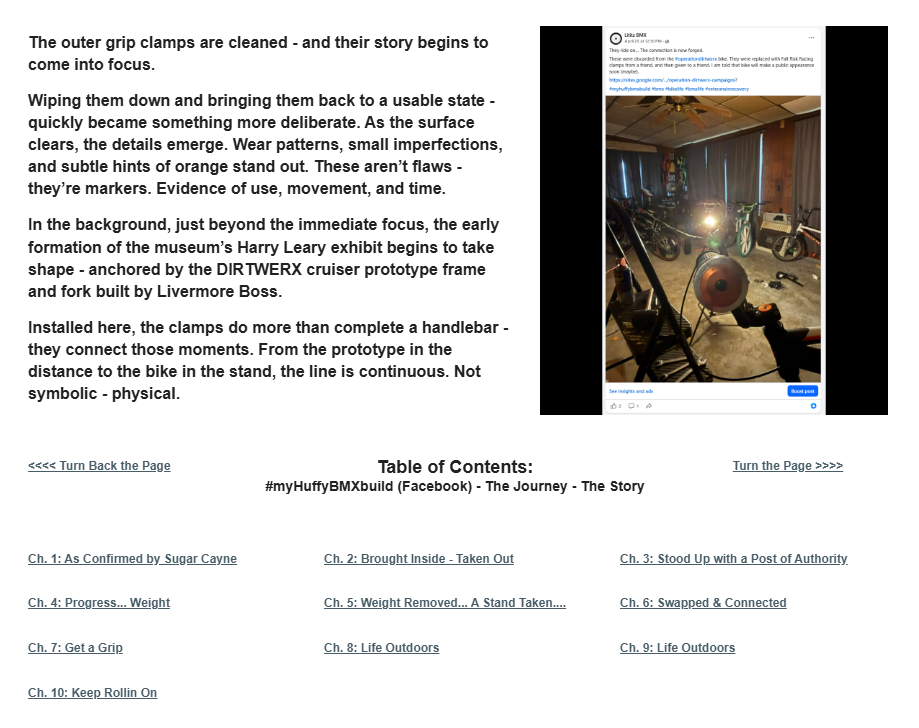

# Chapter 7 of 10
## Get a Grip

> **This is not symbolic. It is physical continuity.**

[← Chapter 6](../06-swapped-and-connected/) · [Table of Contents](../../README.md#table-of-contents) · [Chapter 8 →](../08-life-outdoors/)

---

## The Story

<table>
<tr>
<td width="42%" valign="top"></td>
<td valign="top">
Old parts are reconsidered...

The grips, worn and previously set aside, carry a history that extends beyond this build. Originating from the #operationdirtwerx campaign - a project that ultimately helped reconnect pieces of Harry Leary’s story back to his family, including Linda Leary Taylor - they represent more than leftover components. They are tied to a documented moment where objects moved from discovery to return, from separation back to origin.

Revisiting them here shifts the question entirely. This is no longer about whether the grips are usable - it’s about what they represent and how they continue forward. Like the Kryptonian crystals used to construct the Fortress of Solitude, these pieces carry embedded history, quietly holding information from where they’ve been and what they’ve been part of. When brought into a new build, they don’t just fill a role - they help shape it.

This is where the build fully aligns with the archive mindset. Nothing is meaningless, and nothing is truly finished. Parts don’t just get replaced - they move, evolve, and continue telling their story in new forms.
</td>
</tr>
</table>

<table>
<tr>
<td width="42%" valign="top"></td>
<td valign="top">
At first, the work is simple. Dirt is removed. Edges are wiped down. The goal is just to bring them back to a usable state. Nothing about them is pristine, and that becomes the point. These are not new components being introduced into the build - they are used pieces carrying visible evidence of where they’ve been.

That history matters. These clamps trace directly back to Harry Leary’s DIRTWERX project and were carried forward through the #operationdirtwerx campaign - part of a larger effort that connected artifacts, builds, and ultimately people, including the return of items to Linda Leary Taylor. What sits here in hand is not just hardware - it is part of a documented chain of movement, linking projects together across time.

Installed on this bike, their role changes, but their meaning does not. They are no longer just remnants of a previous build - they become active again, continuing forward in a new form. This is not symbolic. It is physical continuity. The same pieces, now in a different place, carrying the same story forward.

This is where the archive philosophy becomes real. History isn’t just preserved - it is used, moved, and lived with. And in that process, the build becomes more than a collection of parts - it becomes part of a lineage.
</td>
</tr>
</table>

<table>
<tr>
<td width="42%" valign="top"></td>
<td valign="top">
The outer grip clamps are cleaned - and their story begins to come into focus.

Wiping them down and bringing them back to a usable state - quickly became something more deliberate. As the surface clears, the details emerge. Wear patterns, small imperfections, and subtle hints of orange stand out. These aren’t flaws - they’re markers. Evidence of use, movement, and time.

In the background, just beyond the immediate focus, the early formation of the museum’s Harry Leary exhibit begins to take shape - anchored by the DIRTWERX cruiser prototype frame and fork built by Livermore Boss.

Installed here, the clamps do more than complete a handlebar - they connect those moments. From the prototype in the distance to the bike in the stand, the line is continuous. Not symbolic - physical.
</td>
</tr>
</table>

---

## Archival record

**Stable record:** `HUFFY-CH-07`  
**Published page title:** Chapter 7: Get a Grip  
**Primary source date(s):** 2026-04-25  
**Narrative role:** Physical continuity from #OperationDIRTWERX  
**Original Google Sites page:** [https://sites.google.com/view/lititzbmxinventorylist/campaigns/huffybmx-build-campaigns/ch-7-huffy-bmx-build-campaigns](https://sites.google.com/view/lititzbmxinventorylist/campaigns/huffybmx-build-campaigns/ch-7-huffy-bmx-build-campaigns)

> **Evidence qualification:** The recovered grip hardware connects this build with Operation DIRTWERX and Harry Leary preservation work. It does not establish the Huffy as a Harry Leary-owned or Harry Leary-ridden bicycle.

<strong>Preserved public-page capture</strong>

[← Chapter 6](../06-swapped-and-connected/) · [Table of Contents](../../README.md#table-of-contents) · [Chapter 8 →](../08-life-outdoors/)
