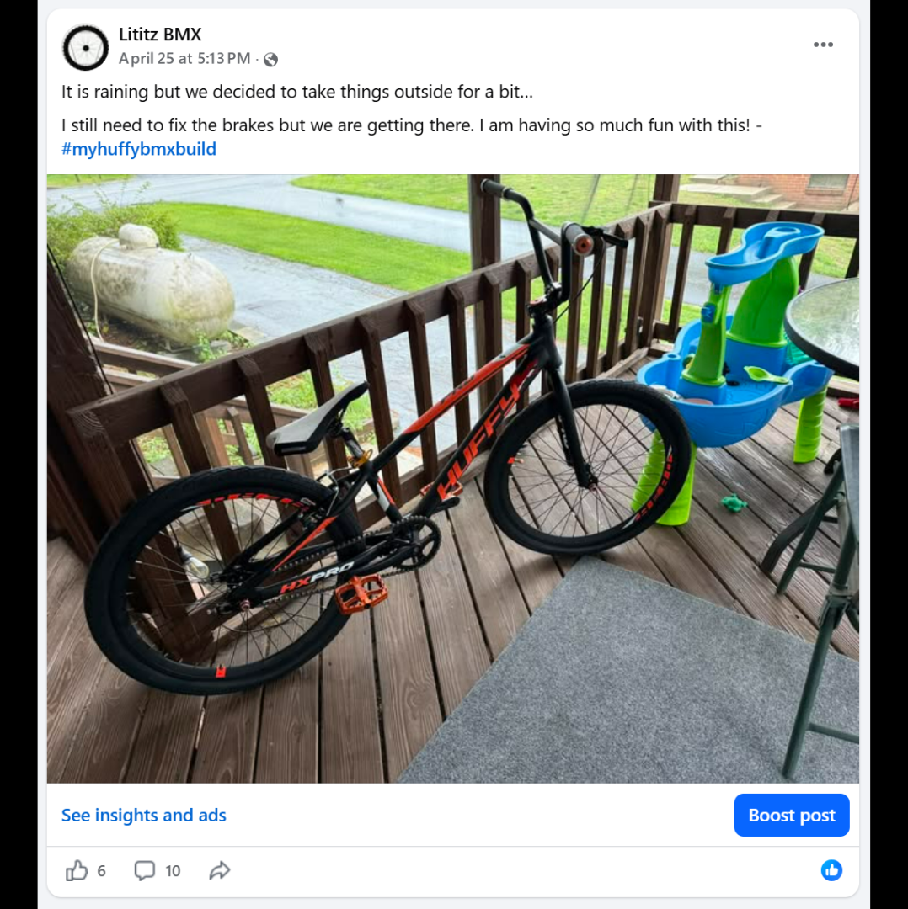
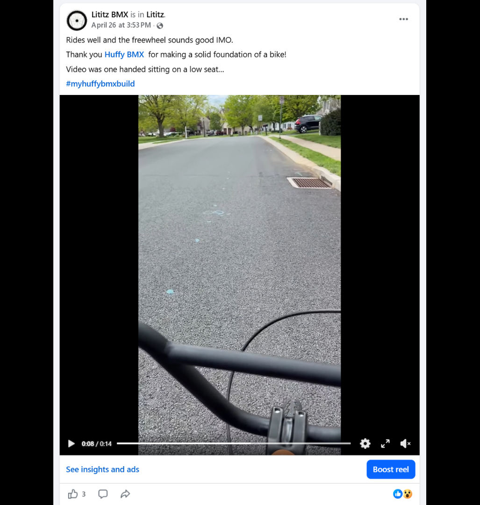
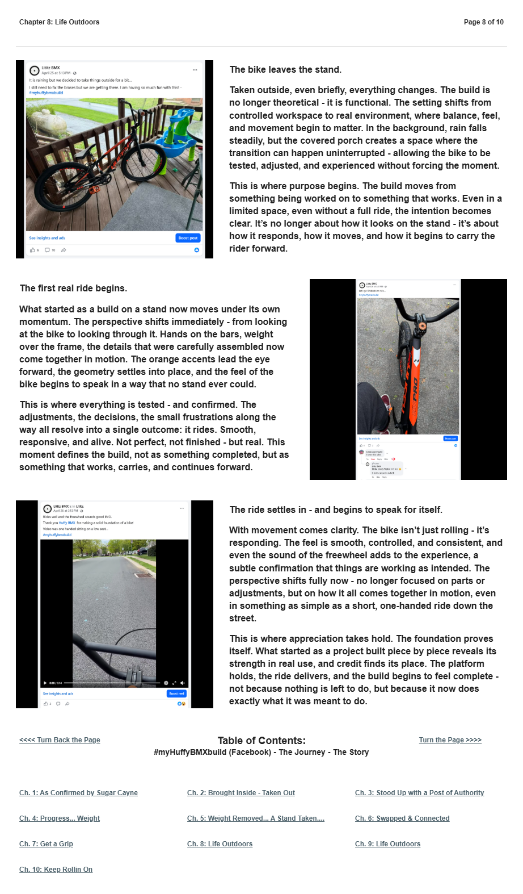

# Chapter 8 of 10
## Life Outdoors

> **The build moves from something being worked on to something that works.**

[← Chapter 7](../07-get-a-grip/) · [Table of Contents](../../README.md#table-of-contents) · [Chapter 9 →](../09-a-week-in-the-life-of/)

---

## The Story

<table>
<tr>
<td width="42%" valign="top"></td>
<td valign="top">
The bike leaves the stand.

Taken outside, even briefly, everything changes. The build is no longer theoretical - it is functional. The setting shifts from controlled workspace to real environment, where balance, feel, and movement begin to matter. In the background, rain falls steadily, but the covered porch creates a space where the transition can happen uninterrupted - allowing the bike to be tested, adjusted, and experienced without forcing the moment.

This is where purpose begins. The build moves from something being worked on to something that works. Even in a limited space, even without a full ride, the intention becomes clear. It’s no longer about how it looks on the stand - it’s about how it responds, how it moves, and how it begins to carry the rider forward.
</td>
</tr>
</table>

<table>
<tr>
<td width="42%" valign="top"></td>
<td valign="top">
The first real ride begins.

What started as a build on a stand now moves under its own momentum. The perspective shifts immediately - from looking at the bike to looking through it. Hands on the bars, weight over the frame, the details that were carefully assembled now come together in motion. The orange accents lead the eye forward, the geometry settles into place, and the feel of the bike begins to speak in a way that no stand ever could.

This is where everything is tested - and confirmed. The adjustments, the decisions, the small frustrations along the way all resolve into a single outcome: it rides. Smooth, responsive, and alive. Not perfect, not finished - but real. This moment defines the build, not as something completed, but as something that works, carries, and continues forward.
</td>
</tr>
</table>

<table>
<tr>
<td width="42%" valign="top"></td>
<td valign="top">
The ride settles in - and begins to speak for itself.

With movement comes clarity. The bike isn’t just rolling - it’s responding. The feel is smooth, controlled, and consistent, and even the sound of the freewheel adds to the experience, a subtle confirmation that things are working as intended. The perspective shifts fully now - no longer focused on parts or adjustments, but on how it all comes together in motion, even in something as simple as a short, one-handed ride down the street.

This is where appreciation takes hold. The foundation proves itself. What started as a project built piece by piece reveals its strength in real use, and credit finds its place. The platform holds, the ride delivers, and the build begins to feel complete - not because nothing is left to do, but because it now does exactly what it was meant to do.
</td>
</tr>
</table>

---

## Archival record

**Stable record:** `HUFFY-CH-08`  
**Published page title:** Chapter 8: Life Outdoors  
**Primary source date(s):** 2026-04-25; 2026-04-26  
**Narrative role:** First motion and functional proof  
**Original Google Sites page:** [https://sites.google.com/view/lititzbmxinventorylist/campaigns/huffybmx-build-campaigns/ch-8-huffy-bmx-build-campaigns](https://sites.google.com/view/lititzbmxinventorylist/campaigns/huffybmx-build-campaigns/ch-8-huffy-bmx-build-campaigns)

> **Evidence qualification:** Ride descriptions reflect the builder’s direct experience during an initial shakedown, not a controlled durability or professional product test.

<strong>Preserved public-page capture</strong>

[← Chapter 7](../07-get-a-grip/) · [Table of Contents](../../README.md#table-of-contents) · [Chapter 9 →](../09-a-week-in-the-life-of/)
