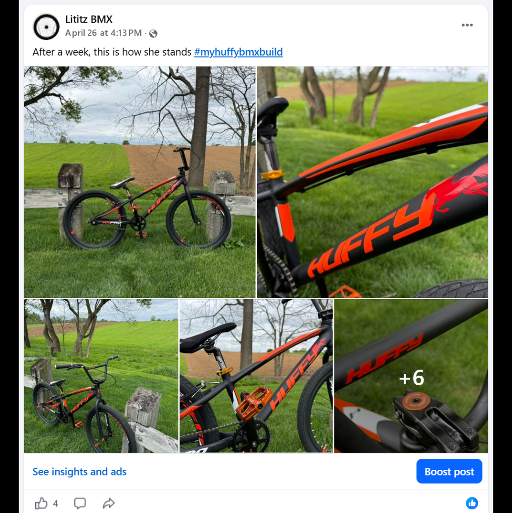
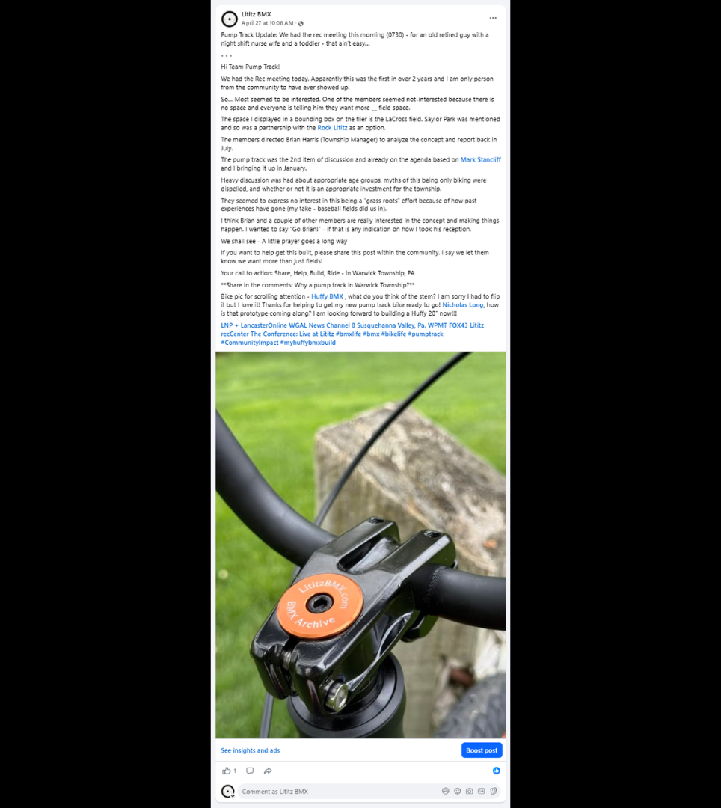
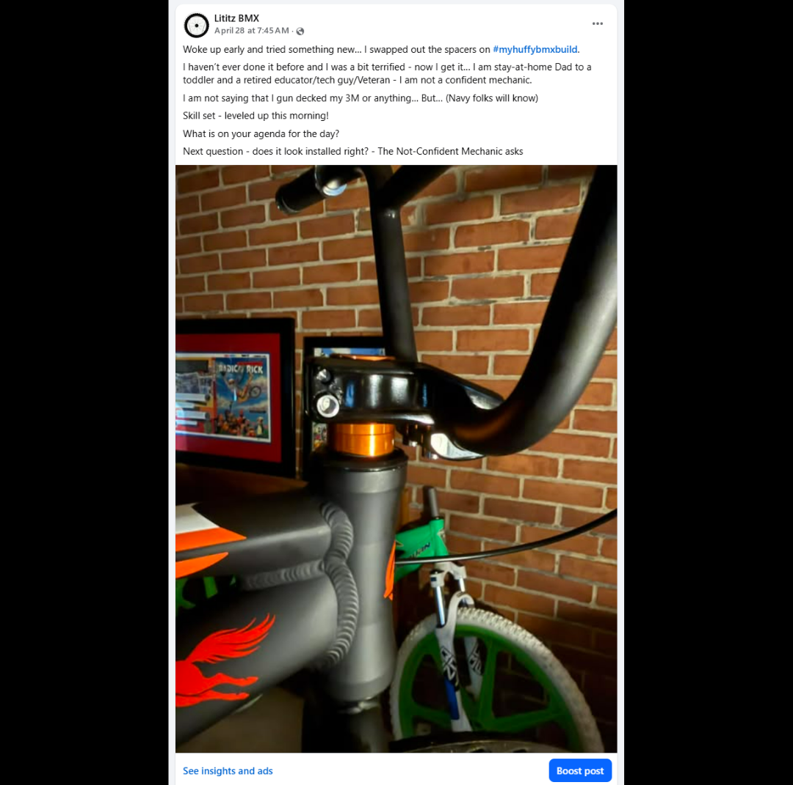
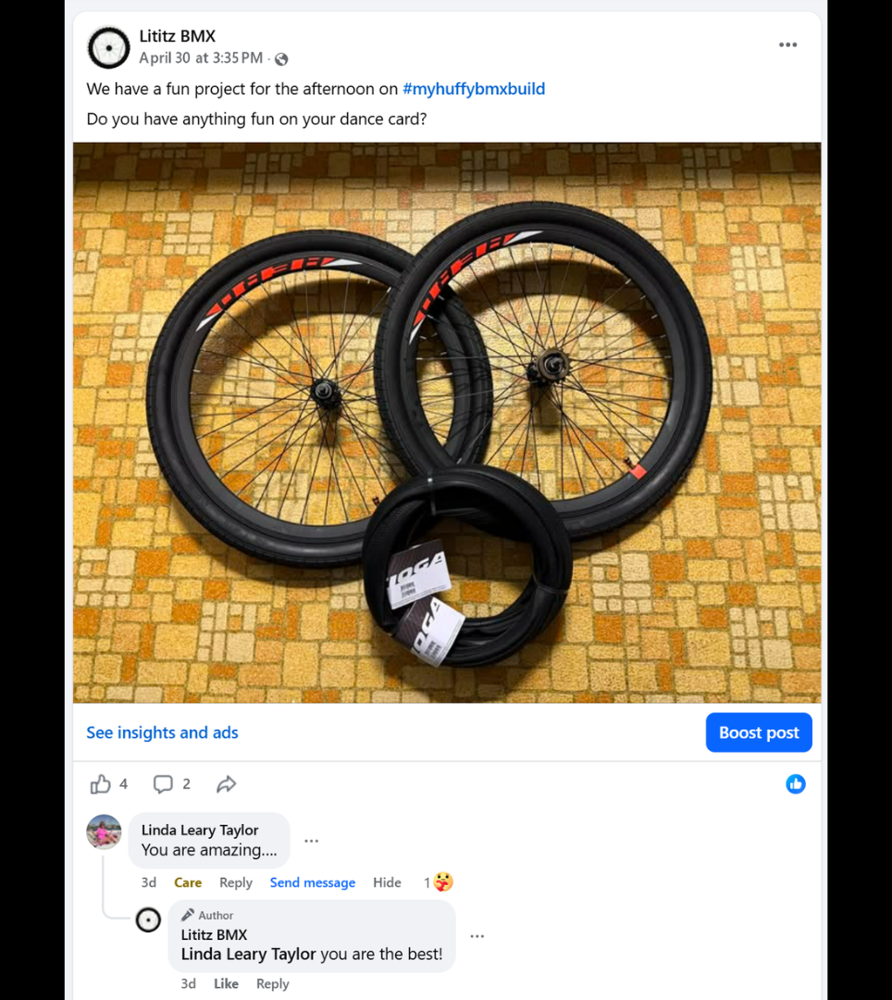
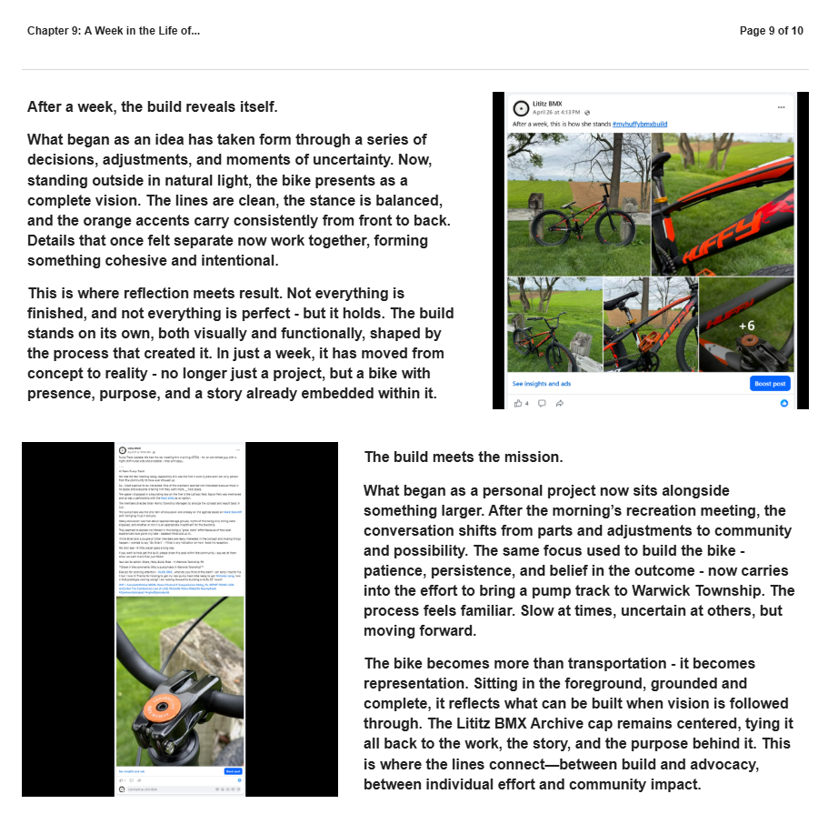
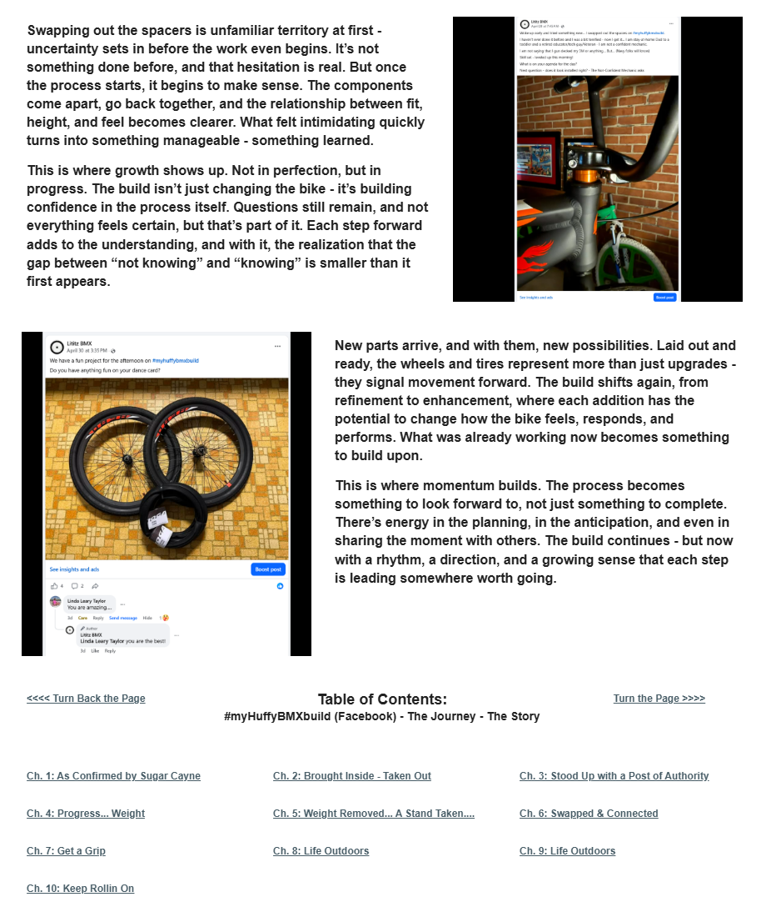

# Chapter 9 of 10
## A Week in the Life of...

> **The build is not only changing the bike - it is building confidence in the process.**

[← Chapter 8](../08-life-outdoors/) · [Table of Contents](../../README.md#table-of-contents) · [Chapter 10 →](../10-keep-rollin-on/)

---

## The Story

<table>
<tr>
<td width="42%" valign="top"></td>
<td valign="top">
After a week, the build reveals itself.

What began as an idea has taken form through a series of decisions, adjustments, and moments of uncertainty. Now, standing outside in natural light, the bike presents as a complete vision. The lines are clean, the stance is balanced, and the orange accents carry consistently from front to back. Details that once felt separate now work together, forming something cohesive and intentional.
</td>
</tr>
</table>

<table>
<tr>
<td width="42%" valign="top"></td>
<td valign="top">
This is where reflection meets result. Not everything is finished, and not everything is perfect - but it holds. The build stands on its own, both visually and functionally, shaped by the process that created it. In just a week, it has moved from concept to reality - no longer just a project, but a bike with presence, purpose, and a story already embedded within it.

The build meets the mission.

What began as a personal project now sits alongside something larger. After the morning’s recreation meeting, the conversation shifts from parts and adjustments to community and possibility. The same focus used to build the bike - patience, persistence, and belief in the outcome - now carries into the effort to bring a pump track to Warwick Township. The process feels familiar. Slow at times, uncertain at others, but moving forward.
</td>
</tr>
</table>

<table>
<tr>
<td width="42%" valign="top"></td>
<td valign="top">
The bike becomes more than transportation - it becomes representation. Sitting in the foreground, grounded and complete, it reflects what can be built when vision is followed through. The Lititz BMX Archive cap remains centered, tying it all back to the work, the story, and the purpose behind it. This is where the lines connect—between build and advocacy, between individual effort and community impact.

Swapping out the spacers is unfamiliar territory at first - uncertainty sets in before the work even begins. It’s not something done before, and that hesitation is real. But once the process starts, it begins to make sense. The components come apart, go back together, and the relationship between fit, height, and feel becomes clearer. What felt intimidating quickly turns into something manageable - something learned.

This is where growth shows up. Not in perfection, but in progress. The build isn’t just changing the bike - it’s building confidence in the process itself. Questions still remain, and not everything feels certain, but that’s part of it. Each step forward adds to the understanding, and with it, the realization that the gap between “not knowing” and “knowing” is smaller than it first appears.
</td>
</tr>
</table>

<table>
<tr>
<td width="42%" valign="top"></td>
<td valign="top">
New parts arrive, and with them, new possibilities. Laid out and ready, the wheels and tires represent more than just upgrades - they signal movement forward. The build shifts again, from refinement to enhancement, where each addition has the potential to change how the bike feels, responds, and performs. What was already working now becomes something to build upon.

This is where momentum builds. The process becomes something to look forward to, not just something to complete. There’s energy in the planning, in the anticipation, and even in sharing the moment with others. The build continues - but now with a rhythm, a direction, and a growing sense that each step is leading somewhere worth going.
</td>
</tr>
</table>

---

## Archival record

**Stable record:** `HUFFY-CH-09`  
**Published page title:** Chapter 9: A Week in the Life of...  
**Primary source date(s):** 2026-04-26; 2026-04-27; 2026-04-28; 2026-04-30  
**Narrative role:** Advocacy, learning and continued evolution  
**Original Google Sites page:** [https://sites.google.com/view/lititzbmxinventorylist/campaigns/huffybmx-build-campaigns/ch-9-huffy-bmx-build-campaigns](https://sites.google.com/view/lititzbmxinventorylist/campaigns/huffybmx-build-campaigns/ch-9-huffy-bmx-build-campaigns)

> **Evidence qualification:** The page header is “A Week in the Life of...” while the repeated table of contents labels Chapter 9 “Life Outdoors.” Both published forms are preserved. The wheels and tires are introduced here, not treated as installed until later evidence.

<strong>Preserved public-page capture</strong>

[← Chapter 8](../08-life-outdoors/) · [Table of Contents](../../README.md#table-of-contents) · [Chapter 10 →](../10-keep-rollin-on/)
