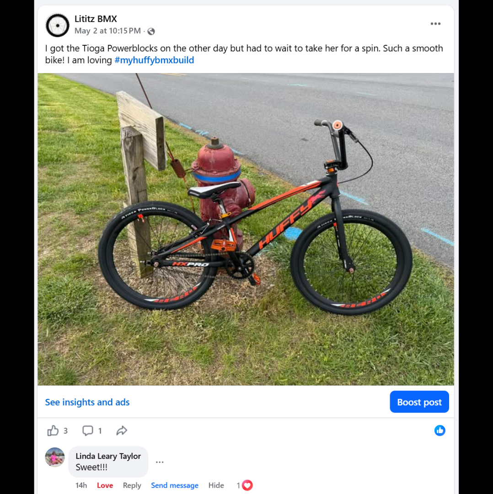
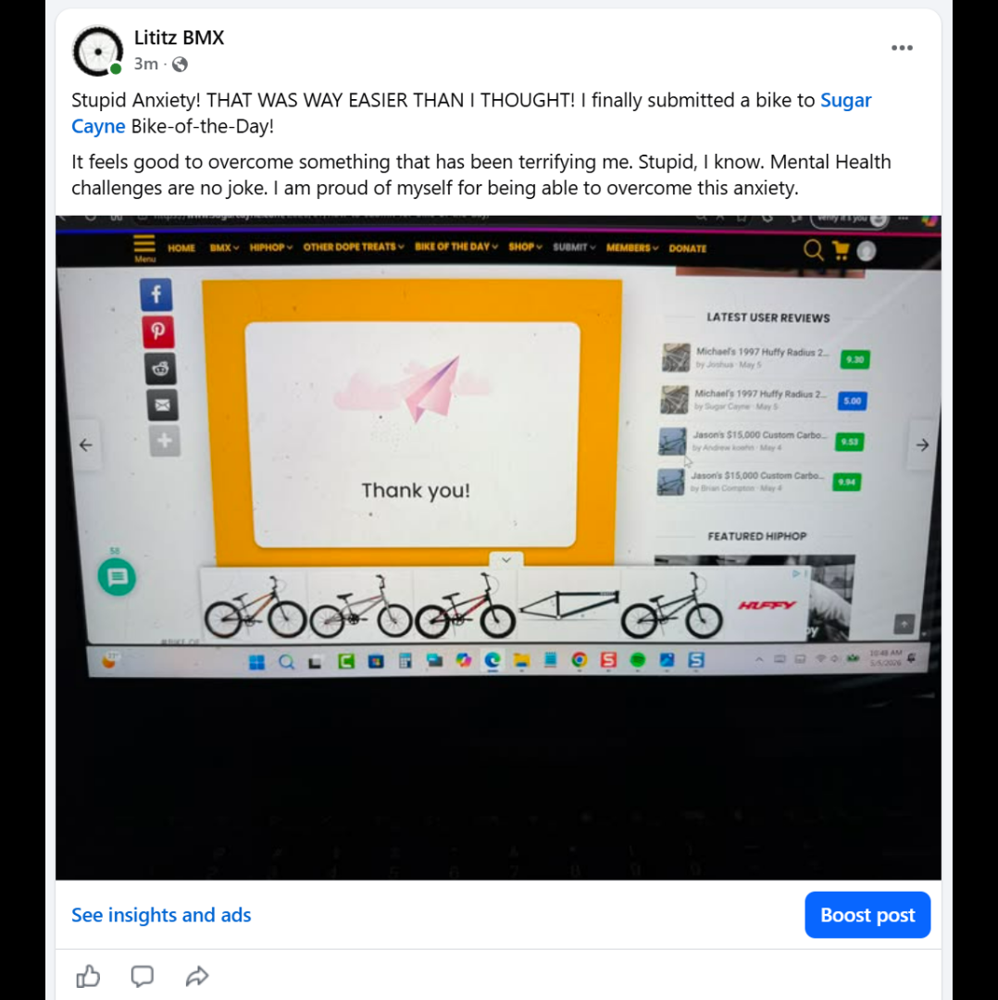
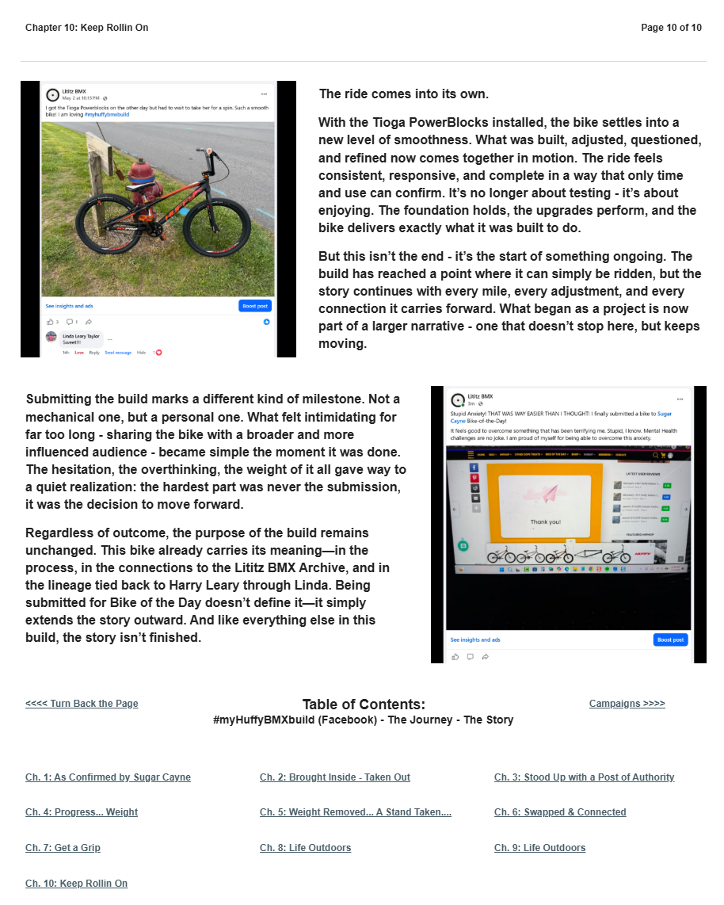

# Chapter 10 of 10
## Keep Rollin On

> **The hardest part was never the submission, it was the decision to move forward.**

[← Chapter 9](../09-a-week-in-the-life-of/) · [Table of Contents](../../README.md#table-of-contents) · [Afterword →](../../afterword/sugar-cayne-bike-of-the-day/)

---

## The Story

<table>
<tr>
<td width="42%" valign="top"></td>
<td valign="top">
The ride comes into its own.

With the Tioga PowerBlocks installed, the bike settles into a new level of smoothness. What was built, adjusted, questioned, and refined now comes together in motion. The ride feels consistent, responsive, and complete in a way that only time and use can confirm. It’s no longer about testing - it’s about enjoying. The foundation holds, the upgrades perform, and the bike delivers exactly what it was built to do.
</td>
</tr>
</table>

<table>
<tr>
<td width="42%" valign="top"></td>
<td valign="top">
But this isn’t the end - it’s the start of something ongoing. The build has reached a point where it can simply be ridden, but the story continues with every mile, every adjustment, and every connection it carries forward. What began as a project is now part of a larger narrative - one that doesn’t stop here, but keeps moving.

Submitting the build marks a different kind of milestone. Not a mechanical one, but a personal one. What felt intimidating for far too long - sharing the bike with a broader and more influenced audience - became simple the moment it was done. The hesitation, the overthinking, the weight of it all gave way to a quiet realization: the hardest part was never the submission, it was the decision to move forward.

Regardless of outcome, the purpose of the build remains unchanged. This bike already carries its meaning—in the process, in the connections to the Lititz BMX Archive, and in the lineage tied back to Harry Leary through Linda. Being submitted for Bike of the Day doesn’t define it—it simply extends the story outward. And like everything else in this build, the story isn’t finished.
</td>
</tr>
</table>

---

## Archival record

**Stable record:** `HUFFY-CH-10`  
**Published page title:** Chapter 10: Keep Rollin On  
**Primary source date(s):** 2026-05-02; May 2026, exact submission timestamp not preserved  
**Narrative role:** Mature configuration and public submission  
**Original Google Sites page:** [https://sites.google.com/view/lititzbmxinventorylist/campaigns/huffybmx-build-campaigns/ch-10-huffy-bmx-build-campaigns](https://sites.google.com/view/lititzbmxinventorylist/campaigns/huffybmx-build-campaigns/ch-10-huffy-bmx-build-campaigns)

> **Evidence qualification:** The source establishes successful submission. Selection and publication are documented separately in the Sugar Cayne Afterword. The mental-health language remains the builder’s own reflection and is not expanded into a medical conclusion.

<strong>Preserved public-page capture</strong>

[← Chapter 9](../09-a-week-in-the-life-of/) · [Table of Contents](../../README.md#table-of-contents) · [Afterword →](../../afterword/sugar-cayne-bike-of-the-day/)
