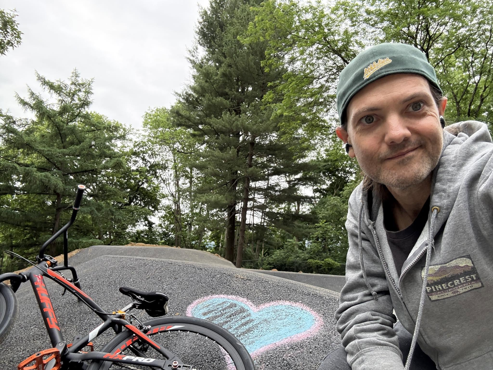
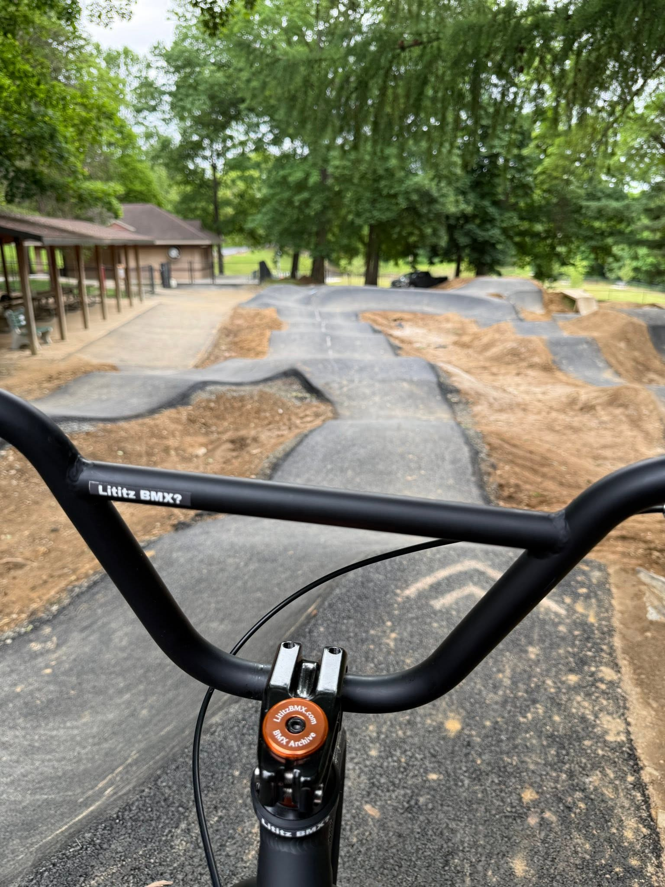
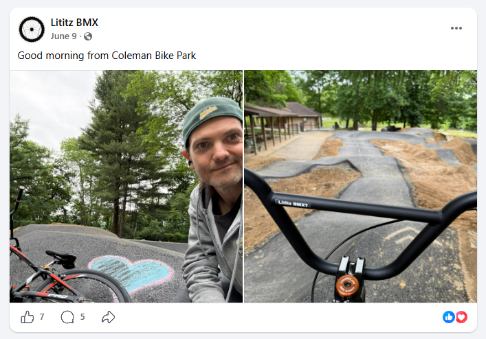
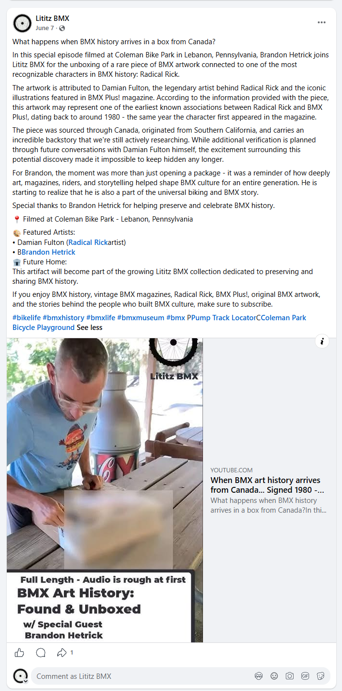
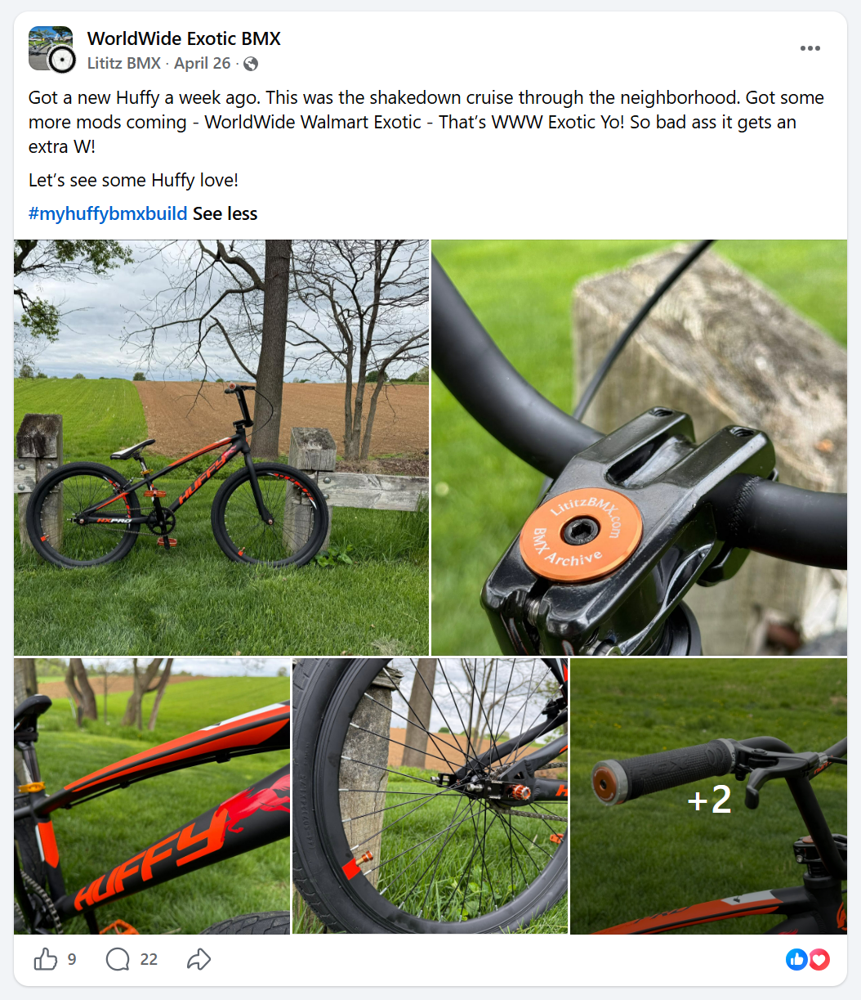
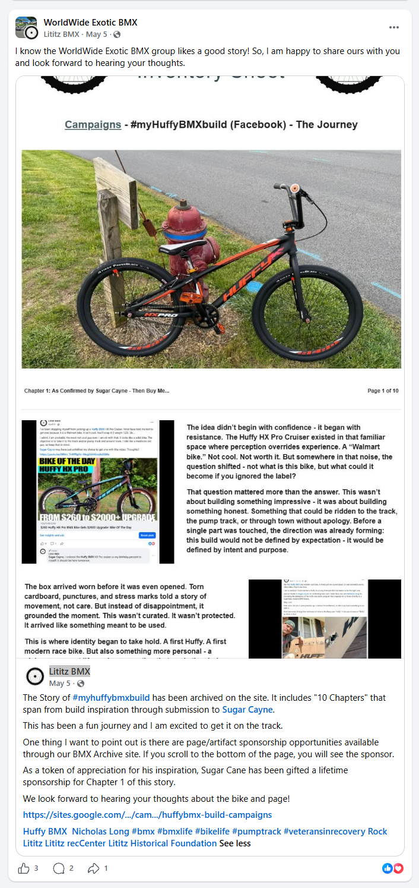

# Postscript
## The Bike Keeps Moving
### Coleman Bike Park — Lebanon, Pennsylvania

[← Afterword](../../afterword/sugar-cayne-bike-of-the-day/) · [Table of Contents](../../README.md#table-of-contents)

---

<table>
<tr>
<td width="50%"></td>
<td width="50%"></td>
</tr>
</table>

The original book remains ten chapters. This Postscript documents what the ending promised: the bicycle kept moving.

At Coleman Bike Park, the Huffy appears as an active Lititz BMX field bike—on the track, carrying the orange archive stem cap and the small **“Lititz BMX?”** handlebar detail. It is no longer only the subject of the campaign. It is present while Lititz BMX documents another piece of BMX history.

## Same-visit museum documentation

Kyle confirmed that the related museum-unboxing Short and the Huffy field photographs came from the same Coleman Bike Park visit. Visible Facebook publication dates include June 7 and June 9, so the archive keeps filming context separate from social-publication dates.

**Canonical Short:** [Lititz BMX Museum Unboxing: (Special Edition) BMX art history arrives from Canada — @Coleman Bike Park](https://www.youtube.com/shorts/pIU9h6CT4eQ)

The Short’s primary subject is the unboxing of BMX artwork connected to Radical Rick and Damian Fulton, filmed with Brandon Hetrick. The Huffy’s role in this campaign record is the visible archive field vehicle and continuing-use context; the Short is not relabeled as a dedicated Huffy video.

## Secondary circulation

The build and campaign were also shared through WorldWide Exotic BMX, where the Huffy was framed as a “WorldWide Walmart Exotic” and the archived ten-chapter story was introduced to another audience.

<table>
<tr>
<td width="50%"></td>
<td width="50%"></td>
</tr>
</table>

## Closing line

The campaign began by asking whether an underestimated bicycle could carry purpose. The Postscript answers through use: it carried the rider onto a pump track, carried the archive identity into the field, and was present while a new historical record was created.

---

[← Afterword](../../afterword/sugar-cayne-bike-of-the-day/) · [Table of Contents](../../README.md#table-of-contents)
