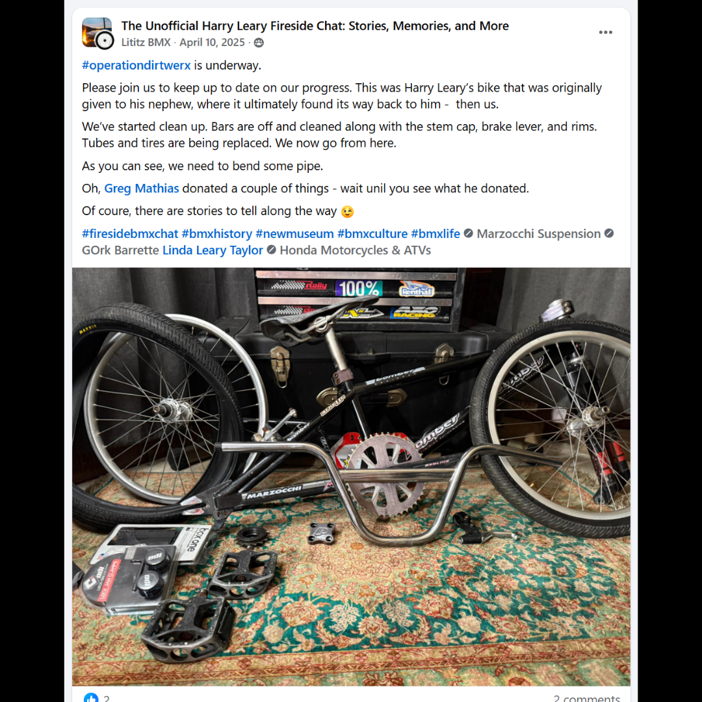
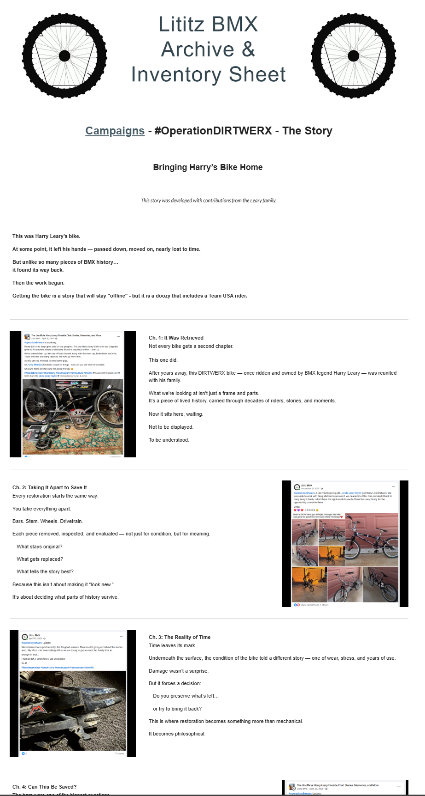
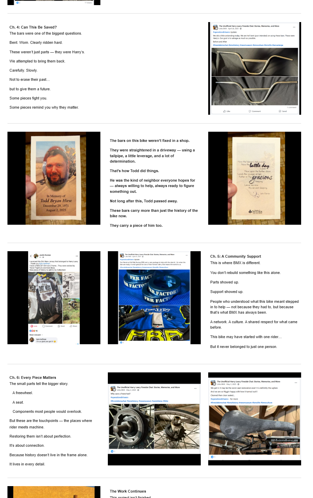
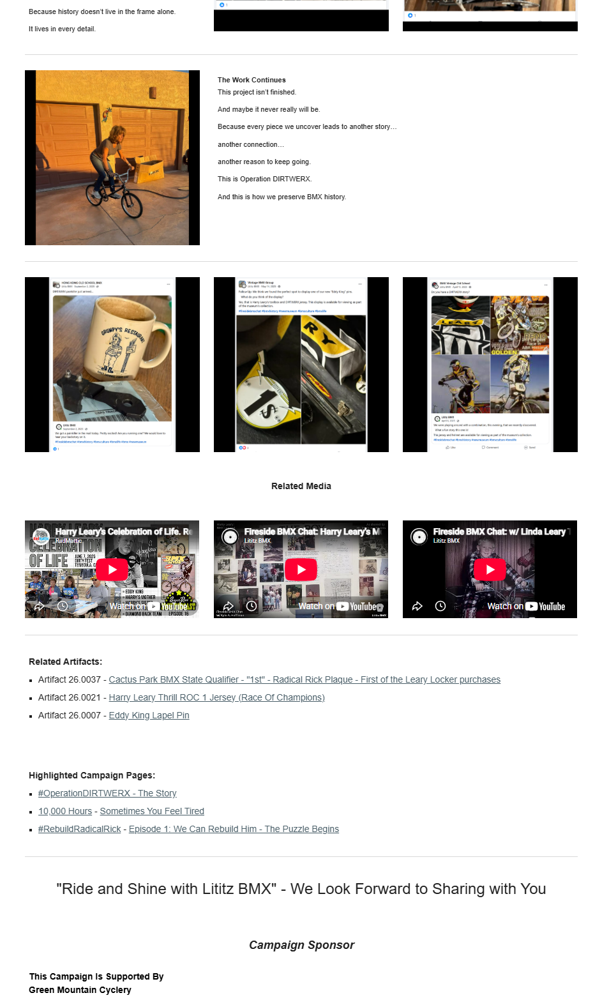

# #OperationDIRTWERX — The Story

## Bringing Harry’s Bike Home

**Campaign status:** Active preservation story  
**Documented top-level source span:** April 10–November 27, 2025  
**Embedded earlier record:** April 6, 2025, preserved within an April 15 share  
**Produced by:** Lititz BMX  
**Contribution credit:** This story was developed with contributions from the Leary family.  
**Archive display version:** 1.1

---

## Campaign Overview

#OperationDIRTWERX documents the recovery, evaluation, preservation, and return of a DIRTWERX bicycle once ridden and owned by BMX pioneer Harry Leary.

The campaign follows the bicycle from its disassembled condition through cleaning, component decisions, handlebar straightening, community support, small-part preservation, and its return to the Leary family. It also records the people, artifacts, memories, and related DIRTWERX material that became connected to the project.

The acquisition story remains offline because the original campaign expressly says it will remain offline. This archive preserves the surviving public record without reconstructing that withheld story.

---

## Visual Campaign Record

### Campaign Launch



### The Bicycle Back with the Leary Family


### Preserved Public Campaign Page







The individual chapter records visibly present every supplied source image and the corresponding public-page capture beside searchable text and verification notes.

---

## Campaign Goals

The campaign and archive were created to:

- preserve the official #OperationDIRTWERX narrative and chapter sequence;
- document the bicycle’s condition, treatment decisions, and evidence of use;
- distinguish original material, replacement choices, and later interventions;
- connect the bicycle with Harry Leary, the Leary family, DIRTWERX, and related BMX history;
- preserve community support, personal memory, and related artifact records;
- maintain the original source wording separately from later archival explanation;
- preserve visual evidence under stable filenames with SHA-256 fixity information;
- document missing dates, URLs, and source boundaries without filling them through assumption.

---

## Campaign Scope

The archive contains:

- **6 official numbered chapters**
- **1 introduction**
- **1 epilogue: The Work Continues**
- **1 supporting-material record**
- **12 preserved public-page captures**
- **14 preserved source-image records**
- **10 dated top-level social-media posts**
- **4 undated or non-post source records**

No missing material has been reconstructed through assumption.

---

## Chapter Archive

The archive preserves the official campaign-page sequence while maintaining a separate source-publication chronology.

- [Open the complete chapter index](chapters/)

### Official Narrative Sequence

1. [Introduction — Bringing Harry’s Bike Home](chapters/00-introduction.md)
2. [Chapter 1 — It Was Retrieved](chapters/01-it-was-retrieved.md)
3. [Chapter 2 — Taking It Apart to Save It](chapters/02-taking-it-apart-to-save-it.md)
4. [Chapter 3 — The Reality of Time](chapters/03-the-reality-of-time.md)
5. [Chapter 4 — Can This Be Saved?](chapters/04-can-this-be-saved.md)
6. [Chapter 5 — A Community Support](chapters/05-a-community-support.md)
7. [Chapter 6 — Every Piece Matters](chapters/06-every-piece-matters.md)
8. [The Work Continues](chapters/07-the-work-continues.md)
9. [Supporting DIRTWERX Material](chapters/08-supporting-material.md)

---

## Featured Subjects

The campaign connects the bicycle and preservation work with:

- Harry Leary;
- Linda Leary Taylor and the Leary family;
- DIRTWERX;
- Greg Mathias;
- Fall Risk Racing;
- Todd Bryan Hirst;
- Justin Dumas;
- Livermore Boss and Trevor Pigott;
- Harry Leary’s handlebars, freewheel, seat, toolbox, jersey, and related display material;
- BMX preservation, restoration choices, community memory, and family return.

---

## Campaign Ledger

The definitive campaign ledger records each unit’s:

- official title and page position;
- primary source date or date status;
- narrative role;
- key content;
- source record;
- known issue or evidence gap;
- required preservation action.

### Available Formats

- [Read the Markdown ledger](Operation-DIRTWERX-Campaign-Ledger-v1.0.md)
- [Download the CSV ledger](Operation-DIRTWERX-Campaign-Ledger-v1.0.csv)
- [Download the Excel audit workbook](Operation-DIRTWERX-Campaign-Ledger-v1.0.xlsx)

---

## Visual Evidence and Fixity

- [Image manifest](IMAGE-MANIFEST.csv)
- [SHA-256 fixity manifest](SHA256SUMS.txt)
- [Preserved public-page captures](page-captures/)
- [Preserved source images](source-images/)
- [Searchable source transcriptions](SOURCE-TRANSCRIPTIONS.md)

The image layer contains **12 public-page captures** and **14 source-image records**. The source records include social-media screenshots, two memorial-card images, and an undated campaign photograph.

---

## Source-Publication Chronology

The dated top-level source sequence is:

```text
2025-04-10 — Source 001 — Chapter 1
2025-04-15 — Source 014 — Supporting material
2025-04-25 — Source 003 — Chapter 3
2025-04-28 — Source 004 — Chapter 4
2025-04-28 — Source 008 — Chapter 5
2025-05-02 — Source 009 — Chapter 6
2025-05-03 — Source 010 — Chapter 6
2025-05-14 — Source 013 — Supporting material
2025-09-02 — Source 012 — Supporting material
2025-11-27 — Source 002 — Chapter 2
```

Source 014 contains an embedded Lititz BMX post dated April 6, 2025, inside the April 15 share. Sources 005, 006, 007, and 011 remain outside the dated chronology because their publication or capture dates were not supplied.

---

## Critical Verification Findings

- The official page contains one Chapter 5 section. The duplicate Chapter 5 in the pasted transcription is preserved as an audit finding, not reproduced as a second chapter.
- Chapter 2 uses the November 27, 2025 family-return post on the live page. The archive preserves that placement and separately records the post last in the dated chronology.
- The exact published title **“A Community Support”** is retained.
- The acquisition story remains offline because the campaign expressly says it will remain offline.
- Source 007 remains undated because only the relative timestamp “4h” is visible.
- Source 011 remains an undated campaign photograph because its original capture date and source-file provenance were not supplied.
- Source 014 retains both visible dates: the April 15 share and the April 6 embedded Lititz BMX post.
- Direct Facebook and embedded-media URLs were not supplied and are not invented.

---

## Public Campaign

The original public campaign remains available through the Lititz BMX Archive:

[View #OperationDIRTWERX — The Story](https://sites.google.com/view/lititzbmxinventorylist/campaigns/operation-dirtwerx-campaigns)

The Google Sites campaign remains the primary public narrative experience. This GitHub record provides the durable, searchable, source-separated preservation layer.

---

## Archival Method

This repository separates:

1. **Original source images** — preserved screenshots and photographs.
2. **Original source wording** — transcribed separately for searchability and accessibility.
3. **Original campaign-page language** — preserved without silent correction.
4. **Normalized archival summaries** — later explanation that does not replace the source record.
5. **Public-page captures** — evidence of the campaign’s live presentation and layout.
6. **Verification notes** — explicit documentation of missing dates, URLs, cropped text, chronology differences, and source boundaries.
7. **Structured data and fixity** — Markdown, CSV, Excel, image-manifest, and SHA-256 records.

Unverified information is identified openly rather than completed through assumption.

---

## Open Verification Items

The following items remain open:

- capture direct Facebook-post URLs where still available;
- capture direct URLs for the three related-media embeds;
- capture direct URLs behind the related-artifact and highlighted-campaign labels if link-level preservation is required;
- recover an absolute publication date for Source 007 if a surviving source becomes available;
- record the original capture date and file provenance for Source 011 if available.

---

## Preservation Statement

#OperationDIRTWERX demonstrates how one bicycle can preserve far more than a finished object.

The campaign records wear, repair, choice, touch, family connection, community assistance, component history, personal memory, and the return of a historically connected bicycle to the rider’s family.

Lititz BMX preserves the campaign as documentation of both the physical work and the human network surrounding it.
