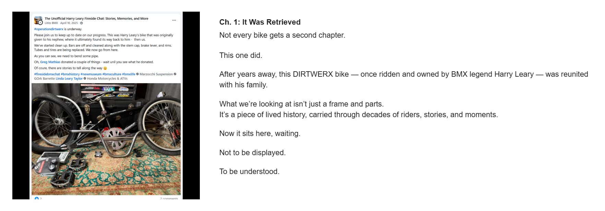

# Chapter 1 — It Was Retrieved

[← Campaign overview](../README.md) | [Chapter index](README.md) | [← Introduction](00-introduction.md) | [Chapter 2 →](02-taking-it-apart-to-save-it.md)

## Record Identification

**Campaign:** #OperationDIRTWERX  
**Official unit:** 1  
**Official title:** It Was Retrieved  
**Primary source date(s):** April 10, 2025  
**Record status:** Verified  
**Original platform:** Google Sites campaign page with preserved Facebook/social-media source records  
**Produced by:** Lititz BMX  
**Archive display version:** 1.1

---

## Resource Structure

1. Preserved original source image or images
2. Searchable transcription of the original published source wording
3. Original campaign-page text
4. Normalized archival summary and context
5. Preserved public archive-page capture or captures
6. Source documentation and verification notes

---

## Public Campaign Page

[View #OperationDIRTWERX — The Story](https://sites.google.com/view/lititzbmxinventorylist/campaigns/operation-dirtwerx-campaigns)

**Stable direct social-media post permalink(s):** Not supplied for the current evidence set

---

## Archival Summary

Chapter 1 establishes the bicycle as a recovered piece of lived BMX history and introduces the project through the April 10, 2025 campaign-launch post showing the bike disassembled for cleanup.

---

## Preserved Published Source Record

### Source 001


*The image above is preserved as a visual source record. Its transcription remains separate so the wording is searchable and accessible.*

#### Preserved Source 001 Text

> #operationdirtwerx is underway.
>
> Please join us to keep up to date on our progress. This was Harry Leary’s bike that was originally given to his nephew, where it ultimately found its way back to him - then us.
>
> We've started clean up. Bars are off and cleaned along with the stem cap, brake lever, and rims.
> Tubes and tires are being replaced. We now go from here.
>
> As you can see, we need to bend some pipe.
>
> Oh, Greg Mathias donated a couple of things - wait until you see what he donated.
>
> Of course, there are stories to tell along the way 😉
>
> #firesidebmxchat #bmxhistory #newmuseum #bmxculture #bmxlife
>
> Tagged accounts visible in the screenshot: Marzocchi Suspension; GOrk Barrette; Linda Leary Taylor; Honda Motorcycles & ATVs.

---

## Original Campaign-Page Text

```text
Ch. 1: It Was Retrieved
Not every bike gets a second chapter.

This one did.

After years away, this DIRTWERX bike — once ridden and owned by BMX legend Harry Leary — was reunited with his family.

What we’re looking at isn’t just a frame and parts.
It’s a piece of lived history, carried through decades of riders, stories, and moments.

Now it sits here, waiting.

Not to be displayed.

To be understood.
```

---

## Archival Context

Chapter 1 establishes the bicycle as a recovered piece of lived BMX history. The accompanying post documents the project’s practical starting point: a disassembled bicycle, initial cleanup, replacement tubes and tires, and the need to address bent tubing.

---

## Preserved Public Archive-Page Capture



*The capture or captures above preserve the public Lititz BMX presentation, including layout, image placement, campaign text, and surrounding context as supplied during the July 2026 archive build.*

---

## Source Documentation

**Campaign ledger:**  
[Operation DIRTWERX Campaign Ledger](../Operation-DIRTWERX-Campaign-Ledger-v1.0.md)

**Source transcriptions:** [Open the preserved source-transcription record](../SOURCE-TRANSCRIPTIONS.md#source-001)  

**Source 001 image:** [Open preserved source image](../source-images/source-001-2025-04-10-campaign-underway.png)  

**Public-page capture:** [Open preserved page capture](../page-captures/page-004-chapter-01-it-was-retrieved.png)  

**Image manifest:** [Open image manifest](../IMAGE-MANIFEST.csv)  
**Fixity manifest:** [Open SHA-256 manifest](../SHA256SUMS.txt)

---

## Verification Notes

- Source 001 is dated April 10, 2025.
- A stable direct Facebook-post permalink was not supplied.
- No missing wording has been invented or reconstructed.

---

## Preservation Note

This record separates original campaign language from later archival explanation. Source images, source transcriptions, campaign-page wording, normalized summaries, public-page captures, and verification findings remain identifiable as different evidence layers rather than being silently merged.

---

[← Campaign overview](../README.md) | [Chapter index](README.md) | [← Introduction](00-introduction.md) | [Chapter 2 →](02-taking-it-apart-to-save-it.md)
