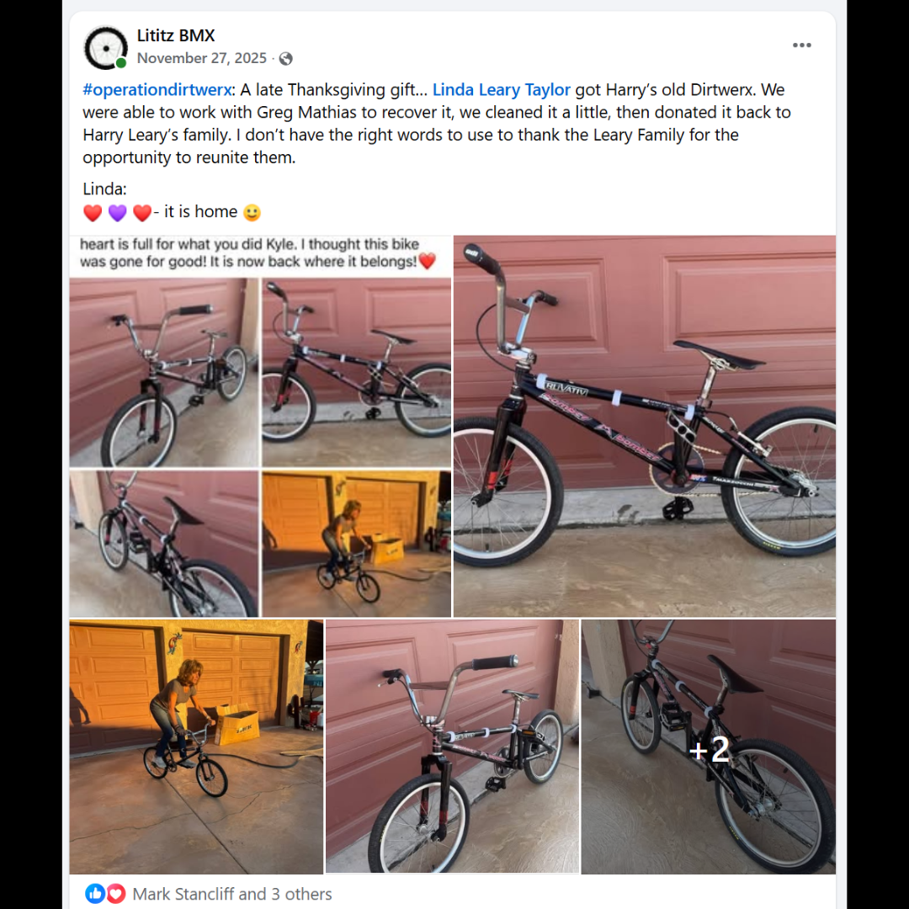
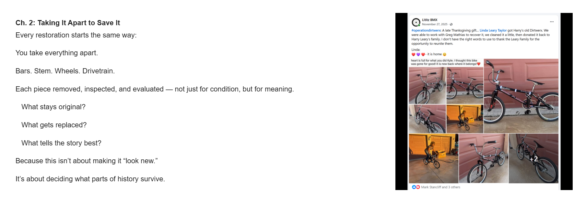

# Chapter 2 — Taking It Apart to Save It

[← Campaign overview](../README.md) | [Chapter index](README.md) | [← Chapter 1](01-it-was-retrieved.md) | [Chapter 3 →](03-the-reality-of-time.md)

## Record Identification

**Campaign:** #OperationDIRTWERX  
**Official unit:** 2  
**Official title:** Taking It Apart to Save It  
**Primary source date(s):** November 27, 2025 source preserved in Chapter 2 page position  
**Record status:** Verified / page placement preserved  
**Original platform:** Google Sites campaign page with preserved Facebook/social-media source records  
**Produced by:** Lititz BMX  
**Archive display version:** 1.1

---

## Resource Structure

1. Preserved original source image or images
2. Searchable transcription of the original published source wording
3. Original campaign-page text
4. Normalized archival summary and context
5. Preserved public archive-page capture or captures
6. Source documentation and verification notes

---

## Public Campaign Page

[View #OperationDIRTWERX — The Story](https://sites.google.com/view/lititzbmxinventorylist/campaigns/operation-dirtwerx-campaigns)

**Stable direct social-media post permalink(s):** Not supplied for the current evidence set

---

## Archival Summary

Chapter 2 explains the preservation choices involved in dismantling and evaluating the bicycle. The live page places the November 27, 2025 family-return post beside this chapter; that placement is preserved without treating it as the chronological beginning of the mechanical work.

---

## Preserved Published Source Record

### Source 002



*The image above is preserved as a visual source record. Its transcription remains separate so the wording is searchable and accessible.*

#### Preserved Source 002 Text

> #operationdirtwerx: A late Thanksgiving gift... Linda Leary Taylor got Harry’s old Dirtwerx. We were able to work with Greg Mathias to recover it, we cleaned it a little, then donated it back to Harry Leary’s family. I don’t have the right words to use to thank the Leary Family for the opportunity to reunite them.
>
> Linda:
> ❤️💜❤️- it is home 😃
>
> Visible embedded message:
> heart is full for what you did Kyle. I thought this bike was gone for good! It is now back where it belongs!❤️
>
> Archival note: the beginning of the embedded message is cropped in the supplied screenshot and is not reconstructed.

---

## Original Campaign-Page Text

```text
Ch. 2: Taking It Apart to Save It
Every restoration starts the same way:

You take everything apart.

Bars. Stem. Wheels. Drivetrain.

Each piece removed, inspected, and evaluated — not just for condition, but for meaning.

   What stays original?

   What gets replaced?

   What tells the story best?

Because this isn’t about making it “look new.”

It’s about deciding what parts of history survive.
```

---

## Archival Context

Chapter 2 explains how dismantling becomes an interpretive act: each part is evaluated for condition, originality, use, and historical meaning. The page’s associated source image records the later outcome—return of the completed bicycle to the Leary family—rather than the chronological beginning of the mechanical work.

---

## Preserved Public Archive-Page Capture



*The capture or captures above preserve the public Lititz BMX presentation, including layout, image placement, campaign text, and surrounding context as supplied during the July 2026 archive build.*

---

## Source Documentation

**Campaign ledger:**  
[Operation DIRTWERX Campaign Ledger](../Operation-DIRTWERX-Campaign-Ledger-v1.0.md)

**Source transcriptions:** [Open the preserved source-transcription record](../SOURCE-TRANSCRIPTIONS.md#source-002)  

**Source 002 image:** [Open preserved source image](../source-images/source-002-2025-11-27-bike-returned-to-family.png)  

**Public-page capture:** [Open preserved page capture](../page-captures/page-005-chapter-02-taking-it-apart-to-save-it.png)  

**Image manifest:** [Open image manifest](../IMAGE-MANIFEST.csv)  
**Fixity manifest:** [Open SHA-256 manifest](../SHA256SUMS.txt)

---

## Verification Notes

- The live campaign page places the November 27, 2025 family-return post beside Chapter 2.
- The archive preserves that official page placement while separately recording Source 002 last in the dated source chronology.
- The cropped beginning of the embedded message is not reconstructed.
- A stable direct Facebook-post permalink was not supplied.

---

## Preservation Note

This record separates original campaign language from later archival explanation. Source images, source transcriptions, campaign-page wording, normalized summaries, public-page captures, and verification findings remain identifiable as different evidence layers rather than being silently merged.

---

[← Campaign overview](../README.md) | [Chapter index](README.md) | [← Chapter 1](01-it-was-retrieved.md) | [Chapter 3 →](03-the-reality-of-time.md)
