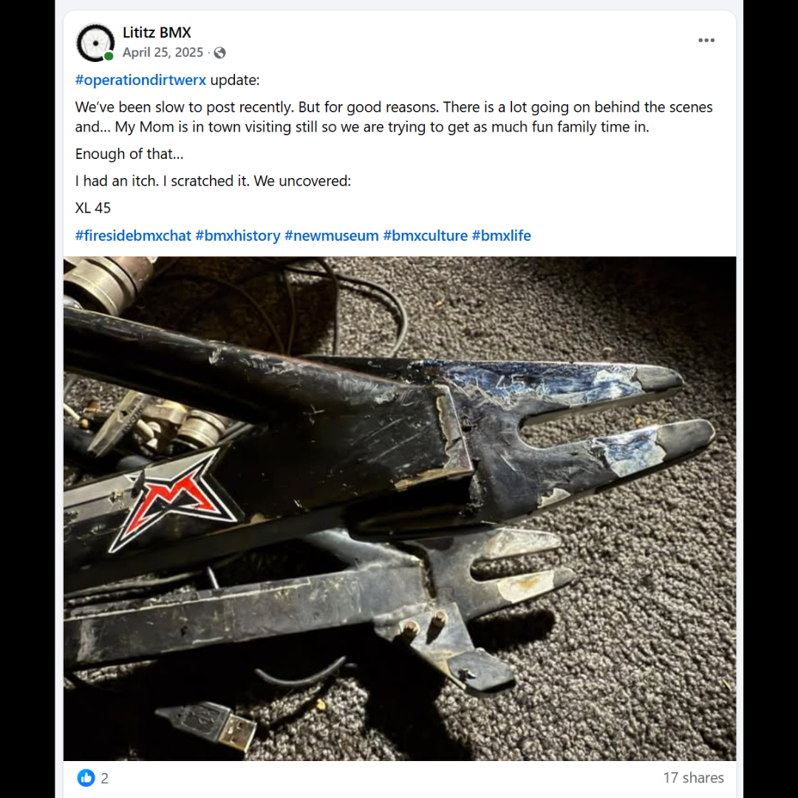
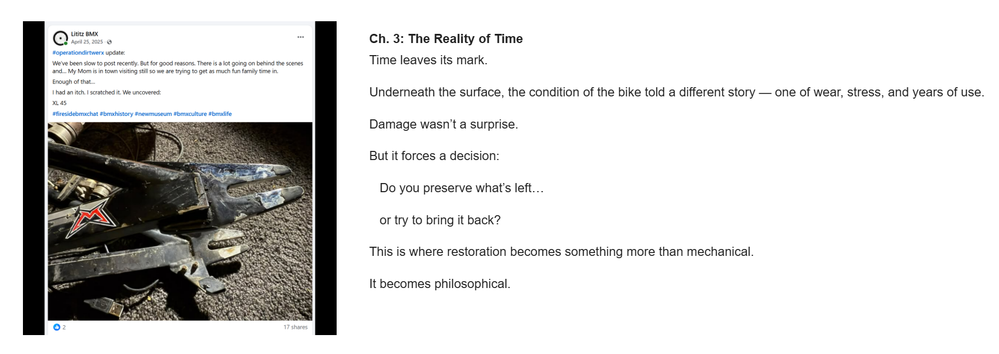

# Chapter 3 — The Reality of Time

[← Campaign overview](../README.md) | [Chapter index](README.md) | [← Chapter 2](02-taking-it-apart-to-save-it.md) | [Chapter 4 →](04-can-this-be-saved.md)

## Record Identification

**Campaign:** #OperationDIRTWERX  
**Official unit:** 3  
**Official title:** The Reality of Time  
**Primary source date(s):** April 25, 2025  
**Record status:** Verified  
**Original platform:** Google Sites campaign page with preserved Facebook/social-media source records  
**Produced by:** Lititz BMX  
**Archive display version:** 1.1

---

## Resource Structure

1. Preserved original source image or images
2. Searchable transcription of the original published source wording
3. Original campaign-page text
4. Normalized archival summary and context
5. Preserved public archive-page capture or captures
6. Source documentation and verification notes

---

## Public Campaign Page

[View #OperationDIRTWERX — The Story](https://sites.google.com/view/lititzbmxinventorylist/campaigns/operation-dirtwerx-campaigns)

**Stable direct social-media post permalink(s):** Not supplied for the current evidence set

---

## Archival Summary

Chapter 3 documents accumulated wear, stress, and damage. The associated source post records the discovery of the XL 45 marking near the rear dropout and supports the chapter's preservation-versus-restoration question.

---

## Preserved Published Source Record

### Source 003



*The image above is preserved as a visual source record. Its transcription remains separate so the wording is searchable and accessible.*

#### Preserved Source 003 Text

> #operationdirtwerx update:
>
> We’ve been slow to post recently. But for good reasons. There is a lot going on behind the scenes and... My Mom is in town visiting still so we are trying to get as much fun family time in.
>
> Enough of that...
>
> I had an itch. I scratched it. We uncovered:
>
> XL 45
>
> #firesidebmxchat #bmxhistory #newmuseum #bmxculture #bmxlife

---

## Original Campaign-Page Text

```text
Ch. 3: The Reality of Time
Time leaves its mark.

Underneath the surface, the condition of the bike told a different story — one of wear, stress, and years of use.

Damage wasn’t a surprise.

But it forces a decision:

   Do you preserve what’s left…

   or try to bring it back?

This is where restoration becomes something more than mechanical.

It becomes philosophical.
```

---

## Archival Context

The chapter frames wear and damage as evidence requiring a preservation decision rather than as defects to be erased automatically. The source post records a specific discovery—XL 45—while the archive avoids assigning a meaning that the surviving source does not establish.

---

## Preserved Public Archive-Page Capture



*The capture or captures above preserve the public Lititz BMX presentation, including layout, image placement, campaign text, and surrounding context as supplied during the July 2026 archive build.*

---

## Source Documentation

**Campaign ledger:**  
[Operation DIRTWERX Campaign Ledger](../Operation-DIRTWERX-Campaign-Ledger-v1.0.md)

**Source transcriptions:** [Open the preserved source-transcription record](../SOURCE-TRANSCRIPTIONS.md#source-003)  

**Source 003 image:** [Open preserved source image](../source-images/source-003-2025-04-25-xl-45-uncovered.png)  

**Public-page capture:** [Open preserved page capture](../page-captures/page-006-chapter-03-the-reality-of-time.png)  

**Image manifest:** [Open image manifest](../IMAGE-MANIFEST.csv)  
**Fixity manifest:** [Open SHA-256 manifest](../SHA256SUMS.txt)

---

## Verification Notes

- Source 003 is dated April 25, 2025.
- The surviving source records the marking as “XL 45.”
- No additional meaning for the marking is asserted without supporting evidence.
- A stable direct Facebook-post permalink was not supplied.

---

## Preservation Note

This record separates original campaign language from later archival explanation. Source images, source transcriptions, campaign-page wording, normalized summaries, public-page captures, and verification findings remain identifiable as different evidence layers rather than being silently merged.

---

[← Campaign overview](../README.md) | [Chapter index](README.md) | [← Chapter 2](02-taking-it-apart-to-save-it.md) | [Chapter 4 →](04-can-this-be-saved.md)
