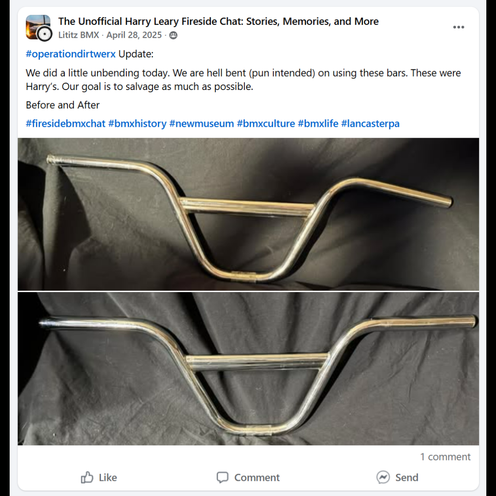
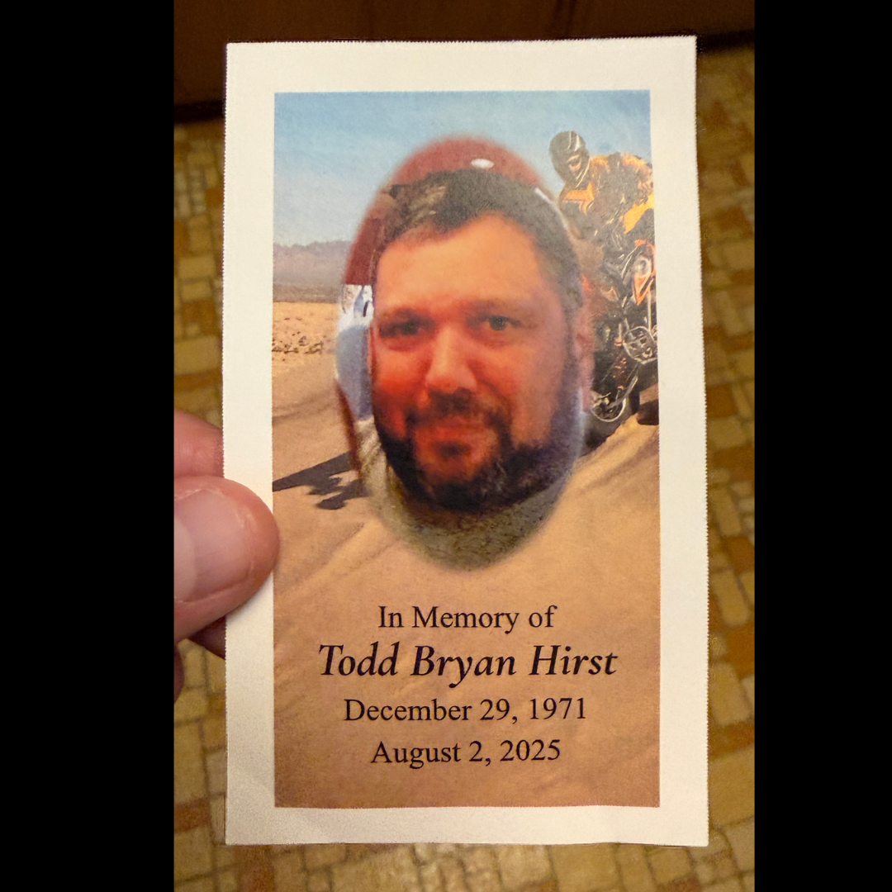
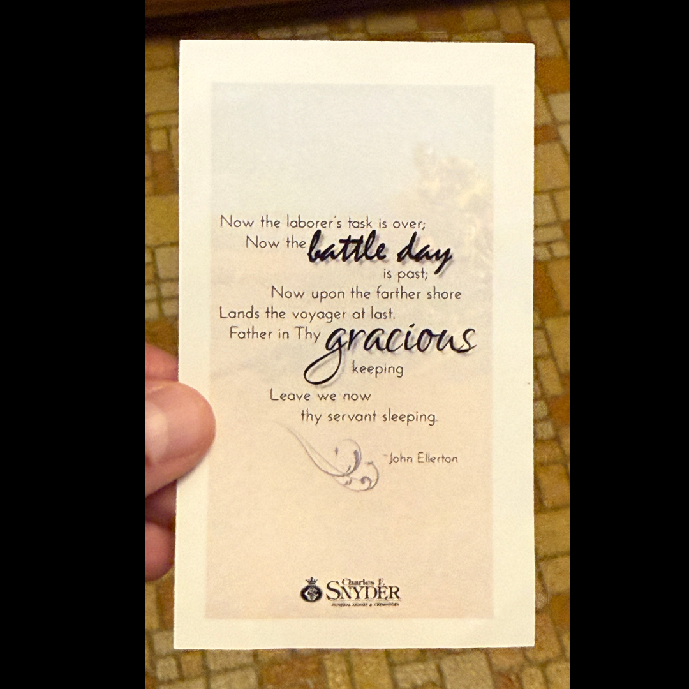
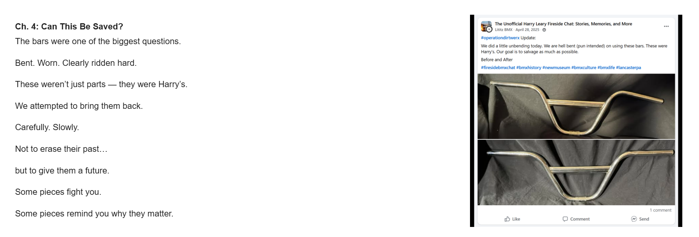
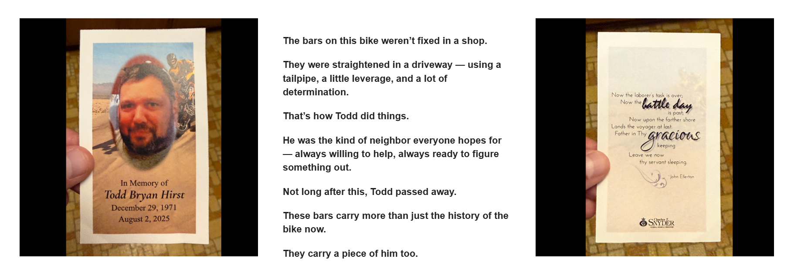

# Chapter 4 — Can This Be Saved?

[← Campaign overview](../README.md) | [Chapter index](README.md) | [← Chapter 3](03-the-reality-of-time.md) | [Chapter 5 →](05-a-community-support.md)

## Record Identification

**Campaign:** #OperationDIRTWERX  
**Official unit:** 4  
**Official title:** Can This Be Saved?  
**Primary source date(s):** April 28, 2025; memorial images undated  
**Record status:** Verified  
**Original platform:** Google Sites campaign page with preserved Facebook/social-media source records  
**Produced by:** Lititz BMX  
**Archive display version:** 1.1

---

## Resource Structure

1. Preserved original source image or images
2. Searchable transcription of the original published source wording
3. Original campaign-page text
4. Normalized archival summary and context
5. Preserved public archive-page capture or captures
6. Source documentation and verification notes

---

## Public Campaign Page

[View #OperationDIRTWERX — The Story](https://sites.google.com/view/lititzbmxinventorylist/campaigns/operation-dirtwerx-campaigns)

**Stable direct social-media post permalink(s):** Not supplied for the current evidence set

---

## Archival Summary

Chapter 4 documents the decision to retain and straighten Harry Leary's bent handlebars. The section also records Todd Bryan Hirst's role in straightening them in a driveway and preserves the memorial context added after his death.

---

## Preserved Published Source Records

### Source 004



*The image above is preserved as a visual source record. Its transcription remains separate so the wording is searchable and accessible.*

#### Preserved Source 004 Text

> #operationdirtwerx Update:
>
> We did a little unbending today. We are hell bent (pun intended) on using these bars. These were Harry’s. Our goal is to salvage as much as possible.
>
> Before and After
>
> #firesidebmxchat #bmxhistory #newmuseum #bmxculture #bmxlife #lancasterpa

### Source 005



*The image above is preserved as a visual source record. Its transcription remains separate so the wording is searchable and accessible.*

#### Preserved Source 005 Text

> In Memory of
> Todd Bryan Hirst
> December 29, 1971
> August 2, 2025

### Source 006



*The image above is preserved as a visual source record. Its transcription remains separate so the wording is searchable and accessible.*

#### Preserved Source 006 Text

> Now the laborer’s task is over;
> Now the battle day is past;
> Now upon the farther shore
> Lands the voyager at last.
> Father in Thy gracious keeping
> Leave we now thy servant sleeping
>
> — John Ellerton
>
> Charles F. Snyder Funeral Homes & Crematory

---

## Original Campaign-Page Text

```text
Ch. 4: Can This Be Saved?
The bars were one of the biggest questions.

Bent. Worn. Clearly ridden hard.

These weren’t just parts — they were Harry’s.

We attempted to bring them back.

Carefully. Slowly.

Not to erase their past…

but to give them a future.

Some pieces fight you.

Some pieces remind you why they matter.

The bars on this bike weren’t fixed in a shop.

They were straightened in a driveway — using a tailpipe, a little leverage, and a lot of determination.

That’s how Todd did things.

He was the kind of neighbor everyone hopes for — always willing to help, always ready to figure something out.

Not long after this, Todd passed away.

These bars carry more than just the history of the bike now.

They carry a piece of him too.
```

---

## Archival Context

Chapter 4 connects mechanical preservation with personal memory. The handlebars were retained because they were documented as Harry Leary’s, and the campaign later preserved Todd Bryan Hirst’s role in straightening them. The chapter therefore records both an intervention on the bicycle and the human relationship attached to that work.

---

## Preserved Public Archive-Page Captures





*The capture or captures above preserve the public Lititz BMX presentation, including layout, image placement, campaign text, and surrounding context as supplied during the July 2026 archive build.*

---

## Source Documentation

**Campaign ledger:**  
[Operation DIRTWERX Campaign Ledger](../Operation-DIRTWERX-Campaign-Ledger-v1.0.md)

**Source transcriptions:** [Open the preserved source-transcription record](../SOURCE-TRANSCRIPTIONS.md#source-004)  

**Source 004 image:** [Open preserved source image](../source-images/source-004-2025-04-28-harry-leary-bars-before-after.png)  

**Source 005 image:** [Open preserved source image](../source-images/source-005-undated-todd-bryan-hirst-memorial-front.png)  

**Source 006 image:** [Open preserved source image](../source-images/source-006-undated-todd-bryan-hirst-memorial-reverse.png)  

**Public-page capture:** [Open preserved page capture](../page-captures/page-007-chapter-04-can-this-be-saved.png)  

**Public-page capture:** [Open preserved page capture](../page-captures/page-008-todd-bryan-hirst-memorial.png)  

**Image manifest:** [Open image manifest](../IMAGE-MANIFEST.csv)  
**Fixity manifest:** [Open SHA-256 manifest](../SHA256SUMS.txt)

---

## Verification Notes

- Source 004 is dated April 28, 2025.
- The memorial-card images do not establish their publication or capture date.
- The dates printed on the memorial card identify Todd Bryan Hirst’s life dates, not the image-publication date.
- No additional biography has been invented.

---

## Preservation Note

This record separates original campaign language from later archival explanation. Source images, source transcriptions, campaign-page wording, normalized summaries, public-page captures, and verification findings remain identifiable as different evidence layers rather than being silently merged.

---

[← Campaign overview](../README.md) | [Chapter index](README.md) | [← Chapter 3](03-the-reality-of-time.md) | [Chapter 5 →](05-a-community-support.md)
