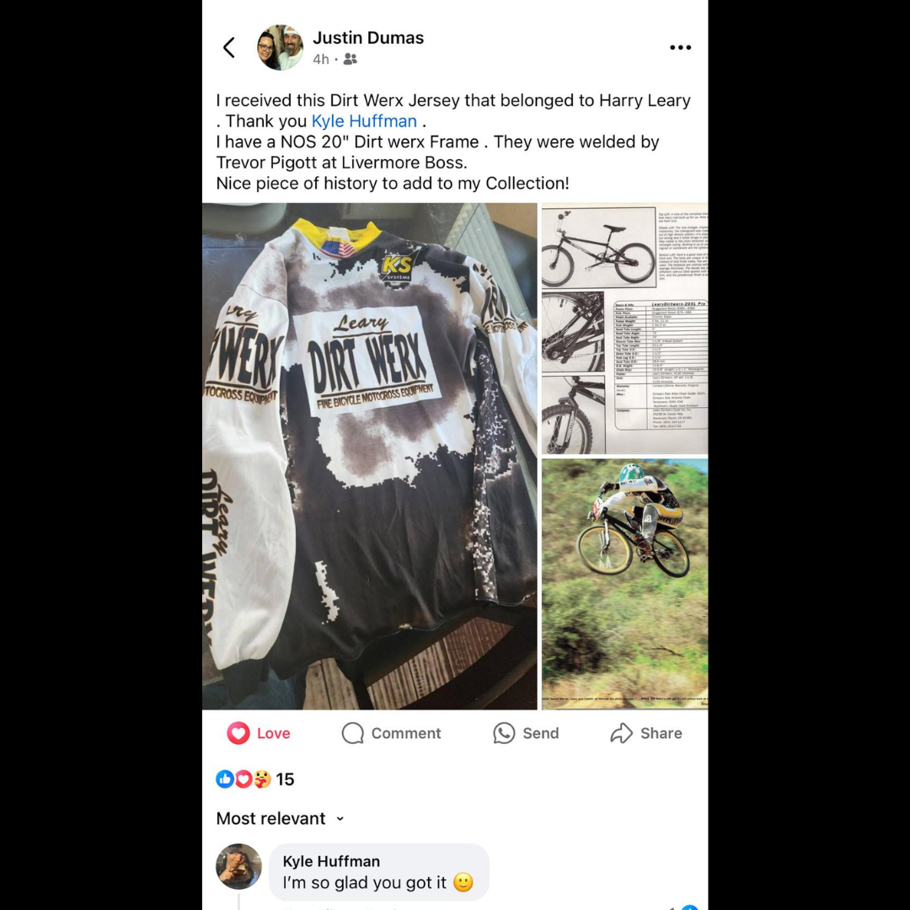
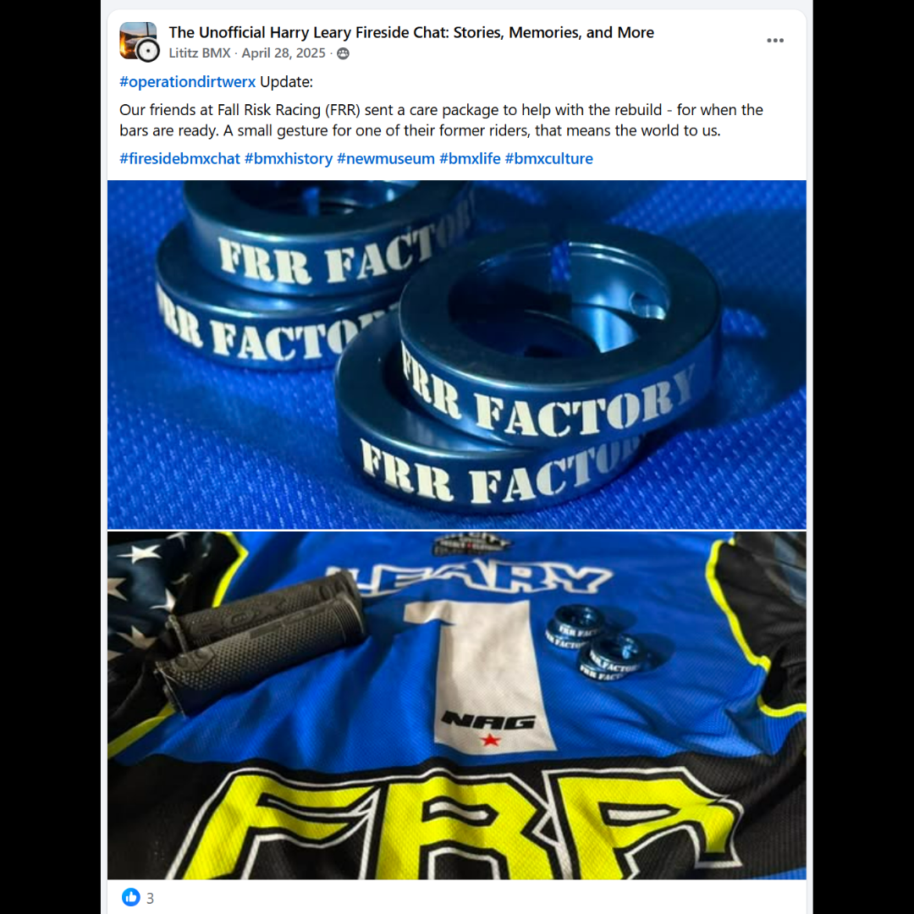
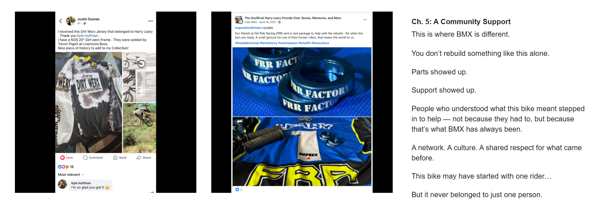

# Chapter 5 — A Community Support

[← Campaign overview](../README.md) | [Chapter index](README.md) | [← Chapter 4](04-can-this-be-saved.md) | [Chapter 6 →](06-every-piece-matters.md)

## Record Identification

**Campaign:** #OperationDIRTWERX  
**Official unit:** 5  
**Official title:** A Community Support  
**Primary source date(s):** April 28, 2025; Justin Dumas post undated  
**Record status:** Verified  
**Original platform:** Google Sites campaign page with preserved Facebook/social-media source records  
**Produced by:** Lititz BMX  
**Archive display version:** 1.1

---

## Resource Structure

1. Preserved original source image or images
2. Searchable transcription of the original published source wording
3. Original campaign-page text
4. Normalized archival summary and context
5. Preserved public archive-page capture or captures
6. Source documentation and verification notes

---

## Public Campaign Page

[View #OperationDIRTWERX — The Story](https://sites.google.com/view/lititzbmxinventorylist/campaigns/operation-dirtwerx-campaigns)

**Stable direct social-media post permalink(s):** Not supplied for the current evidence set

---

## Archival Summary

Chapter 5 documents community connections surrounding the campaign, including support from Fall Risk Racing and Justin Dumas's record of receiving Harry Leary's Dirt Werx jersey. The title is preserved exactly as published: 'A Community Support.'

---

## Preserved Published Source Records

### Source 007



*The image above is preserved as a visual source record. Its transcription remains separate so the wording is searchable and accessible.*

#### Preserved Source 007 Text

> I received this Dirt Werx Jersey that belonged to Harry Leary
> . Thank you Kyle Huffman .
> I have a NOS 20" Dirt werx Frame . They were welded by
> Trevor Pigott at Livermore Boss.
> Nice piece of history to add to my Collection!
>
> Visible Kyle Huffman comment:
> I’m so glad you got it 🙂

### Source 008



*The image above is preserved as a visual source record. Its transcription remains separate so the wording is searchable and accessible.*

#### Preserved Source 008 Text

> #operationdirtwerx Update:
>
> Our friends at Fall Risk Racing (FRR) sent a care package to help with the rebuild - for when the bars are ready. A small gesture for one of their former riders, that means the world to us.
>
> #firesidebmxchat #bmxhistory #newmuseum #bmxlife #bmxculture

---

## Original Campaign-Page Text

```text
Ch. 5: A Community Support
This is where BMX is different.

You don’t rebuild something like this alone.

Parts showed up.

Support showed up.

People who understood what this bike meant stepped in to help — not because they had to, but because that’s what BMX has always been.

A network. A culture. A shared respect for what came before.

This bike may have started with one rider…

But it never belonged to just one person.
```

---

## Archival Context

Chapter 5 documents the network surrounding the bicycle rather than treating preservation as solitary work. It connects Fall Risk Racing’s support with the circulation and preservation of other DIRTWERX-related artifacts and firsthand statements.

---

## Preserved Public Archive-Page Capture



*The capture or captures above preserve the public Lititz BMX presentation, including layout, image placement, campaign text, and surrounding context as supplied during the July 2026 archive build.*

---

## Source Documentation

**Campaign ledger:**  
[Operation DIRTWERX Campaign Ledger](../Operation-DIRTWERX-Campaign-Ledger-v1.0.md)

**Source transcriptions:** [Open the preserved source-transcription record](../SOURCE-TRANSCRIPTIONS.md#source-007)  

**Source 007 image:** [Open preserved source image](../source-images/source-007-undated-justin-dumas-dirt-werx-jersey-post.png)  

**Source 008 image:** [Open preserved source image](../source-images/source-008-2025-04-28-fall-risk-racing-care-package.png)  

**Public-page capture:** [Open preserved page capture](../page-captures/page-009-chapter-05-a-community-support.png)  

**Image manifest:** [Open image manifest](../IMAGE-MANIFEST.csv)  
**Fixity manifest:** [Open SHA-256 manifest](../SHA256SUMS.txt)

---

## Verification Notes

- The title “A Community Support” is preserved exactly as published.
- The supplied pasted page transcription repeated Chapter 5, but the page captures show one official Chapter 5 section.
- Source 007 remains undated because only the relative timestamp “4h” is visible.
- Stable direct Facebook-post permalinks were not supplied.

---

## Preservation Note

This record separates original campaign language from later archival explanation. Source images, source transcriptions, campaign-page wording, normalized summaries, public-page captures, and verification findings remain identifiable as different evidence layers rather than being silently merged.

---

[← Campaign overview](../README.md) | [Chapter index](README.md) | [← Chapter 4](04-can-this-be-saved.md) | [Chapter 6 →](06-every-piece-matters.md)
