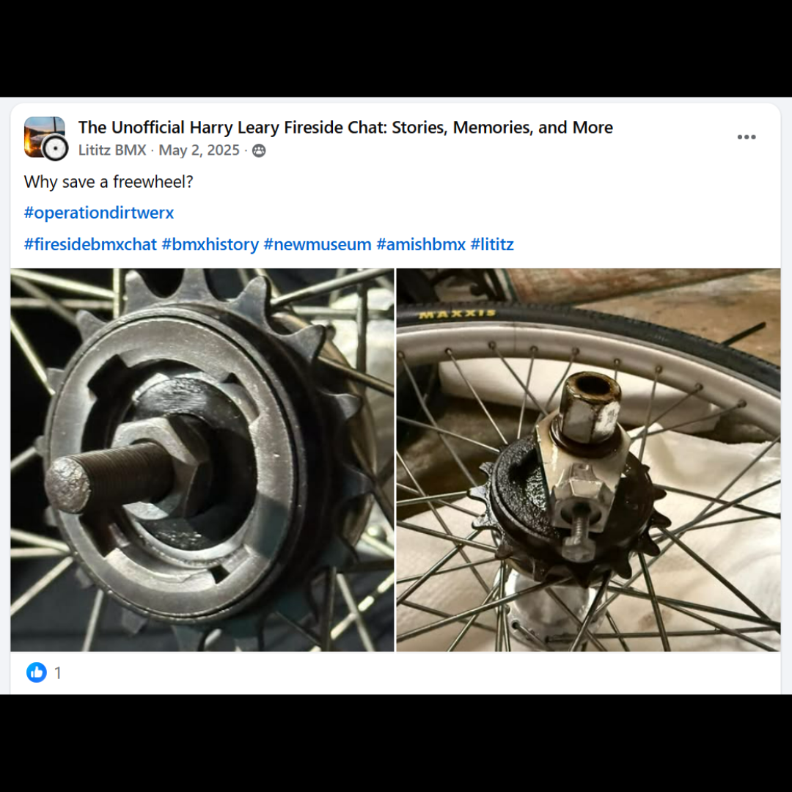
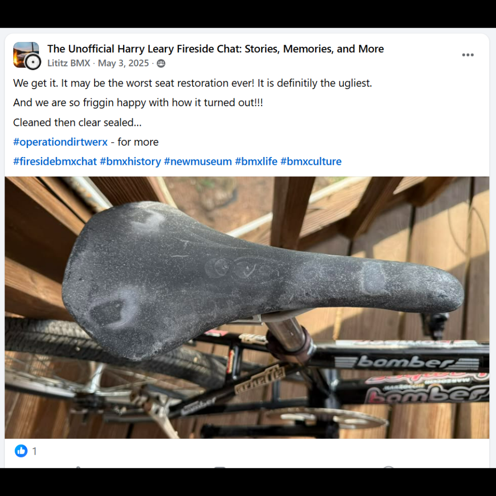
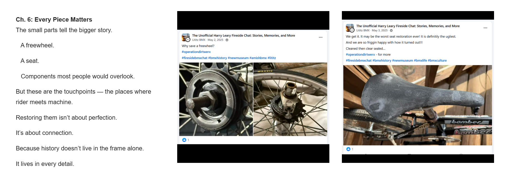

# Chapter 6 — Every Piece Matters

[← Campaign overview](../README.md) | [Chapter index](README.md) | [← Chapter 5](05-a-community-support.md) | [Epilogue →](07-the-work-continues.md)

## Record Identification

**Campaign:** #OperationDIRTWERX  
**Official unit:** 6  
**Official title:** Every Piece Matters  
**Primary source date(s):** May 2–3, 2025  
**Record status:** Verified  
**Original platform:** Google Sites campaign page with preserved Facebook/social-media source records  
**Produced by:** Lititz BMX  
**Archive display version:** 1.1

---

## Resource Structure

1. Preserved original source image or images
2. Searchable transcription of the original published source wording
3. Original campaign-page text
4. Normalized archival summary and context
5. Preserved public archive-page capture or captures
6. Source documentation and verification notes

---

## Public Campaign Page

[View #OperationDIRTWERX — The Story](https://sites.google.com/view/lititzbmxinventorylist/campaigns/operation-dirtwerx-campaigns)

**Stable direct social-media post permalink(s):** Not supplied for the current evidence set

---

## Archival Summary

Chapter 6 focuses on small components as historical touchpoints. The freewheel and seat posts document the choice to retain evidence of use rather than pursue cosmetic perfection.

---

## Preserved Published Source Records

### Source 009



*The image above is preserved as a visual source record. Its transcription remains separate so the wording is searchable and accessible.*

#### Preserved Source 009 Text

> Why save a freewheel?
>
> #operationdirtwerx
>
> #firesidebmxchat #bmxhistory #newmuseum #amishbmx #lititz

### Source 010



*The image above is preserved as a visual source record. Its transcription remains separate so the wording is searchable and accessible.*

#### Preserved Source 010 Text

> We get it. It may be the worst seat restoration ever! It is definitely the ugliest.
>
> And we are so friggin happy with how it turned out!!!
>
> Cleaned then clear sealed...
>
> #operationdirtwerx - for more
>
> #firesidebmxchat #bmxhistory #newmuseum #bmxlife #bmxculture

---

## Original Campaign-Page Text

```text
Ch. 6: Every Piece Matters
The small parts tell the bigger story.

   A freewheel.

   A seat.

   Components most people would overlook.

But these are the touchpoints — the places where rider meets machine.

Restoring them isn’t about perfection.

It’s about connection.

Because history doesn’t live in the frame alone.

It lives in every detail.
```

---

## Archival Context

Chapter 6 treats small components as evidence of use and as physical contact points between rider and machine. The freewheel and seat records make the preservation philosophy concrete: historical value is not limited to the frame or to cosmetically perfect parts.

---

## Preserved Public Archive-Page Capture



*The capture or captures above preserve the public Lititz BMX presentation, including layout, image placement, campaign text, and surrounding context as supplied during the July 2026 archive build.*

---

## Source Documentation

**Campaign ledger:**  
[Operation DIRTWERX Campaign Ledger](../Operation-DIRTWERX-Campaign-Ledger-v1.0.md)

**Source transcriptions:** [Open the preserved source-transcription record](../SOURCE-TRANSCRIPTIONS.md#source-009)  

**Source 009 image:** [Open preserved source image](../source-images/source-009-2025-05-02-freewheel.png)  

**Source 010 image:** [Open preserved source image](../source-images/source-010-2025-05-03-seat-restoration.png)  

**Public-page capture:** [Open preserved page capture](../page-captures/page-010-chapter-06-every-piece-matters.png)  

**Image manifest:** [Open image manifest](../IMAGE-MANIFEST.csv)  
**Fixity manifest:** [Open SHA-256 manifest](../SHA256SUMS.txt)

---

## Verification Notes

- Source 009 is dated May 2, 2025.
- Source 010 is dated May 3, 2025.
- The archive preserves the published wording without silently correcting tone, spelling, or punctuation.
- Stable direct Facebook-post permalinks were not supplied.

---

## Preservation Note

This record separates original campaign language from later archival explanation. Source images, source transcriptions, campaign-page wording, normalized summaries, public-page captures, and verification findings remain identifiable as different evidence layers rather than being silently merged.

---

[← Campaign overview](../README.md) | [Chapter index](README.md) | [← Chapter 5](05-a-community-support.md) | [Epilogue →](07-the-work-continues.md)
