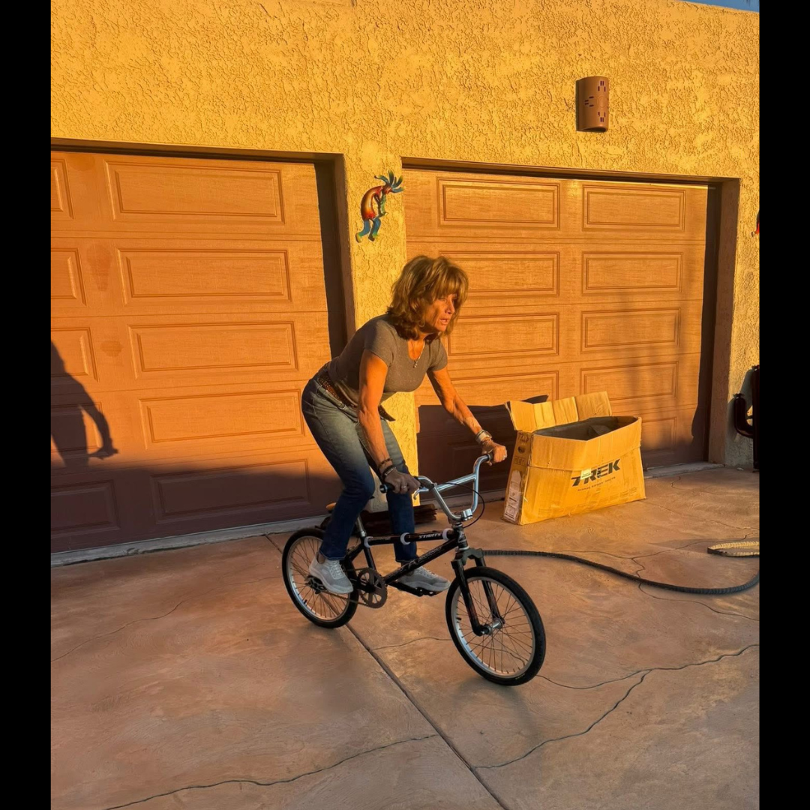
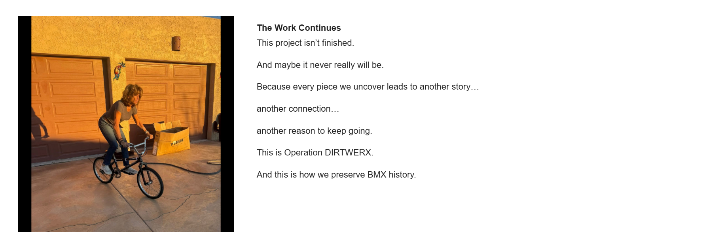

# The Work Continues

[← Campaign overview](../README.md) | [Chapter index](README.md) | [← Chapter 6](06-every-piece-matters.md) | [Supporting material →](08-supporting-material.md)

## Record Identification

**Campaign:** #OperationDIRTWERX  
**Official unit:** Epilogue  
**Official title:** The Work Continues  
**Primary source date(s):** Undated campaign photograph  
**Record status:** Verified / photograph undated  
**Original platform:** Google Sites campaign page with preserved Facebook/social-media source records  
**Produced by:** Lititz BMX  
**Archive display version:** 1.1

---

## Resource Structure

1. Preserved original source image or images
2. Searchable transcription of the original published source wording
3. Original campaign-page text
4. Normalized archival summary and context
5. Preserved public archive-page capture or captures
6. Source documentation and verification notes

---

## Public Campaign Page

[View #OperationDIRTWERX — The Story](https://sites.google.com/view/lititzbmxinventorylist/campaigns/operation-dirtwerx-campaigns)

**Stable direct social-media post permalink(s):** Not supplied for the current evidence set

---

## Archival Summary

The closing section presents the campaign as continuing and open-ended. The accompanying photograph connects the completed bicycle with its return to the Leary family and the larger preservation purpose of the project.

---

## Preserved Published Source Record

### Source 011



*The image above is preserved as a visual source record. Its transcription remains separate so the wording is searchable and accessible.*

#### Preserved Source 011 Text

> No written post text is present in the supplied source image.
>
> Campaign-page context: the photograph is presented in “The Work Continues” section as Linda Leary Taylor riding the completed bicycle.

---

## Original Campaign-Page Text

```text
The Work Continues
This project isn’t finished.

And maybe it never really will be.

Because every piece we uncover leads to another story…

another connection…

another reason to keep going.

This is Operation DIRTWERX.

And this is how we preserve BMX history.
```

---

## Archival Context

The epilogue deliberately leaves the preservation story open. The completed bicycle and the photograph of Linda Leary Taylor connect the mechanical work to family return, continued research, and the broader archive rather than presenting the campaign as a closed restoration transaction.

---

## Preserved Public Archive-Page Capture



*The capture or captures above preserve the public Lititz BMX presentation, including layout, image placement, campaign text, and surrounding context as supplied during the July 2026 archive build.*

---

## Source Documentation

**Campaign ledger:**  
[Operation DIRTWERX Campaign Ledger](../Operation-DIRTWERX-Campaign-Ledger-v1.0.md)

**Source transcriptions:** [Open the preserved source-transcription record](../SOURCE-TRANSCRIPTIONS.md#source-011)  

**Source 011 image:** [Open preserved source image](../source-images/source-011-undated-linda-leary-taylor-riding-bike.png)  

**Public-page capture:** [Open preserved page capture](../page-captures/page-011-the-work-continues.png)  

**Image manifest:** [Open image manifest](../IMAGE-MANIFEST.csv)  
**Fixity manifest:** [Open SHA-256 manifest](../SHA256SUMS.txt)

---

## Verification Notes

- Source 011 is preserved as an undated campaign photograph.
- The original capture date and source-file provenance were not supplied.
- No written social-media post is reconstructed for the photograph.

---

## Preservation Note

This record separates original campaign language from later archival explanation. Source images, source transcriptions, campaign-page wording, normalized summaries, public-page captures, and verification findings remain identifiable as different evidence layers rather than being silently merged.

---

[← Campaign overview](../README.md) | [Chapter index](README.md) | [← Chapter 6](06-every-piece-matters.md) | [Supporting material →](08-supporting-material.md)
