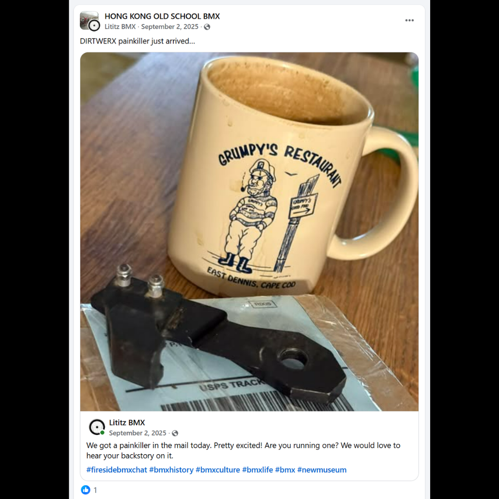
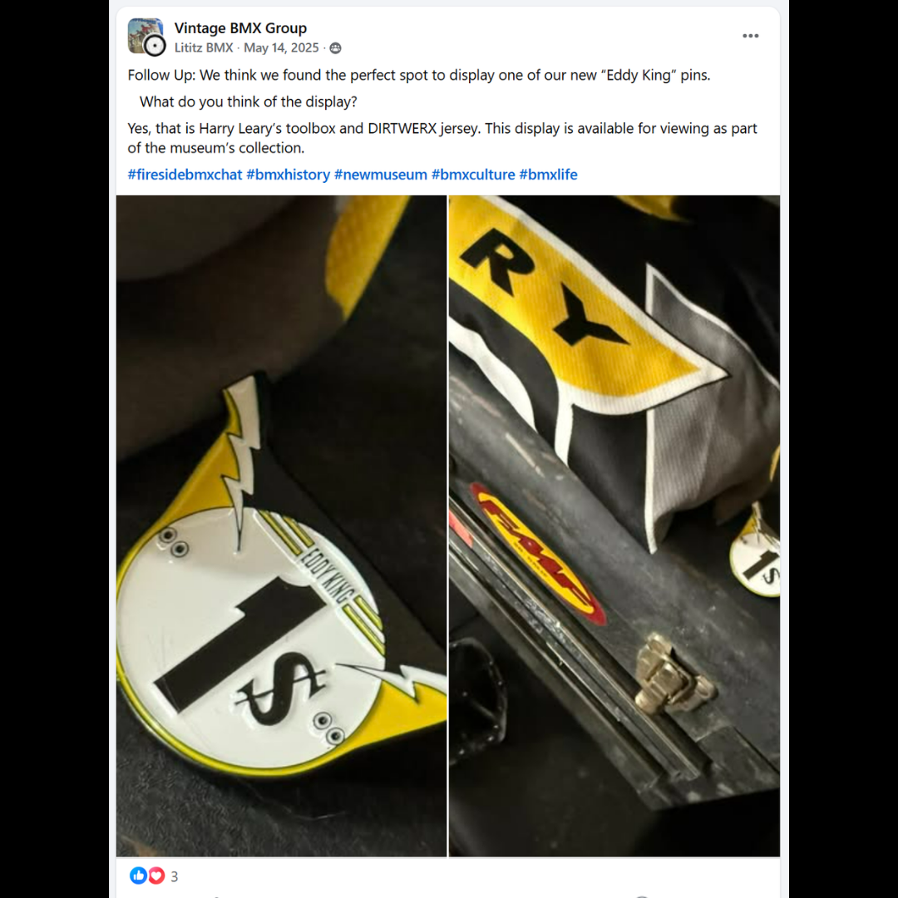
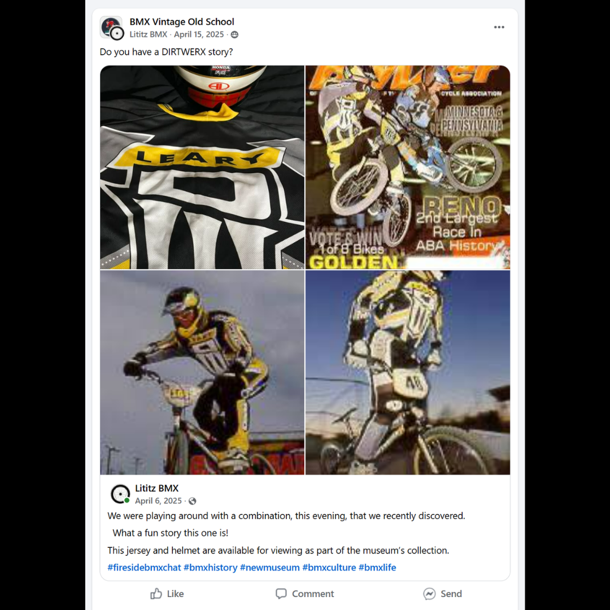
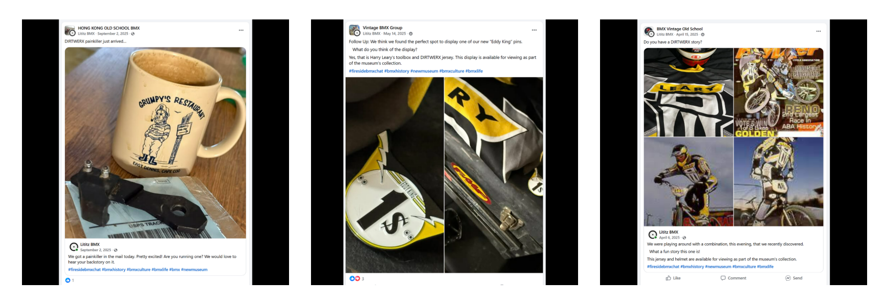

# Supporting DIRTWERX Material

[← Campaign overview](../README.md) | [Chapter index](README.md) | [← Epilogue](07-the-work-continues.md)

## Record Identification

**Campaign:** #OperationDIRTWERX  
**Official unit:** Supporting  
**Official title:** Supporting DIRTWERX Posts and Related Records  
**Primary source date(s):** April 15, May 14, and September 2, 2025  
**Record status:** Verified supporting records  
**Original platform:** Google Sites campaign page with preserved Facebook/social-media source records  
**Produced by:** Lititz BMX  
**Archive display version:** 1.1

---

## Resource Structure

1. Preserved original source image or images
2. Searchable transcription of the original published source wording
3. Original campaign-page text
4. Normalized archival summary and context
5. Preserved public archive-page capture or captures
6. Source documentation and verification notes

---

## Public Campaign Page

[View #OperationDIRTWERX — The Story](https://sites.google.com/view/lititzbmxinventorylist/campaigns/operation-dirtwerx-campaigns)

**Stable direct social-media post permalink(s):** Not supplied for the current evidence set

---

## Archival Summary

The supporting-material section preserves three related posts concerning a DIRTWERX 'painkiller,' an Eddy King pin display with Harry Leary's toolbox and jersey, and a jersey-and-helmet display inviting additional DIRTWERX stories.

---

## Preserved Published Source Records

### Source 012

*The image above is preserved as a visual source record. Its transcription remains separate so the wording is searchable and accessible.*

#### Preserved Source 012 Text

> Share caption:
> DIRTWERX painkiller just arrived...
>
> Embedded Lititz BMX post:
> We got a painkiller in the mail today. Pretty excited! Are you running one? We would love to hear your backstory on it.
>
> #firesidebmxchat #bmxhistory #bmxculture #bmxlife #bmx #newmuseum

### Source 013

*The image above is preserved as a visual source record. Its transcription remains separate so the wording is searchable and accessible.*

#### Preserved Source 013 Text

> Follow Up: We think we found the perfect spot to display one of our new “Eddy King” pins.
>
> What do you think of the display?
>
> Yes, that is Harry Leary’s toolbox and DIRTWERX jersey. This display is available for viewing as part of the museum’s collection.
>
> #firesidebmxchat #bmxhistory #newmuseum #bmxculture #bmxlife

### Source 014

*The image above is preserved as a visual source record. Its transcription remains separate so the wording is searchable and accessible.*

#### Preserved Source 014 Text

> Share caption:
> Do you have a DIRTWERX story?
>
> Embedded Lititz BMX post:
> We were playing around with a combination, this evening, that we recently discovered.
>
> What a fun story this one is!
>
> This jersey and helmet are available for viewing as part of the museum’s collection.
>
> #firesidebmxchat #bmxhistory #newmuseum #bmxculture #bmxlife

---

## Original Campaign-Page Text

No separate official campaign-page narrative was supplied for this supporting-material unit.

---

## Archival Context

The supporting records extend the campaign beyond a single bicycle. They connect DIRTWERX components, apparel, personal tools, display objects, audience prompts, and related public media, showing how the campaign functions as an entry point into a wider network of BMX artifacts and memories.

### Related Media Visible on the Campaign Page

The supplied page capture shows three YouTube embeds. Their visible titles are truncated in the screenshot:

1. `Harry Leary's Celebration of Life. Re...`
2. `Fireside BMX Chat Harry Leary's M...`
3. `Fireside BMX Chat w/ Linda Leary T...`

Direct video URLs were not supplied and are not guessed.

### Related Artifacts Visible on the Campaign Page

- Artifact 26.0037 — Cactus Park BMX State Qualifier - "1st" - Radical Rick Plaque - First of the Leary Locker purchases
- Artifact 26.0021 — Harry Leary Thrill ROC 1 Jersey (Race Of Champions)
- Artifact 26.0007 — Eddy King Lapel Pin

### Highlighted Campaign Pages Visible on the Campaign Page

- #OperationDIRTWERX - The Story
- 10,000 Hours - Sometimes You Feel Tired
- #RebuildRadicalRick - Episode 1: We Can Rebuild Him - The Puzzle Begins

### Closing and Sponsorship

> "Ride and Shine with Lititz BMX" - We Look Forward to Sharing with You

**Campaign sponsor:** Green Mountain Cyclery

---

## Preserved Public Archive-Page Capture

*The capture or captures above preserve the public Lititz BMX presentation, including layout, image placement, campaign text, and surrounding context as supplied during the July 2026 archive build.*

---

## Source Documentation

**Campaign ledger:**  
[Operation DIRTWERX Campaign Ledger](../Operation-DIRTWERX-Campaign-Ledger-v1.0.md)

**Source transcriptions:** [Open the preserved source-transcription record](../SOURCE-TRANSCRIPTIONS.md#source-012)  

**Source 012 image:** [Open preserved source image](../source-images/source-012-2025-09-02-dirtwerx-painkiller.png)  

**Source 013 image:** [Open preserved source image](../source-images/source-013-2025-05-14-eddy-king-pin-display.png)  

**Source 014 image:** [Open preserved source image](../source-images/source-014-2025-04-15-dirtwerx-story-jersey-helmet.png)  

**Public-page capture:** [Open preserved page capture](../page-captures/page-012-supporting-posts.png)  

**Image manifest:** [Open image manifest](../IMAGE-MANIFEST.csv)  
**Fixity manifest:** [Open SHA-256 manifest](../SHA256SUMS.txt)

---

## Verification Notes

- Source 014 preserves two visible dates: the April 15 share date and the April 6 embedded-post date.
- Direct Facebook-post URLs were not supplied and are not guessed.
- The direct URLs behind the visible YouTube embeds and related-page labels were not supplied and are not guessed.

---

## Preservation Note

This record separates original campaign language from later archival explanation. Source images, source transcriptions, campaign-page wording, normalized summaries, public-page captures, and verification findings remain identifiable as different evidence layers rather than being silently merged.

---

[← Campaign overview](../README.md) | [Chapter index](README.md) | [← Epilogue](07-the-work-continues.md)
