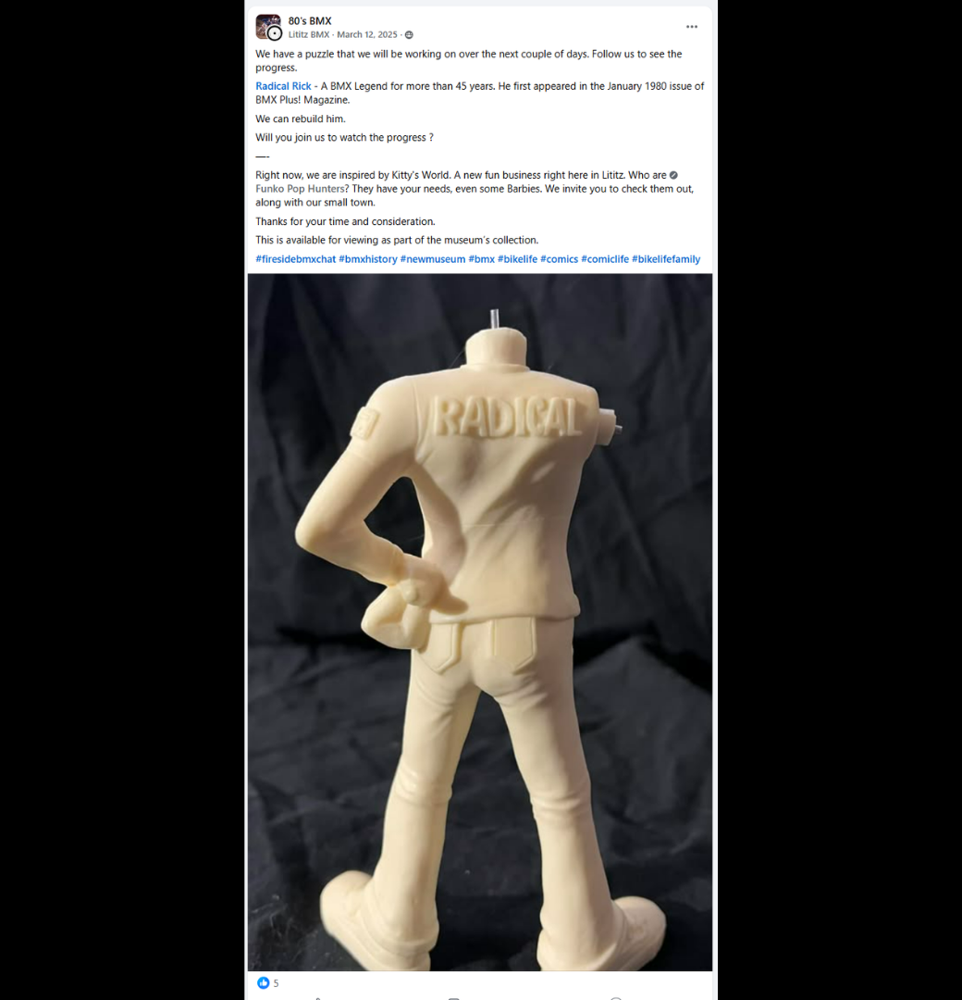
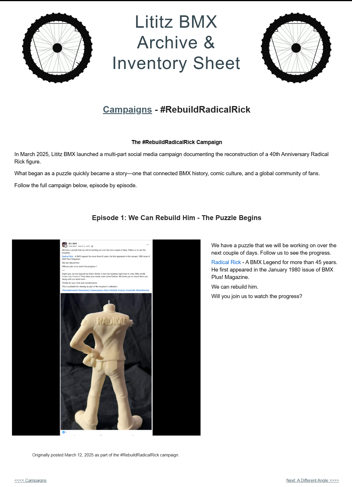

# Episode 1: We Can Rebuild Him — The Puzzle Begins

[← Campaign overview](../README.md) | [Episode index](README.md) | [Episode 2 →](episode-02-a-different-angle.md)

## Episode Identification

**Campaign:** #RebuildRadicalRick  
**Official episode number:** 1  
**Official title:** We Can Rebuild Him — The Puzzle Begins  
**Publication date:** March 12, 2025  
**Chronological position:** 1  
**Record status:** Verified  
**Original platform:** Facebook  
**Produced by:** Lititz BMX  
**Archive display version:** 1.1

---

## Resource Structure

1. Preserved original social-media post image
2. Original published campaign text
3. Normalized episode summary and archival context
4. Full public archive-page capture
5. Source documentation and verification notes

---

## Public Archive Page

[View Episode 1 and the original campaign introduction](https://sites.google.com/view/lititzbmxinventorylist/campaigns/rebuild-radical-rick-campaigns)

**Original social-media post:** Not yet recovered as a stable direct-post permalink  
**Facebook page reference:** [80's BMX / bmxrules](https://www.facebook.com/bmxrules)

---

## Episode Summary

Episode 1 introduced the #RebuildRadicalRick campaign by presenting the primary body component of a 40th Anniversary Radical Rick figure as the beginning of a puzzle.

The post invited the public to follow the reconstruction over the following days and established basic historical context by noting that Radical Rick first appeared in the January 1980 issue of *BMX Plus!* Magazine.

The phrase “We can rebuild him” established the campaign’s central concept: documenting the figure’s reconstruction one piece at a time through a serialized public story.

---

## Published Social-Media Source Image

*The screenshot above is preserved as the visual source record for the published campaign post. The transcription below remains separate so the wording is searchable and accessible.*

---

## Original Published Text

> We have a puzzle that we will be working on over the next couple of days. Follow us to see the progress.
>
> Radical Rick - A BMX Legend for more than 45 years. He first appeared in the January 1980 issue of BMX Plus! Magazine.
>
> We can rebuild him.
>
> Will you join us to watch the progress?

The wording above is preserved from the verified campaign page and supplied source screenshot.

---

## Archival Context

This episode serves as both the opening installment and the introduction to the full #RebuildRadicalRick campaign.

The accompanying image shows the figure’s headless body before reconstruction. By withholding the remaining components, the post created a visual mystery and encouraged followers to return for subsequent reveals.

The episode also connected the physical figure to the longer history of Radical Rick in *BMX Plus!* Magazine. That connection established that the campaign would document more than the assembly of an object: it would also explore BMX publishing, comic history, creator history, and community memory.

Episode 1 remains on the primary campaign page rather than on a separate numbered episode page.

---

## Related Subjects

- Radical Rick
- Damian X. Fulton
- *BMX Plus!* Magazine
- 40th Anniversary Radical Rick figure
- BMX comic history
- BMX preservation
- Serialized social-media storytelling
- Lititz BMX

---

## Related Media and Resources

- [View the complete public campaign](https://sites.google.com/view/lititzbmxinventorylist/campaigns/rebuild-radical-rick-campaigns)
- [Watch the Fireside BMX Chat featuring Damian X. Fulton](https://youtu.be/vtVr6GBJtlM?feature=shared)
- [Visit the Radical Rick website](https://radicalrickbmx.com/)

---

## Preserved Public Archive Page Capture

*This full-page capture preserves the public Lititz BMX presentation, including layout, image placement, campaign text, and navigation as supplied during the July 2026 archive build.*

---

## Source Documentation

**Campaign ledger:**  
[Rebuild Radical Rick Campaign Ledger](../ledger/Rebuild-Radical-Rick-Campaign-Ledger-v1.0.md)

**Published-post screenshot:** [Open preserved source image](../source-images/episode-01-facebook-post.png)  
**Public-page capture:** [Open preserved page capture](../page-captures/episode-01-page-capture.png)  
**Image-evidence status:** Verified and visibly presented in this record

**Source-text status:** Verified from the supplied screenshot, campaign-page transcription, and public archive page

---

## Verification Notes

- The official title, publication date, image, and episode text have been verified.
- Episode 1 was published on March 12, 2025.
- Episode 1 is first in both official numbering and publication chronology.
- The primary campaign page also functions as the public Episode 1 page.
- A stable direct permalink to the original Facebook post has not yet been recovered.
- The supplied Facebook URL has therefore not been treated as a verified direct-post permalink.
- No missing wording has been invented or reconstructed.

---

## Preservation Note

This episode record separates original campaign language from later archival explanation.

The verified post wording is preserved in the **Original Published Text** section. The episode summary and archival context were written later to explain the record and do not replace or alter the original source.

---

[← Campaign overview](../README.md) | [Episode index](README.md) | [Episode 2 →](episode-02-a-different-angle.md)
