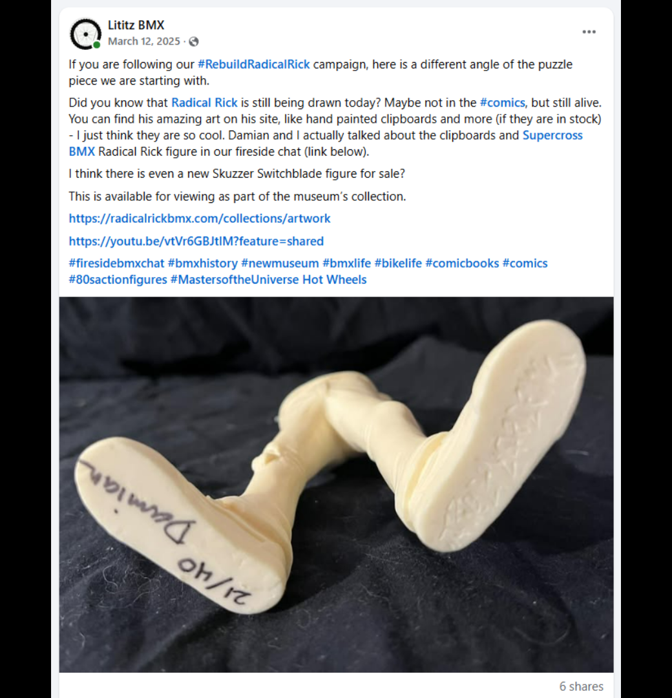
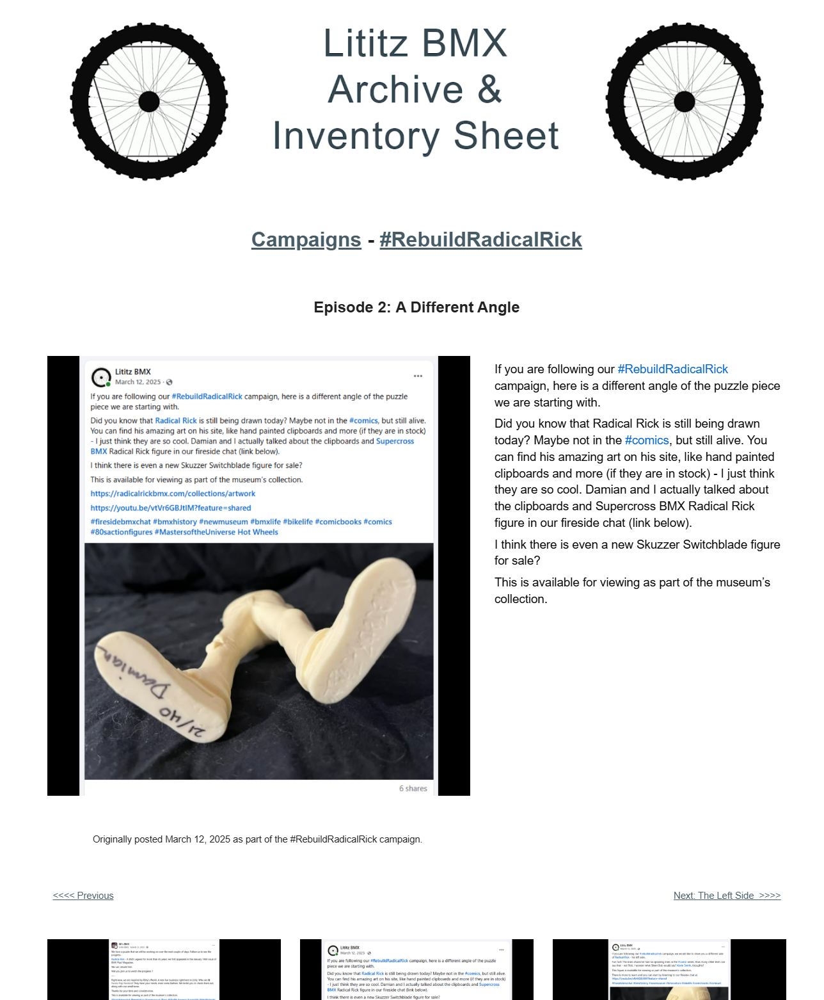

# Episode 2: A Different Angle

[← Episode 1](episode-01-we-can-rebuild-him-the-puzzle-begins.md) | [Episode index](README.md) | [Episode 3 →](episode-03-the-left-side.md)

## Episode Identification

**Campaign:** #RebuildRadicalRick  
**Official episode number:** 2  
**Official title:** A Different Angle  
**Publication date:** March 12, 2025  
**Chronological position:** 2  
**Record status:** Verified  
**Original platform:** Facebook  
**Produced by:** Lititz BMX  
**Archive display version:** 1.1

---

## Resource Structure

1. Preserved original social-media post image
2. Original published campaign text
3. Normalized episode summary and archival context
4. Full public archive-page capture
5. Source documentation and verification notes

---

## Public Archive Page

[View Episode 2 in the Lititz BMX Archive](https://sites.google.com/view/lititzbmxinventorylist/campaigns/rebuild-radical-rick-campaigns/episode-2-rebuild-radical-rick-campaigns)

**Original social-media post:** Not yet recovered as a stable direct-post permalink

---

## Episode Summary

Episode 2 presented a different view of the starting figure component, showing the underside and lower portion of the unassembled 40th Anniversary Radical Rick figure.

The post expanded the campaign beyond the physical reconstruction by directing readers toward contemporary Radical Rick artwork, hand-painted clipboards, related figures, and the Fireside BMX Chat with Radical Rick creator Damian X. Fulton.

---

## Published Social-Media Source Image

*The screenshot above is preserved as the visual source record for the published campaign post. The transcription below remains separate so the wording is searchable and accessible.*

---

## Original Published Text

> If you are following our #RebuildRadicalRick campaign, here is a different angle of the puzzle piece we are starting with.
>
> Did you know that Radical Rick is still being drawn today? Maybe not in the #comics, but still alive. You can find his amazing art on his site, like hand painted clipboards and more (if they are in stock) - I just think they are so cool. Damian and I actually talked about the clipboards and Supercross BMX Radical Rick figure in our fireside chat (link below).
>
> I think there is even a new Skuzzer Switchblade figure for sale?
>
> This is available for viewing as part of the museum’s collection.

The wording above is preserved from the verified campaign page and supplied source screenshot.

---

## Archival Context

Episode 2 continued the opening-day reveal by showing the starting component from another angle.

The post also established an important pattern used throughout the campaign: each reconstruction update served as an entry point into a larger subject. In this case, the physical figure connected audiences with current Radical Rick artwork, collectible figures, Damian X. Fulton’s creative work, and the related Fireside BMX Chat interview.

This episode therefore advanced both the visual puzzle and the campaign’s educational purpose.

---

## Related Subjects

- Radical Rick
- Damian X. Fulton
- 40th Anniversary Radical Rick figure
- Radical Rick artwork
- Hand-painted clipboards
- Supercross BMX Radical Rick figure
- Skuzzer Switchblade
- BMX comic history
- Fireside BMX Chat
- Lititz BMX

---

## Related Media and Resources

- [View the complete public campaign](https://sites.google.com/view/lititzbmxinventorylist/campaigns/rebuild-radical-rick-campaigns)
- [View Radical Rick artwork](https://radicalrickbmx.com/collections/artwork)
- [Watch the Fireside BMX Chat featuring Damian X. Fulton](https://youtu.be/vtVr6GBJtlM?feature=shared)

---

## Preserved Public Archive Page Capture

*This full-page capture preserves the public Lititz BMX presentation, including layout, image placement, campaign text, and navigation as supplied during the July 2026 archive build.*

---

## Source Documentation

**Campaign ledger:**  
[Rebuild Radical Rick Campaign Ledger](../ledger/Rebuild-Radical-Rick-Campaign-Ledger-v1.0.md)

**Published-post screenshot:** [Open preserved source image](../source-images/episode-02-facebook-post.png)  
**Public-page capture:** [Open preserved page capture](../page-captures/episode-02-page-capture.png)  
**Image-evidence status:** Verified and visibly presented in this record

**Source-text status:** Verified from the supplied screenshot, campaign-page transcription, and public archive page

---

## Verification Notes

- The official episode number, title, publication date, image, and published text have been verified.
- Episode 2 was published on March 12, 2025, the same date as Episode 1.
- Episode 2 is second in both official numbering and verified publication chronology.
- The public archive provides a separate Episode 2 page.
- A stable direct permalink to the original Facebook post has not yet been recovered.
- The question concerning a Skuzzer Switchblade figure is preserved as originally published and has not been converted into a verified factual statement.
- No missing wording has been invented or reconstructed.

---

## Preservation Note

This episode record separates original campaign language from later archival explanation.

The verified post wording is preserved in the **Original Published Text** section. The episode summary and archival context were written later to explain the record and do not replace or alter the original source.

---

[← Episode 1](episode-01-we-can-rebuild-him-the-puzzle-begins.md) | [Episode index](README.md) | [Episode 3 →](episode-03-the-left-side.md)
