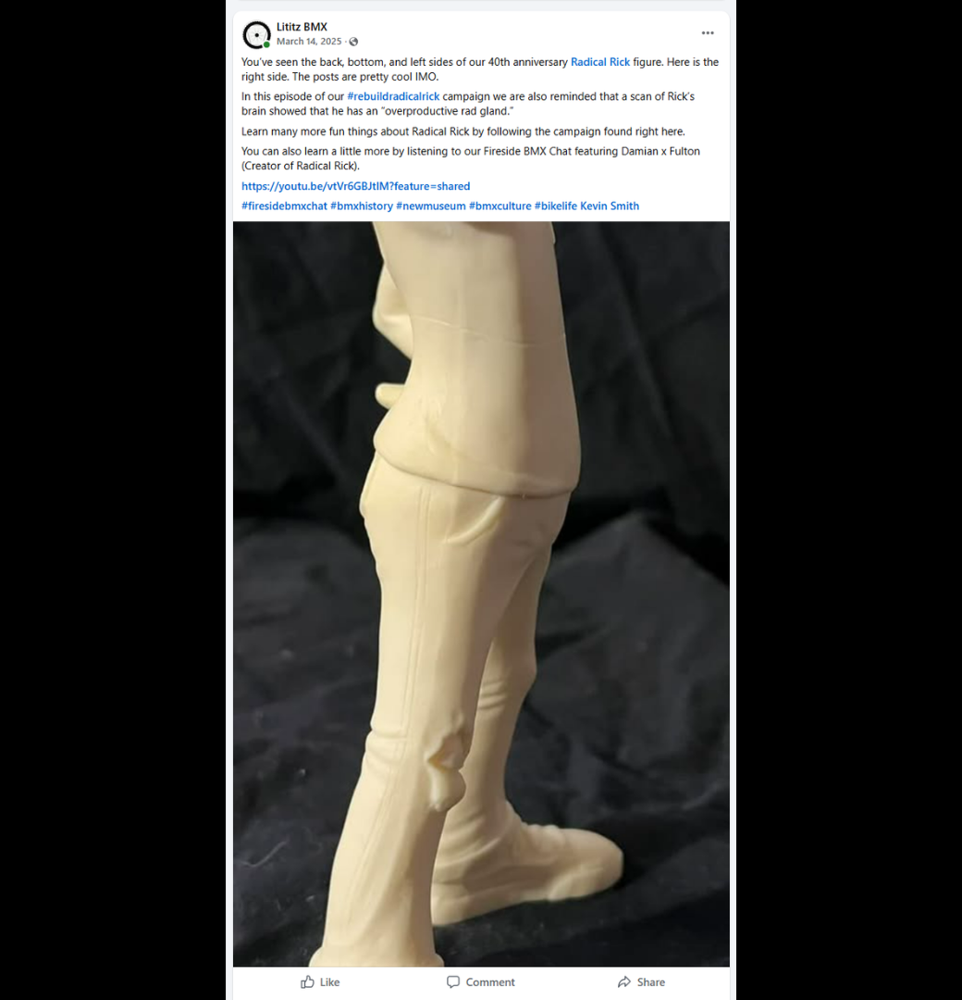
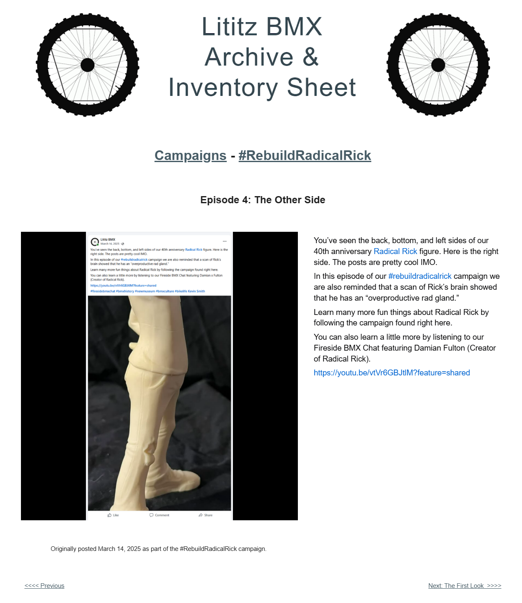

# Episode 4: The Other Side

[← Episode 3](episode-03-the-left-side.md) | [Episode index](README.md) | [Episode 5 →](episode-05-forward-facing.md)

## Episode Identification

**Campaign:** #RebuildRadicalRick  
**Official episode number:** 4  
**Official title:** The Other Side  
**Publication date:** March 14, 2025  
**Chronological position:** 4  
**Record status:** Verified  
**Original platform:** Facebook  
**Produced by:** Lititz BMX  
**Archive display version:** 1.1

---

## Resource Structure

1. Preserved original social-media post image
2. Original published campaign text
3. Normalized episode summary and archival context
4. Full public archive-page capture
5. Source documentation and verification notes

---

## Public Archive Page

[View the complete #RebuildRadicalRick campaign](https://sites.google.com/view/lititzbmxinventorylist/campaigns/rebuild-radical-rick-campaigns)

**Separate Episode 4 archive-page URL:** Not yet recorded  
**Original social-media post:** Not yet recovered as a stable direct-post permalink

---

## Episode Summary

Episode 4 completed the opening examination of the figure’s primary body component by presenting its right side.

The post continued the campaign’s mixture of physical documentation, humor, and Radical Rick history by referencing the character’s fictional “overproductive rad gland.”

It also directed audiences to the larger campaign and the Fireside BMX Chat featuring Radical Rick creator Damian Fulton.

---

## Published Social-Media Source Image

*The screenshot above is preserved as the visual source record for the published campaign post. The transcription below remains separate so the wording is searchable and accessible.*

---

## Original Published Text

> You’ve seen the back, bottom, and left sides of our 40th anniversary Radical Rick figure. Here is the right side. The posts are pretty cool IMO.
>
> In this episode of our #rebuildradicalrick campaign we are also reminded that a scan of Rick’s brain showed that he has an “overproductive rad gland.”
>
> Learn many more fun things about Radical Rick by following the campaign found right here.
>
> You can also learn a little more by listening to our Fireside BMX Chat featuring Damian Fulton (Creator of Radical Rick).
>
> https://youtu.be/vtVr6GBJtlM?feature=shared

The wording above is preserved from the verified campaign page and supplied source screenshot.

---

## Archival Context

Episode 4 concluded the campaign’s initial series of views documenting the unassembled figure body.

Episodes 1 through 4 presented the body from the back, bottom, left, and right. This established a visual baseline before additional pieces were introduced and attached.

The “overproductive rad gland” reference preserved the humor associated with Radical Rick while connecting the physical reconstruction with the character’s fictional history. The linked Fireside BMX Chat expanded that connection through a firsthand conversation with creator Damian Fulton.

---

## Related Subjects

- Radical Rick
- Damian Fulton
- 40th Anniversary Radical Rick figure
- Radical Rick character history
- BMX comic history
- BMX preservation
- Fireside BMX Chat
- Lititz BMX

---

## Related Media and Resources

- [View the complete public campaign](https://sites.google.com/view/lititzbmxinventorylist/campaigns/rebuild-radical-rick-campaigns)
- [Watch the Fireside BMX Chat featuring Damian Fulton](https://youtu.be/vtVr6GBJtlM?feature=shared)
- [Visit the Radical Rick website](https://radicalrickbmx.com/)

---

## Preserved Public Archive Page Capture

*This full-page capture preserves the public Lititz BMX presentation, including layout, image placement, campaign text, and navigation as supplied during the July 2026 archive build.*

---

## Source Documentation

**Campaign ledger:**  
[Rebuild Radical Rick Campaign Ledger](../ledger/Rebuild-Radical-Rick-Campaign-Ledger-v1.0.md)

**Published-post screenshot:** [Open preserved source image](../source-images/episode-04-facebook-post.png)  
**Public-page capture:** [Open preserved page capture](../page-captures/episode-04-page-capture.png)  
**Image-evidence status:** Verified and visibly presented in this record

**Source-text status:** Verified from the supplied screenshot and campaign-page transcription

---

## Verification Notes

- The official episode number, title, publication date, image, and published text have been verified.
- Episode 4 was published on March 14, 2025.
- Episode 4 is fourth in both official numbering and verified publication chronology.
- A stable direct permalink to the original Facebook post has not yet been recovered.
- The exact URL of the separate Episode 4 public archive page has not yet been recorded and has not been guessed.
- The “overproductive rad gland” statement is preserved as original campaign language and is not presented as a factual anatomical claim.
- No missing wording has been invented or reconstructed.

---

## Preservation Note

This episode record separates original campaign language from later archival explanation.

The verified post wording is preserved in the **Original Published Text** section. The episode summary and archival context were written later to explain the record and do not replace or alter the original source.

---

[← Episode 3](episode-03-the-left-side.md) | [Episode index](README.md) | [Episode 5 →](episode-05-forward-facing.md)
