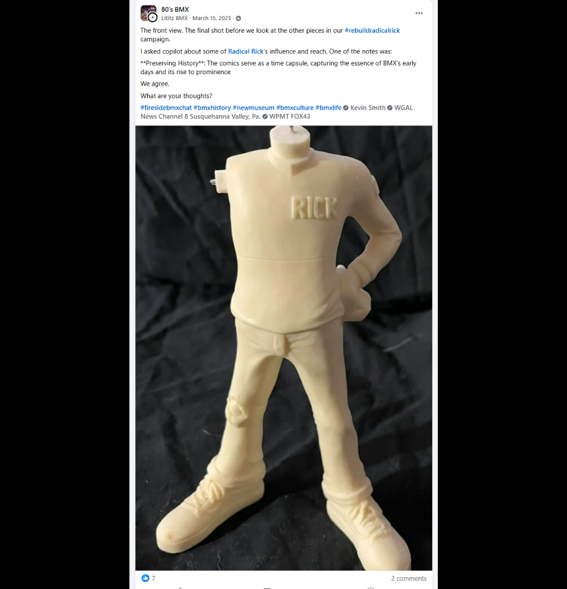
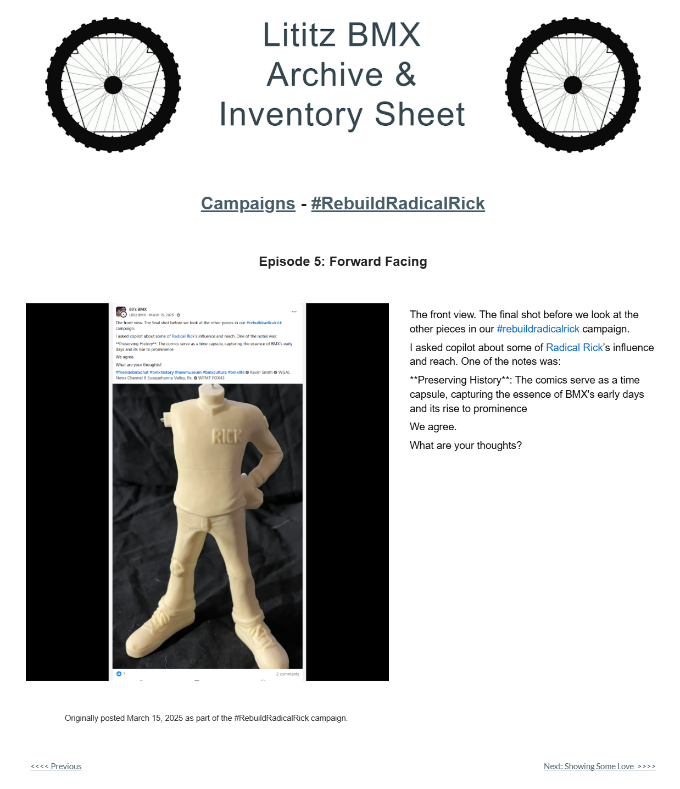

# Episode 5: Forward Facing

[← Episode 4](episode-04-the-other-side.md) | [Episode index](README.md) | [Episode 6 →](episode-06-showing-some-love.md)

## Episode Identification

**Campaign:** #RebuildRadicalRick  
**Official episode number:** 5  
**Official title:** Forward Facing  
**Publication date:** March 15, 2025  
**Chronological position:** 5  
**Record status:** Verified  
**Original platform:** Facebook  
**Produced by:** Lititz BMX  
**Archive display version:** 1.1

---

## Resource Structure

1. Preserved original social-media post image
2. Original published campaign text
3. Normalized episode summary and archival context
4. Full public archive-page capture
5. Source documentation and verification notes

---

## Public Archive Page

[View Episode 5 in the Lititz BMX Archive](https://sites.google.com/view/lititzbmxinventorylist/campaigns/rebuild-radical-rick-campaigns/episode-5-rebuild-radical-rick-campaigns)

**Original social-media post:** Not yet recovered as a stable direct-post permalink

---

## Episode Summary

Episode 5 presented the front view of the unassembled 40th Anniversary Radical Rick figure.

This was the final examination of the primary body component before the campaign began introducing and attaching the figure’s remaining pieces.

The post also connected the figure to the preservation value of the original Radical Rick comics, describing them as a record of BMX’s early development and growing cultural prominence.

---

## Published Social-Media Source Image

*The screenshot above is preserved as the visual source record for the published campaign post. The transcription below remains separate so the wording is searchable and accessible.*

---

## Original Published Text

> The front view. The final shot before we look at the other pieces in our #rebuildradicalrick campaign.
>
> I asked copilot about some of Radical Rick’s influence and reach. One of the notes was:
>
> **Preserving History**: The comics serve as a time capsule, capturing the essence of BMX's early days and its rise to prominence
>
> We agree.
>
> What are your thoughts?

The wording above is preserved from the verified campaign page and supplied source screenshot.

---

## Archival Context

Episode 5 completed the campaign’s opening documentation of the primary figure component.

Episodes 1 through 5 presented the body from multiple viewpoints before any additional parts were attached. Together, these episodes created a visual baseline for the reconstruction and introduced the figure as both a physical artifact and an entry point into BMX comic history.

The post’s preservation statement framed Radical Rick comics as historical records reflecting BMX’s early culture and increasing prominence. Because the statement was originally attributed to Copilot, that attribution is retained rather than silently presenting the wording as independently authored historical analysis.

---

## Related Subjects

- Radical Rick
- 40th Anniversary Radical Rick figure
- *BMX Plus!* Magazine
- BMX comic history
- BMX cultural history
- Historic preservation
- Serialized social-media storytelling
- Lititz BMX

---

## Related Media and Resources

- [View the complete public campaign](https://sites.google.com/view/lititzbmxinventorylist/campaigns/rebuild-radical-rick-campaigns)
- [Watch the Fireside BMX Chat featuring Damian X. Fulton](https://youtu.be/vtVr6GBJtlM?feature=shared)
- [Visit the Radical Rick website](https://radicalrickbmx.com/)

---

## Preserved Public Archive Page Capture

*This full-page capture preserves the public Lititz BMX presentation, including layout, image placement, campaign text, and navigation as supplied during the July 2026 archive build.*

---

## Source Documentation

**Campaign ledger:**  
[Rebuild Radical Rick Campaign Ledger](../ledger/Rebuild-Radical-Rick-Campaign-Ledger-v1.0.md)

**Published-post screenshot:** [Open preserved source image](../source-images/episode-05-facebook-post.png)  
**Public-page capture:** [Open preserved page capture](../page-captures/episode-05-page-capture.png)  
**Image-evidence status:** Verified and visibly presented in this record

**Source-text status:** Verified from the supplied screenshot, campaign-page transcription, and public archive page

---

## Verification Notes

- The official episode number, title, publication date, image, and published text have been verified.
- Episode 5 was published on March 15, 2025.
- Episode 5 is fifth in both official numbering and verified publication chronology.
- The public archive provides a separate Episode 5 page.
- A stable direct permalink to the original Facebook post has not yet been recovered.
- The preservation statement is retained with its original attribution to Copilot.
- The attributed statement has not been treated as an independently verified historical source.
- No missing wording has been invented or reconstructed.

---

## Preservation Note

This episode record separates original campaign language from later archival explanation.

The verified post wording is preserved in the **Original Published Text** section. The episode summary and archival context were written later to explain the record and do not replace or alter the original source.

---

[← Episode 4](episode-04-the-other-side.md) | [Episode index](README.md) | [Episode 6 →](episode-06-showing-some-love.md)
