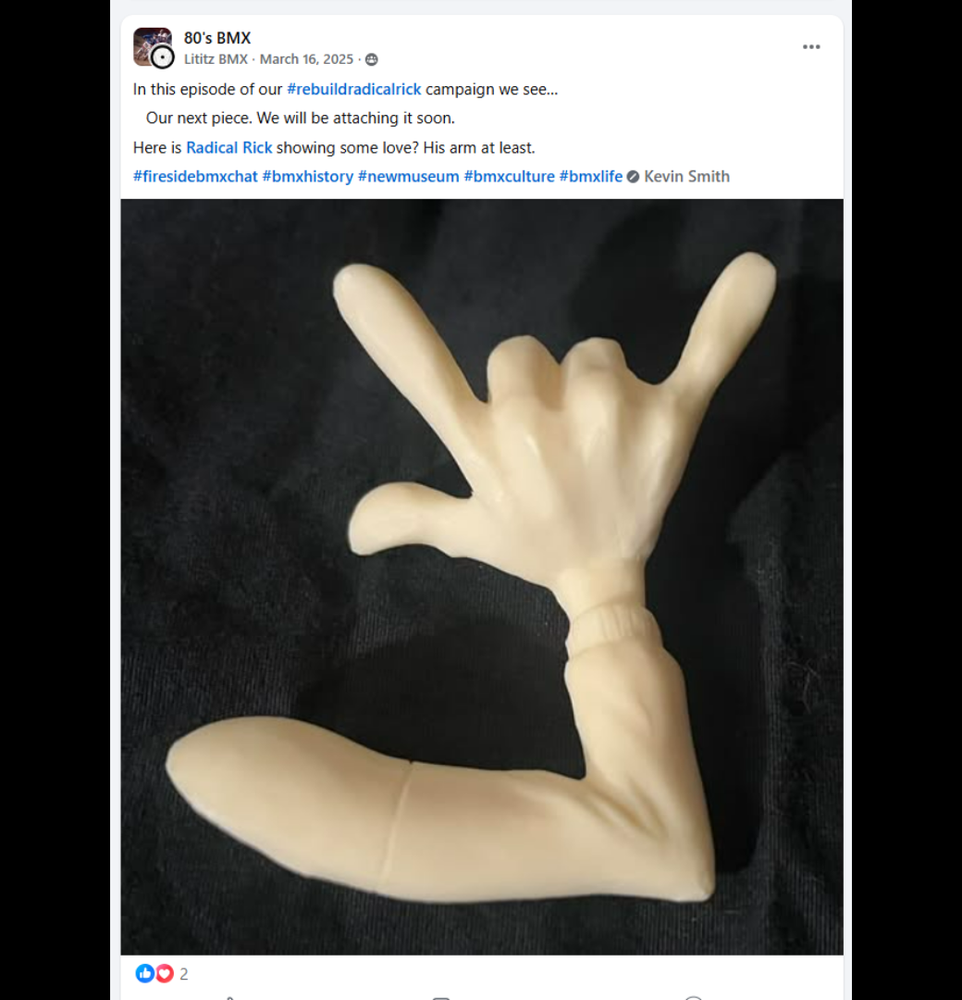
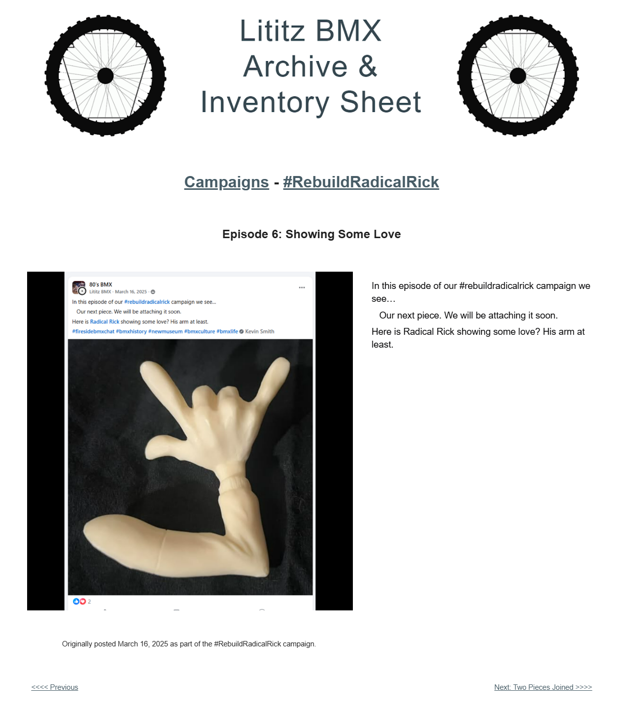

# Episode 6: Showing Some Love

[← Episode 5](episode-05-forward-facing.md) | [Episode index](README.md) | [Episode 7 →](episode-07-two-pieces-joined.md)

## Episode Identification

**Campaign:** #RebuildRadicalRick  
**Official episode number:** 6  
**Official title:** Showing Some Love  
**Publication date:** March 16, 2025  
**Chronological position:** 6  
**Record status:** Verified  
**Original platform:** Facebook  
**Produced by:** Lititz BMX  
**Archive display version:** 1.1

---

## Resource Structure

1. Preserved original social-media post image
2. Original published campaign text
3. Normalized episode summary and archival context
4. Full public archive-page capture
5. Source documentation and verification notes

---

## Public Archive Page

[View the complete #RebuildRadicalRick campaign](https://sites.google.com/view/lititzbmxinventorylist/campaigns/rebuild-radical-rick-campaigns)

**Separate Episode 6 archive-page URL:** Not yet recorded  
**Original social-media post:** Not yet recovered as a stable direct-post permalink

---

## Episode Summary

Episode 6 introduced the first separate component to be added to the figure: Radical Rick’s extended arm and hand.

The post used the hand gesture as a playful visual cue, describing the unfinished figure as “showing some love” while announcing that the component would soon be attached.

This episode marked the campaign’s transition from documenting the original body component to actively reconstructing the figure.

---

## Published Social-Media Source Image

*The screenshot above is preserved as the visual source record for the published campaign post. The transcription below remains separate so the wording is searchable and accessible.*

---

## Original Published Text

> In this episode of our #rebuildradicalrick campaign we see…
>
> Our next piece. We will be attaching it soon.
>
> Here is Radical Rick showing some love? His arm at least.

The wording above is preserved from the verified campaign page and supplied source screenshot.

---

## Archival Context

Episode 6 began the assembly phase of the campaign.

Episodes 1 through 5 documented the primary body component from several viewpoints. Episode 6 introduced a separate arm-and-hand component and prepared the audience for the first visible addition to the figure.

The episode’s title and wording used the hand gesture to add humor and personality to an otherwise straightforward reconstruction update. This continued the campaign’s practice of combining physical documentation with conversational storytelling.

---

## Related Subjects

- Radical Rick
- 40th Anniversary Radical Rick figure
- Figure reconstruction
- Collectible figure components
- Serialized social-media storytelling
- BMX preservation
- Lititz BMX

---

## Related Media and Resources

- [View the complete public campaign](https://sites.google.com/view/lititzbmxinventorylist/campaigns/rebuild-radical-rick-campaigns)
- [Watch the Fireside BMX Chat featuring Damian X. Fulton](https://youtu.be/vtVr6GBJtlM?feature=shared)
- [Visit the Radical Rick website](https://radicalrickbmx.com/)

---

## Preserved Public Archive Page Capture

*This full-page capture preserves the public Lititz BMX presentation, including layout, image placement, campaign text, and navigation as supplied during the July 2026 archive build.*

---

## Source Documentation

**Campaign ledger:**  
[Rebuild Radical Rick Campaign Ledger](../ledger/Rebuild-Radical-Rick-Campaign-Ledger-v1.0.md)

**Published-post screenshot:** [Open preserved source image](../source-images/episode-06-facebook-post.png)  
**Public-page capture:** [Open preserved page capture](../page-captures/episode-06-page-capture.png)  
**Image-evidence status:** Verified and visibly presented in this record

**Source-text status:** Verified from the supplied screenshot and campaign-page transcription

---

## Verification Notes

- The official episode number, title, publication date, image, and published text have been verified.
- Episode 6 was published on March 16, 2025.
- Episode 6 is sixth in both official numbering and verified publication chronology.
- The photographed component is an arm and hand intended for attachment to the figure.
- A stable direct permalink to the original Facebook post has not yet been recovered.
- The exact URL of the separate Episode 6 public archive page has not yet been recorded and has not been guessed.
- The phrase “showing some love” is preserved as original campaign language.
- No missing wording has been invented or reconstructed.

---

## Preservation Note

This episode record separates original campaign language from later archival explanation.

The verified post wording is preserved in the **Original Published Text** section. The episode summary and archival context were written later to explain the record and do not replace or alter the original source.

---

[← Episode 5](episode-05-forward-facing.md) | [Episode index](README.md) | [Episode 7 →](episode-07-two-pieces-joined.md)
