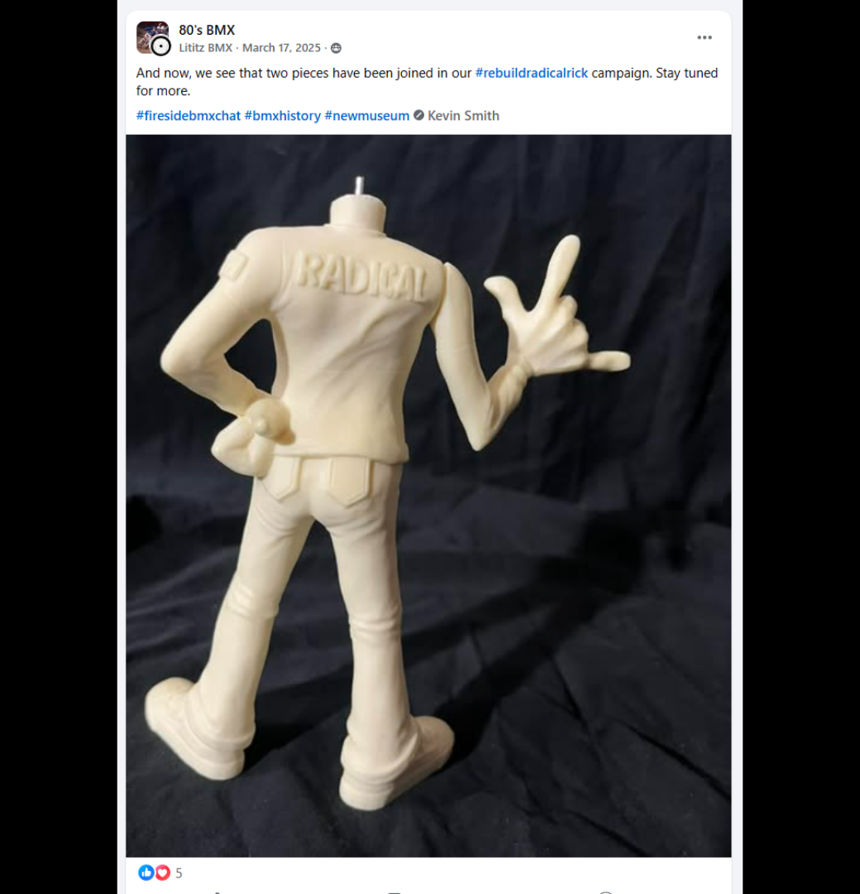
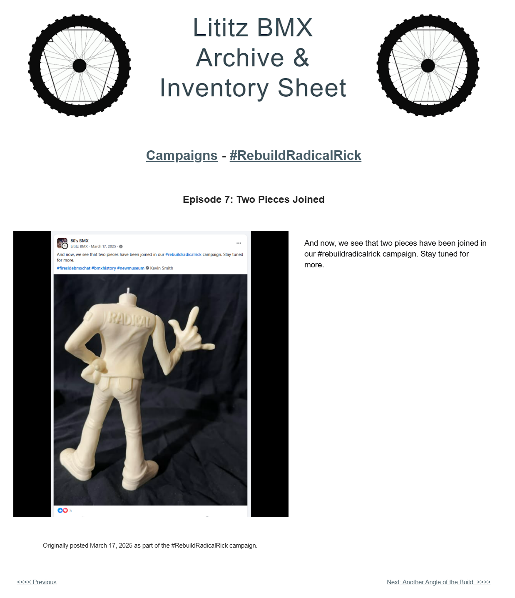

# Episode 7: Two Pieces Joined

[← Episode 6](episode-06-showing-some-love.md) | [Episode index](README.md) | [Episode 8 →](episode-08-another-angle-of-the-build.md)

## Episode Identification

**Campaign:** #RebuildRadicalRick  
**Official episode number:** 7  
**Official title:** Two Pieces Joined  
**Publication date:** March 17, 2025  
**Chronological position:** 7  
**Record status:** Verified  
**Original platform:** Facebook  
**Produced by:** Lititz BMX  
**Archive display version:** 1.1

---

## Resource Structure

1. Preserved original social-media post image
2. Original published campaign text
3. Normalized episode summary and archival context
4. Full public archive-page capture
5. Source documentation and verification notes

---

## Public Archive Page

[View Episode 7 in the Lititz BMX Archive](https://sites.google.com/view/lititzbmxinventorylist/campaigns/rebuild-radical-rick-campaigns/episode-7-rebuild-radical-rick-campaigns)

**Original social-media post:** Not yet recovered as a stable direct-post permalink

---

## Episode Summary

Episode 7 documented the first completed attachment in the reconstruction: the extended arm-and-hand component introduced in Episode 6 had been joined to the figure’s primary body.

The post presented the partially assembled figure from the rear and invited audiences to continue following the campaign as additional components were added.

This episode marked the first visible transformation from a collection of separate parts into a reconstructed Radical Rick figure.

---

## Published Social-Media Source Image

*The screenshot above is preserved as the visual source record for the published campaign post. The transcription below remains separate so the wording is searchable and accessible.*

---

## Original Published Text

> And now, we see that two pieces have been joined in our #rebuildradicalrick campaign. Stay tuned for more.

The wording above is preserved from the verified campaign page and supplied source screenshot.

---

## Archival Context

Episode 7 recorded the campaign’s first completed assembly step.

Episode 6 introduced the separate arm-and-hand component. Episode 7 showed that component attached to the primary figure body, allowing audiences to compare the individual part with its installed position.

Although brief, the post represented an important narrative transition. The campaign was no longer limited to examining unassembled components; the reconstruction itself was now visibly underway.

---

## Related Subjects

- Radical Rick
- 40th Anniversary Radical Rick figure
- Figure reconstruction
- Arm-and-hand component
- Collectible figure assembly
- Serialized social-media storytelling
- BMX preservation
- Lititz BMX

---

## Related Media and Resources

- [View the complete public campaign](https://sites.google.com/view/lititzbmxinventorylist/campaigns/rebuild-radical-rick-campaigns)
- [Watch the Fireside BMX Chat featuring Damian X. Fulton](https://youtu.be/vtVr6GBJtlM?feature=shared)
- [Visit the Radical Rick website](https://radicalrickbmx.com/)

---

## Preserved Public Archive Page Capture

*This full-page capture preserves the public Lititz BMX presentation, including layout, image placement, campaign text, and navigation as supplied during the July 2026 archive build.*

---

## Source Documentation

**Campaign ledger:**  
[Rebuild Radical Rick Campaign Ledger](../ledger/Rebuild-Radical-Rick-Campaign-Ledger-v1.0.md)

**Published-post screenshot:** [Open preserved source image](../source-images/episode-07-facebook-post.png)  
**Public-page capture:** [Open preserved page capture](../page-captures/episode-07-page-capture.png)  
**Image-evidence status:** Verified and visibly presented in this record

**Source-text status:** Verified from the supplied screenshot, campaign-page transcription, and public archive page

---

## Verification Notes

- The official episode number, title, publication date, image, and published text have been verified.
- Episode 7 was published on March 17, 2025.
- Episode 7 is seventh in both official numbering and verified publication chronology.
- The image shows the arm-and-hand component attached to the figure’s primary body.
- The public archive provides a separate Episode 7 page.
- A stable direct permalink to the original Facebook post has not yet been recovered.
- No missing wording has been invented or reconstructed.

---

## Preservation Note

This episode record separates original campaign language from later archival explanation.

The verified post wording is preserved in the **Original Published Text** section. The episode summary and archival context were written later to explain the record and do not replace or alter the original source.

---

[← Episode 6](episode-06-showing-some-love.md) | [Episode index](README.md) | [Episode 8 →](episode-08-another-angle-of-the-build.md)
