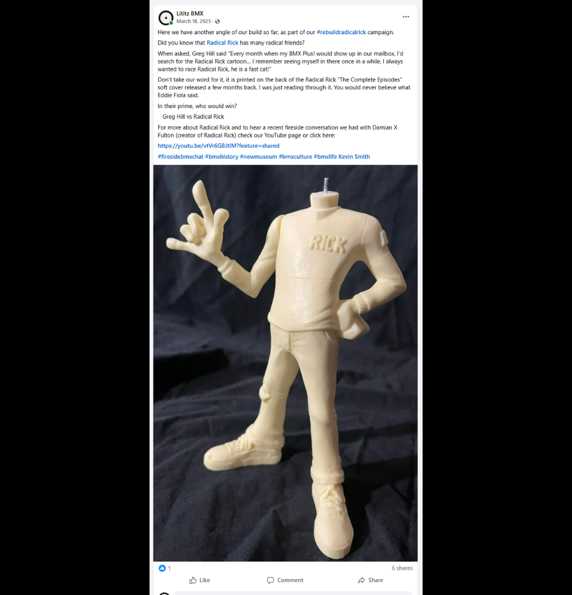
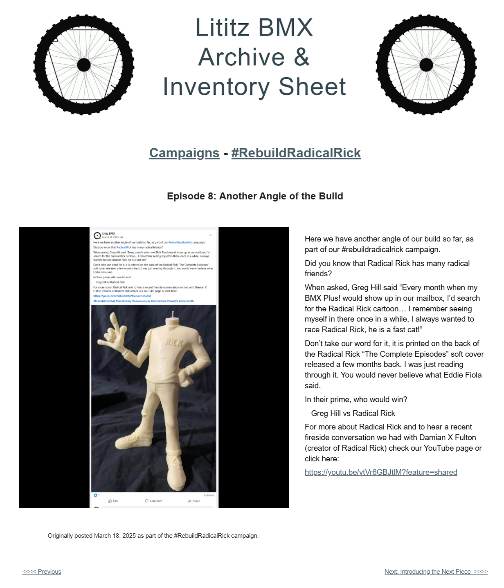

# Episode 8: Another Angle of the Build

[← Episode 7](episode-07-two-pieces-joined.md) | [Episode index](README.md) | [Episode 9 →](episode-09-introducing-the-next-piece.md)

## Episode Identification

**Campaign:** #RebuildRadicalRick  
**Official episode number:** 8  
**Official title:** Another Angle of the Build  
**Publication date:** March 18, 2025  
**Chronological position:** 8  
**Record status:** Verified  
**Original platform:** Facebook  
**Produced by:** Lititz BMX  
**Archive display version:** 1.1

---

## Resource Structure

1. Preserved original social-media post image
2. Original published campaign text
3. Normalized episode summary and archival context
4. Full public archive-page capture
5. Source documentation and verification notes

---

## Public Archive Page

[View the complete #RebuildRadicalRick campaign](https://sites.google.com/view/lititzbmxinventorylist/campaigns/rebuild-radical-rick-campaigns)

**Separate Episode 8 archive-page URL:** Not yet recorded  
**Original social-media post:** Not yet recovered as a stable direct-post permalink

---

## Episode Summary

Episode 8 presented another view of the partially reconstructed 40th Anniversary Radical Rick figure after the first arm-and-hand component had been attached.

The post expanded the reconstruction story through a published recollection from BMX racer Greg Hill, who remembered searching each new issue of *BMX Plus!* for the Radical Rick cartoon and wanting an opportunity to race the character.

The episode invited audiences to consider a fictional race between Greg Hill and Radical Rick while directing them to the Fireside BMX Chat with Radical Rick creator Damian X. Fulton.

---

## Published Social-Media Source Image

*The screenshot above is preserved as the visual source record for the published campaign post. The transcription below remains separate so the wording is searchable and accessible.*

---

## Original Published Text

> Here we have another angle of our build so far, as part of our #rebuildradicalrick campaign.
>
> Did you know that Radical Rick has many radical friends?
>
> When asked, Greg Hill said “Every month when my BMX Plus! would show up in our mailbox, I’d search for the Radical Rick cartoon… I remember seeing myself in there once in a while, I always wanted to race Radical Rick, he is a fast cat!”
>
> Don’t take our word for it, it is printed on the back of the Radical Rick “The Complete Episodes” soft cover released a few months back. I was just reading through it. You would never believe what Eddie Fiola said.
>
> In their prime, who would win?
>
> Greg Hill vs Radical Rick
>
> For more about Radical Rick and to hear a recent fireside conversation we had with Damian X Fulton (creator of Radical Rick) check our YouTube page or click here:
>
> https://youtu.be/vtVr6GBJtlM?feature=shared

The wording above is preserved from the verified campaign page and supplied source screenshot.

---

## Archival Context

Episode 8 continued documenting the figure after the campaign’s first completed assembly step.

The episode also demonstrated how the reconstruction was used to connect a physical collectible with firsthand BMX memories and published historical material. Greg Hill’s recollection linked Radical Rick with the experience of riders and readers who encountered the character through *BMX Plus!* Magazine.

The hypothetical Greg Hill-versus-Radical Rick race added a participatory question for the audience while preserving a connection between a real BMX racer and a fictional BMX character.

The reference to Eddie Fiola indicated that additional rider commentary appeared in *Radical Rick: The Complete Episodes*, but the episode did not reproduce that statement.

---

## Related Subjects

- Radical Rick
- Damian X. Fulton
- Greg Hill
- Eddie Fiola
- 40th Anniversary Radical Rick figure
- *BMX Plus!* Magazine
- *Radical Rick: The Complete Episodes*
- BMX comic history
- BMX rider memories
- Fireside BMX Chat
- Lititz BMX

---

## Related Media and Resources

- [View the complete public campaign](https://sites.google.com/view/lititzbmxinventorylist/campaigns/rebuild-radical-rick-campaigns)
- [Watch the Fireside BMX Chat featuring Damian X. Fulton](https://youtu.be/vtVr6GBJtlM?feature=shared)
- [Visit the Radical Rick website](https://radicalrickbmx.com/)

---

## Preserved Public Archive Page Capture

*This full-page capture preserves the public Lititz BMX presentation, including layout, image placement, campaign text, and navigation as supplied during the July 2026 archive build.*

---

## Source Documentation

**Campaign ledger:**  
[Rebuild Radical Rick Campaign Ledger](../ledger/Rebuild-Radical-Rick-Campaign-Ledger-v1.0.md)

**Published-post screenshot:** [Open preserved source image](../source-images/episode-08-facebook-post.png)  
**Public-page capture:** [Open preserved page capture](../page-captures/episode-08-page-capture.png)  
**Image-evidence status:** Verified and visibly presented in this record

**Source-text status:** Verified from the supplied screenshot and campaign-page transcription

---

## Verification Notes

- The official episode number, title, publication date, image, and published text have been verified.
- Episode 8 was published on March 18, 2025.
- Episode 8 is eighth in both official numbering and verified publication chronology.
- The image shows the partially assembled figure with the arm-and-hand component attached.
- Greg Hill’s statement is preserved as it appeared in the original campaign post.
- The campaign attributed the Greg Hill quotation to the back cover of *Radical Rick: The Complete Episodes*.
- Eddie Fiola was mentioned, but his referenced statement was not reproduced in the episode and has not been reconstructed.
- A stable direct permalink to the original Facebook post has not yet been recovered.
- The exact URL of the separate Episode 8 public archive page has not yet been recorded and has not been guessed.
- No missing wording has been invented or reconstructed.

---

## Preservation Note

This episode record separates original campaign language from later archival explanation.

The verified post wording is preserved in the **Original Published Text** section. The episode summary and archival context were written later to explain the record and do not replace or alter the original source.

---

[← Episode 7](episode-07-two-pieces-joined.md) | [Episode index](README.md) | [Episode 9 →](episode-09-introducing-the-next-piece.md)
