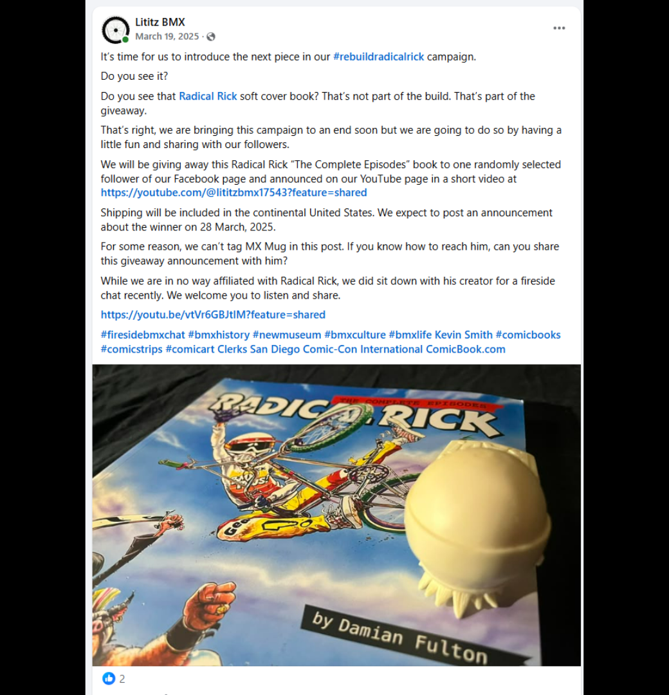
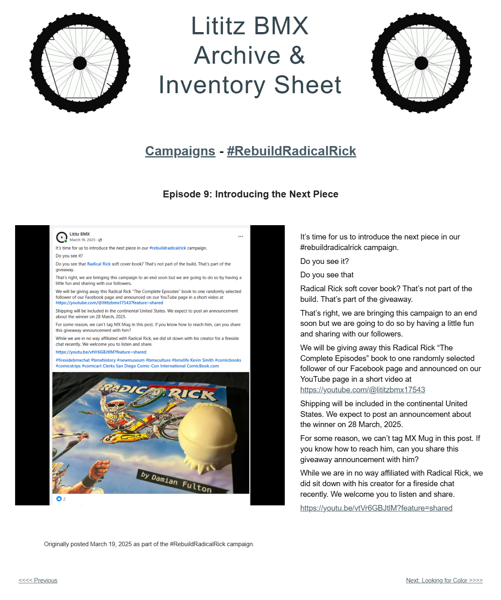

# Episode 9: Introducing the Next Piece

[← Episode 8](episode-08-another-angle-of-the-build.md) | [Episode index](README.md) | [Episode 10 →](episode-10-looking-for-color.md)

## Episode Identification

**Campaign:** #RebuildRadicalRick  
**Official episode number:** 9  
**Official title:** Introducing the Next Piece  
**Publication date:** March 19, 2025  
**Chronological position:** 9  
**Record status:** Verified  
**Original platform:** Facebook  
**Produced by:** Lititz BMX  
**Archive display version:** 1.1

---

## Resource Structure

1. Preserved original social-media post image
2. Original published campaign text
3. Normalized episode summary and archival context
4. Full public archive-page capture
5. Source documentation and verification notes

---

## Public Archive Page

[View Episode 9 in the Lititz BMX Archive](https://sites.google.com/view/lititzbmxinventorylist/campaigns/rebuild-radical-rick-campaigns/episode-9-rebuild-radical-rick-campaigns)

**Original social-media post:** Not yet recovered as a stable direct-post permalink

---

## Episode Summary

Episode 9 introduced the figure’s separate head component while announcing that the #RebuildRadicalRick campaign was approaching its conclusion.

The accompanying image positioned the head beside *Radical Rick: The Complete Episodes*, which became the focus of a community giveaway connected with the campaign.

The episode explained the giveaway terms, directed audiences to the Lititz BMX YouTube channel for the eventual winner announcement, and invited listeners to explore the Fireside BMX Chat with Radical Rick creator Damian X. Fulton.

---

## Published Social-Media Source Image

*The screenshot above is preserved as the visual source record for the published campaign post. The transcription below remains separate so the wording is searchable and accessible.*

---

## Original Published Text

> It’s time for us to introduce the next piece in our #rebuildradicalrick campaign.
>
> Do you see it?
>
> Do you see that
>
> Radical Rick soft cover book? That’s not part of the build. That’s part of the giveaway.
>
> That’s right, we are bringing this campaign to an end soon but we are going to do so by having a little fun and sharing with our followers.
>
> We will be giving away this Radical Rick “The Complete Episodes” book to one randomly selected follower of our Facebook page and announced on our YouTube page in a short video at https://youtube.com/@lititzbmx17543
>
> Shipping will be included in the continental United States. We expect to post an announcement about the winner on 28 March, 2025.
>
> For some reason, we can’t tag MX Mug in this post. If you know how to reach him, can you share this giveaway announcement with him?
>
> While we are in no way affiliated with Radical Rick, we did sit down with his creator for a fireside chat recently. We welcome you to listen and share.
>
> https://youtu.be/vtVr6GBJtlM?feature=shared

The wording above is preserved from the verified campaign page and supplied source screenshot.

---

## Archival Context

Episode 9 began the campaign’s transition from the active reconstruction phase toward its concluding episodes.

The separate head component represented the next major physical addition to the figure. At the same time, the post introduced a community giveaway involving a copy of *Radical Rick: The Complete Episodes*.

The giveaway extended participation beyond following the reconstruction itself. Audiences were encouraged to follow the Lititz BMX Facebook page, watch the YouTube channel for the winner announcement, and share the campaign with others.

The post also repeated the distinction between Lititz BMX and the official Radical Rick organization while directing audiences to a firsthand conversation with creator Damian X. Fulton.

---

## Related Subjects

- Radical Rick
- Damian X. Fulton
- 40th Anniversary Radical Rick figure
- Figure reconstruction
- Figure head component
- *Radical Rick: The Complete Episodes*
- Community giveaway
- MX Mug
- Fireside BMX Chat
- Lititz BMX YouTube
- BMX preservation
- Lititz BMX

---

## Related Media and Resources

- [View the complete public campaign](https://sites.google.com/view/lititzbmxinventorylist/campaigns/rebuild-radical-rick-campaigns)
- [Visit the Lititz BMX YouTube channel](https://youtube.com/@lititzbmx17543)
- [Watch the Fireside BMX Chat featuring Damian X. Fulton](https://youtu.be/vtVr6GBJtlM?feature=shared)
- [Visit the Radical Rick website](https://radicalrickbmx.com/)

---

## Preserved Public Archive Page Capture

*This full-page capture preserves the public Lititz BMX presentation, including layout, image placement, campaign text, and navigation as supplied during the July 2026 archive build.*

---

## Source Documentation

**Campaign ledger:**  
[Rebuild Radical Rick Campaign Ledger](../ledger/Rebuild-Radical-Rick-Campaign-Ledger-v1.0.md)

**Published-post screenshot:** [Open preserved source image](../source-images/episode-09-facebook-post.png)  
**Public-page capture:** [Open preserved page capture](../page-captures/episode-09-page-capture.png)  
**Image-evidence status:** Verified and visibly presented in this record

**Source-text status:** Verified from the supplied screenshot, campaign-page transcription, and public archive page

---

## Verification Notes

- The official episode number, title, publication date, image, and published text have been verified.
- Episode 9 was published on March 19, 2025.
- Episode 9 is ninth in both official numbering and verified publication chronology.
- The image shows the separate figure head positioned beside *Radical Rick: The Complete Episodes*.
- The giveaway details are preserved as a historical campaign record and do not describe a current offer.
- The original post stated that shipping would be included within the continental United States.
- The original post anticipated announcing the winner on March 28, 2025.
- The reference to MX Mug is preserved without adding information that was not supplied by the original post.
- The campaign’s statement that Lititz BMX was not affiliated with Radical Rick is preserved as originally published.
- A stable direct permalink to the original Facebook post has not yet been recovered.
- No missing wording has been invented or reconstructed.

---

## Preservation Note

This episode record separates original campaign language from later archival explanation.

The verified post wording is preserved in the **Original Published Text** section. The episode summary and archival context were written later to explain the record and do not replace or alter the original source.

---

[← Episode 8](episode-08-another-angle-of-the-build.md) | [Episode index](README.md) | [Episode 10 →](episode-10-looking-for-color.md)
