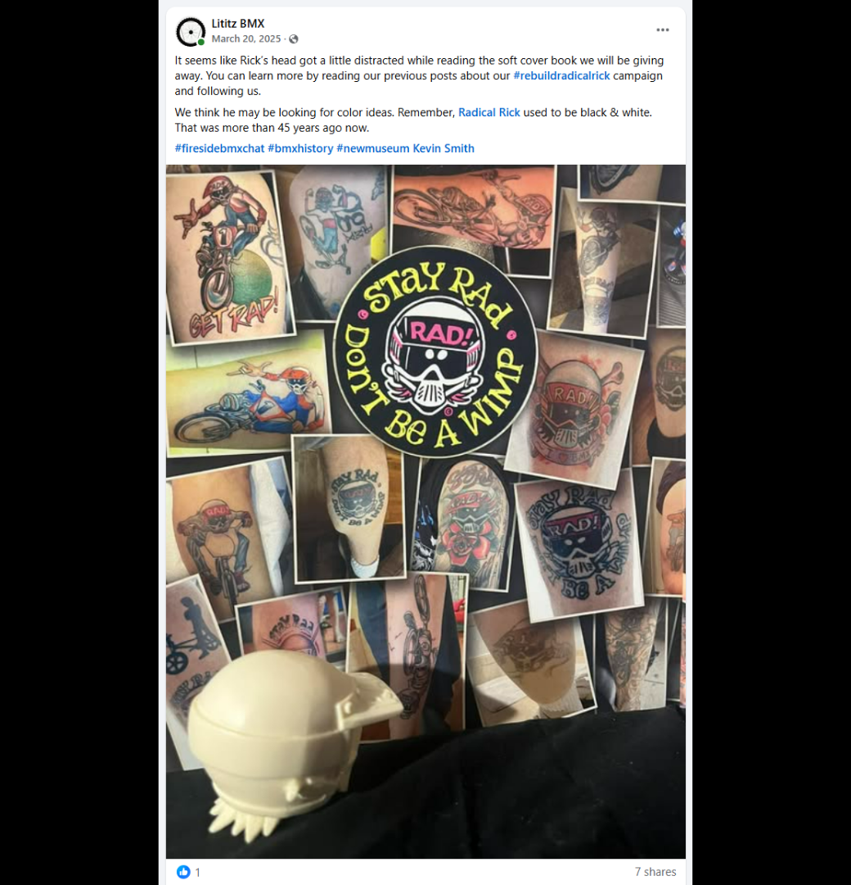
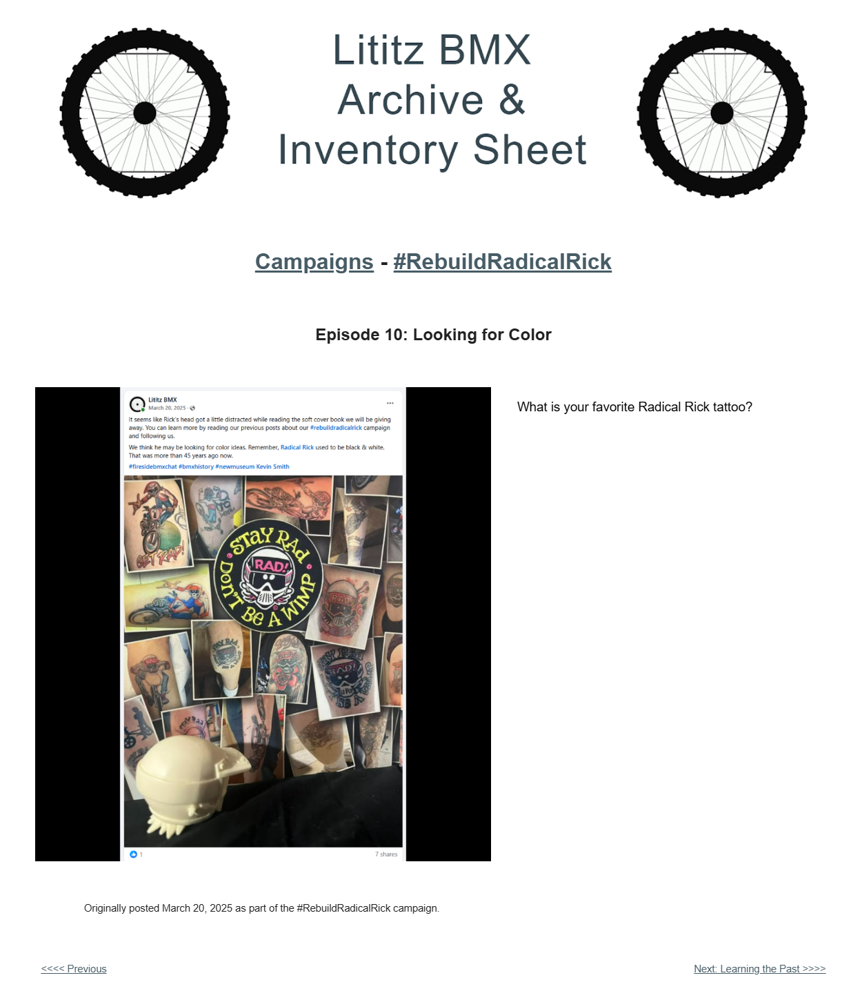

# Episode 10: Looking for Color

[← Episode 9](episode-09-introducing-the-next-piece.md) | [Episode index](README.md) | [Episode 11 →](episode-11-learning-the-past.md)

## Episode Identification

**Campaign:** #RebuildRadicalRick  
**Official episode number:** 10  
**Official title:** Looking for Color  
**Publication date:** March 20, 2025  
**Chronological position:** 10  
**Record status:** Verified  
**Original platform:** Facebook  
**Produced by:** Lititz BMX  
**Archive display version:** 1.1

---

## Resource Structure

1. Preserved original social-media post image
2. Original published campaign text
3. Normalized episode summary and archival context
4. Full public archive-page capture
5. Source documentation and verification notes

---

## Public Archive Page

[View Episode 10 in the Lititz BMX Archive](https://sites.google.com/view/lititzbmxinventorylist/campaigns/rebuild-radical-rick-campaigns/episode-10-rebuild-radical-rick-campaigns)

**Original social-media post:** Not yet recovered as a stable direct-post permalink

---

## Episode Summary

Episode 10 presented the separate Radical Rick head component in front of a collage of Radical Rick-inspired tattoos.

The post playfully suggested that the figure’s head had become distracted while reading the softcover book associated with the campaign giveaway and might be searching for color ideas.

The episode connected the reconstruction with fan artwork, tattoos, Radical Rick’s early black-and-white presentation, and direct community participation through the question, “What is your favorite Radical Rick tattoo?”

---

## Published Social-Media Source Image

*The screenshot above is preserved as the visual source record for the published campaign post. The transcription below remains separate so the wording is searchable and accessible.*

---

## Original Published Text

> It seems like Rick’s head got a little distracted while reading the soft cover book we will be giving away. You can learn more by reading our previous posts about our #rebuildradicalrick campaign and following us.
>
> We think he may be looking for color ideas. Remember, Radical Rick used to be black & white. That was more than 45 years ago now.

The wording above is preserved from the supplied source screenshot.

The accompanying public archive page asks:

> What is your favorite Radical Rick tattoo?

---

## Archival Context

Episode 10 shifted the campaign temporarily away from the physical assembly process and toward the visual culture surrounding Radical Rick.

The photograph placed the unassembled head component in front of a collage of Radical Rick tattoos and related imagery. This connected the collectible figure with the ways fans have continued interpreting and preserving the character through personal artwork.

The post also used the figure’s historical black-and-white presentation as a bridge between the character’s early publication history and later color interpretations.

The question asking viewers to identify their favorite tattoo encouraged participation and demonstrated how the campaign incorporated community response into the larger preservation story.

---

## Related Subjects

- Radical Rick
- Damian X. Fulton
- 40th Anniversary Radical Rick figure
- Radical Rick head component
- Radical Rick tattoos
- Fan artwork
- Black-and-white comic art
- *Radical Rick: The Complete Episodes*
- Campaign giveaway
- BMX comic history
- Community participation
- Lititz BMX

---

## Related Media and Resources

- [View the complete public campaign](https://sites.google.com/view/lititzbmxinventorylist/campaigns/rebuild-radical-rick-campaigns)
- [Watch the Fireside BMX Chat featuring Damian X. Fulton](https://youtu.be/vtVr6GBJtlM?feature=shared)
- [Visit the Radical Rick website](https://radicalrickbmx.com/)

---

## Preserved Public Archive Page Capture

*This full-page capture preserves the public Lititz BMX presentation, including layout, image placement, campaign text, and navigation as supplied during the July 2026 archive build.*

---

## Source Documentation

**Campaign ledger:**  
[Rebuild Radical Rick Campaign Ledger](../ledger/Rebuild-Radical-Rick-Campaign-Ledger-v1.0.md)

**Published-post screenshot:** [Open preserved source image](../source-images/episode-10-facebook-post.png)  
**Public-page capture:** [Open preserved page capture](../page-captures/episode-10-page-capture.png)  
**Image-evidence status:** Verified and visibly presented in this record

**Source-text status:** Verified from the supplied screenshot, campaign-page transcription, and public archive page

---

## Verification Notes

- The official episode number, title, publication date, image, and available published text have been verified.
- Episode 10 was published on March 20, 2025.
- Episode 10 is tenth in both official numbering and verified publication chronology.
- The image shows the separate Radical Rick head component positioned in front of a collage of Radical Rick-inspired tattoos and artwork.
- The public archive page contains the question, “What is your favorite Radical Rick tattoo?”
- The supplied Facebook screenshot preserves additional original post text that is not reproduced on the current public archive page.
- The statement that Radical Rick was originally presented in black and white is preserved as original campaign language.
- A stable direct permalink to the original Facebook post has not yet been recovered.
- No missing wording has been invented or reconstructed.

---

## Preservation Note

This episode record separates original campaign language from later archival explanation.

The verified Facebook wording is preserved in the **Original Published Text** section. The shorter question preserved on the public archive page is documented separately rather than being treated as the complete original post.

The episode summary and archival context were written later to explain the record and do not replace or alter either surviving source.

---

[← Episode 9](episode-09-introducing-the-next-piece.md) | [Episode index](README.md) | [Episode 11 →](episode-11-learning-the-past.md)
