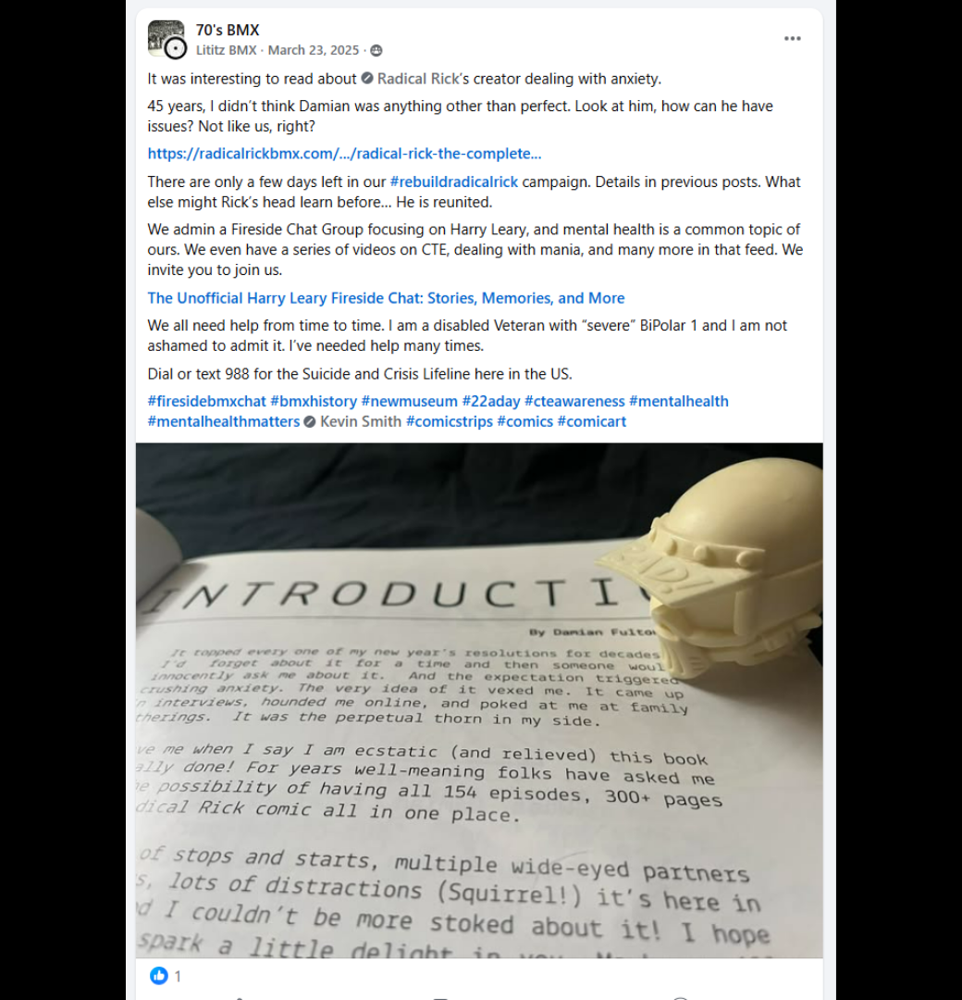
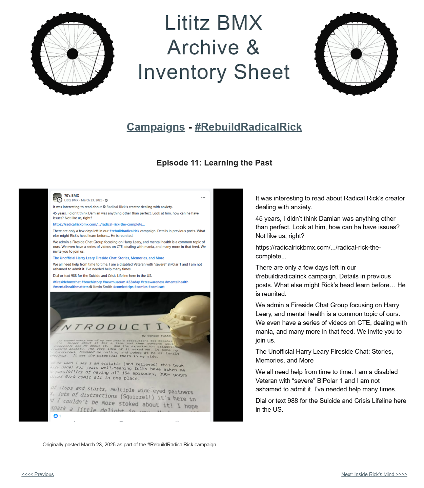

# Episode 11: Learning the Past

[← Episode 10](episode-10-looking-for-color.md) | [Episode index](README.md) | [Episode 12 →](episode-12-inside-ricks-mind.md)

## Episode Identification

**Campaign:** #RebuildRadicalRick  
**Official episode number:** 11  
**Official title:** Learning the Past  
**Publication date:** March 23, 2025  
**Chronological position:** 13  
**Record status:** Verified  
**Original platform:** Facebook  
**Produced by:** Lititz BMX  
**Archive display version:** 1.1

---

## Resource Structure

1. Preserved original social-media post image
2. Original published campaign text
3. Normalized episode summary and archival context
4. Full public archive-page capture
5. Source documentation and verification notes

---

## Public Archive Page

[View Episode 11 in the Lititz BMX Archive](https://sites.google.com/view/lititzbmxinventorylist/campaigns/rebuild-radical-rick-campaigns/episode-11-rebuild-radical-rick-campaigns)

**Original social-media post:** Not yet recovered as a stable direct-post permalink

---

## Episode Summary

Episode 11 presented the separate Radical Rick head component positioned over the introduction to *Radical Rick: The Complete Episodes*.

The post connected the campaign with Radical Rick creator Damian Fulton’s discussion of anxiety and expanded the episode into a broader message about mental health, personal openness, and the importance of seeking help when needed.

The episode also documented Lititz BMX founder Kyle A. Huffman’s public discussion of living with Bipolar I disorder and included the 988 Suicide and Crisis Lifeline information as originally published.

---

## Published Social-Media Source Image

*The screenshot above is preserved as the visual source record for the published campaign post. The transcription below remains separate so the wording is searchable and accessible.*

---

## Original Published Text

> It was interesting to read about Radical Rick’s creator dealing with anxiety.
>
> 45 years, I didn’t think Damian was anything other than perfect. Look at him, how can he have issues? Not like us, right?
>
> https://radicalrickbmx.com/.../radical-rick-the-complete...
>
> There are only a few days left in our #rebuildradicalrick campaign. Details in previous posts. What else might Rick’s head learn before… He is reunited.
>
> We admin a Fireside Chat Group focusing on Harry Leary, and mental health is a common topic of ours. We even have a series of videos on CTE, dealing with mania, and many more in that feed. We invite you to join us.
>
> The Unofficial Harry Leary Fireside Chat: Stories, Memories, and More
>
> We all need help from time to time. I am a disabled Veteran with “severe” BiPolar 1 and I am not ashamed to admit it. I’ve needed help many times.
>
> Dial or text 988 for the Suicide and Crisis Lifeline here in the US.

The wording above is preserved from the verified campaign page and supplied source screenshot.

---

## Archival Context

Episode 11 used the ongoing figure reconstruction as an entry point into a personal and human part of the Radical Rick story.

The photograph showed Rick’s head positioned as though it were reading the introduction to *Radical Rick: The Complete Episodes*. That introduction included Damian Fulton’s discussion of anxiety, which prompted the campaign post to reflect on the difference between public perception and private struggle.

The episode then connected Damian’s experience with conversations already taking place in the Harry Leary Fireside Chat community, including mental health, mania, and the long-term effects of head injuries.

Kyle A. Huffman’s personal disclosure was part of the original campaign language and is preserved as published. The episode concluded with crisis-resource information rather than treating mental health solely as a historical or biographical subject.

---

## Related Subjects

- Radical Rick
- Damian X. Fulton
- Kyle A. Huffman
- 40th Anniversary Radical Rick figure
- Radical Rick head component
- *Radical Rick: The Complete Episodes*
- Anxiety
- Bipolar I disorder
- Mental health awareness
- Veterans
- CTE discussions
- Harry Leary
- The Unofficial Harry Leary Fireside Chat
- BMX community support
- Lititz BMX

---

## Related Media and Resources

- [View the complete public campaign](https://sites.google.com/view/lititzbmxinventorylist/campaigns/rebuild-radical-rick-campaigns)
- [Watch the Fireside BMX Chat featuring Damian X. Fulton](https://youtu.be/vtVr6GBJtlM?feature=shared)
- [Visit the Radical Rick website](https://radicalrickbmx.com/)

---

## Preserved Public Archive Page Capture

*This full-page capture preserves the public Lititz BMX presentation, including layout, image placement, campaign text, and navigation as supplied during the July 2026 archive build.*

---

## Source Documentation

**Campaign ledger:**  
[Rebuild Radical Rick Campaign Ledger](../ledger/Rebuild-Radical-Rick-Campaign-Ledger-v1.0.md)

**Published-post screenshot:** [Open preserved source image](../source-images/episode-11-facebook-post.png)  
**Public-page capture:** [Open preserved page capture](../page-captures/episode-11-page-capture.png)  
**Image-evidence status:** Verified and visibly presented in this record

**Source-text status:** Verified from the supplied screenshot, campaign-page transcription, and public archive page

---

## Verification Notes

- The official episode number, title, publication date, image, and published text have been verified.
- Episode 11 was published on March 23, 2025.
- Episode 11 is the eleventh officially numbered episode but thirteenth in verified publication chronology.
- Episodes 12 and 13 were published before Episode 11.
- The image shows the separate Radical Rick head component positioned over the introduction to *Radical Rick: The Complete Episodes*.
- The discussion of Damian Fulton’s anxiety is preserved as original campaign language based on the photographed book introduction.
- Kyle A. Huffman’s personal mental-health disclosure is preserved exactly as part of the original published record.
- The 988 information is preserved as it appeared in the March 23, 2025 post.
- The shortened Radical Rick web address is preserved as displayed and has not been expanded through assumption.
- A stable direct permalink to the original Facebook post has not yet been recovered.
- No missing wording has been invented or reconstructed.

---

## Preservation Note

This episode record separates original campaign language from later archival explanation.

The verified post wording, including the personal mental-health disclosure and crisis-resource information, is preserved in the **Original Published Text** section.

The episode summary and archival context were written later to explain the record and do not replace, reinterpret, or alter the original source.

---

[← Episode 10](episode-10-looking-for-color.md) | [Episode index](README.md) | [Episode 12 →](episode-12-inside-ricks-mind.md)
