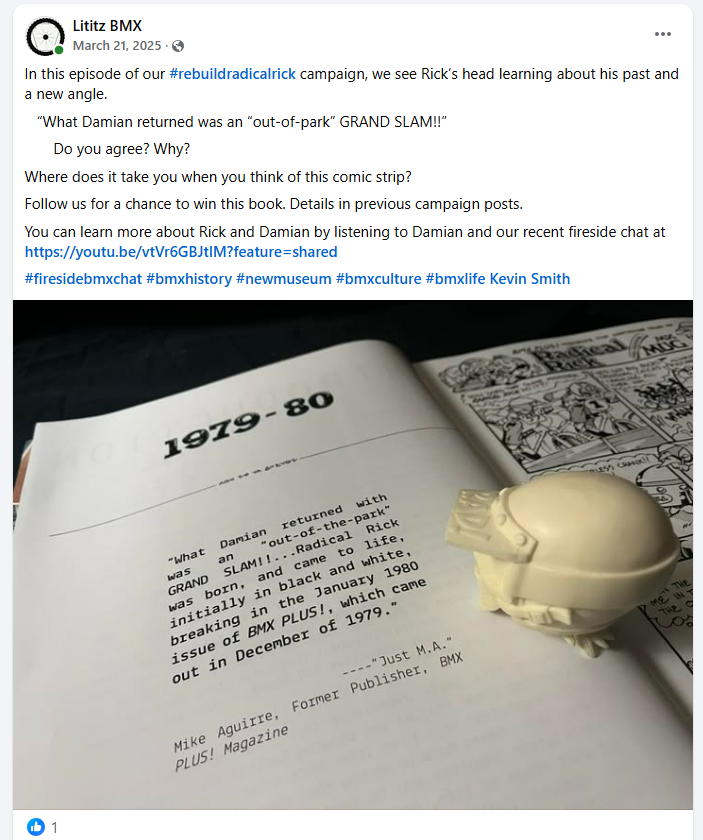
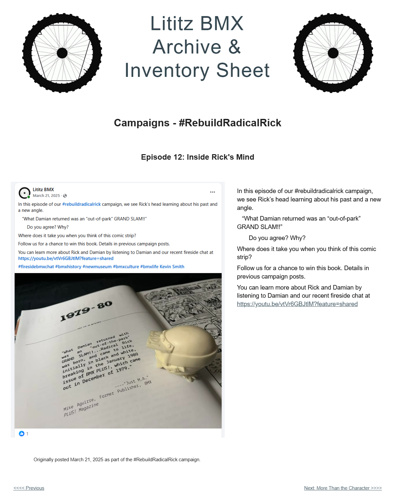

# Episode 12: Inside Rick's Mind

[← Episode 11](episode-11-learning-the-past.md) | [Episode index](README.md) | [Episode 13 →](episode-13-more-than-the-character.md)

## Episode Identification

**Campaign:** #RebuildRadicalRick  
**Official episode number:** 12  
**Official title:** Inside Rick's Mind  
**Publication date:** March 21, 2025  
**Chronological position:** 11  
**Record status:** Verified  
**Original platform:** Facebook  
**Produced by:** Lititz BMX  
**Archive display version:** 1.1

---

## Resource Structure

1. Preserved original social-media post image
2. Original published campaign text
3. Normalized episode summary and archival context
4. Full public archive-page capture
5. Source documentation and verification notes

---

## Public Archive Page

[View Episode 12 in the Lititz BMX Archive](https://sites.google.com/view/lititzbmxinventorylist/campaigns/rebuild-radical-rick-campaigns/episode-12-rebuild-radical-rick-campaigns)

**Original social-media post:** Not yet recovered as a stable direct-post permalink

---

## Episode Summary

Episode 12 presented the separate Radical Rick head component positioned over the opening historical section of *Radical Rick: The Complete Episodes*.

The photographed page described the return of Radical Rick as an “out-of-park” grand slam and discussed the character’s introduction through *BMX Plus!* Magazine.

The post encouraged audiences to reflect on their memories of the comic strip, promoted the campaign’s book giveaway, and directed viewers to the Fireside BMX Chat featuring Radical Rick creator Damian X. Fulton.

---

## Published Social-Media Source Image

*The screenshot above is preserved as the visual source record for the published campaign post. The transcription below remains separate so the wording is searchable and accessible.*

---

## Original Published Text

> In this episode of our #rebuildradicalrick campaign, we see Rick’s head learning about his past and a new angle.
>
> “What Damian returned was an “out-of-park” GRAND SLAM!!”
>
> Do you agree? Why?
>
> Where does it take you when you think of this comic strip?
>
> Follow us for a chance to win this book. Details in previous campaign posts.
>
> You can learn more about Rick and Damian by listening to Damian and our recent fireside chat at https://youtu.be/vtVr6GBJtlM?feature=shared

The wording above is preserved from the verified campaign page and supplied source screenshot.

---

## Archival Context

Episode 12 connected the ongoing figure reconstruction with the documented publication history of Radical Rick.

The image positioned Rick’s unassembled head as though it were reading a historical account in *Radical Rick: The Complete Episodes*. The displayed passage described Damian Fulton’s work as an “out-of-the-park” grand slam and discussed Radical Rick’s early appearance in *BMX Plus!* Magazine.

The photographed page attributes the recollection to Mike Aguirre, identified there as a former publisher of *BMX Plus!* Magazine.

By asking where the comic strip takes the reader, the episode invited audiences to contribute their own memories and emotional connections to Radical Rick. The physical artifact therefore served as a bridge between published history, creator testimony, personal nostalgia, and community participation.

The post also continued promoting the campaign giveaway and the related Fireside BMX Chat with Damian X. Fulton.

---

## Related Subjects

- Radical Rick
- Damian X. Fulton
- Mike Aguirre
- 40th Anniversary Radical Rick figure
- Radical Rick head component
- *Radical Rick: The Complete Episodes*
- *BMX Plus!* Magazine
- Radical Rick publication history
- BMX comic history
- BMX reader memories
- Campaign giveaway
- Fireside BMX Chat
- Lititz BMX

---

## Related Media and Resources

- [View the complete public campaign](https://sites.google.com/view/lititzbmxinventorylist/campaigns/rebuild-radical-rick-campaigns)
- [Watch the Fireside BMX Chat featuring Damian X. Fulton](https://youtu.be/vtVr6GBJtlM?feature=shared)
- [Visit the Radical Rick website](https://radicalrickbmx.com/)

---

## Preserved Public Archive Page Capture

*This full-page capture preserves the public Lititz BMX presentation, including layout, image placement, campaign text, and navigation as supplied during the July 2026 archive build.*

---

## Source Documentation

**Campaign ledger:**  
[Rebuild Radical Rick Campaign Ledger](../ledger/Rebuild-Radical-Rick-Campaign-Ledger-v1.0.md)

**Published-post screenshot:** [Open preserved source image](../source-images/episode-12-facebook-post.png)  
**Public-page capture:** [Open preserved page capture](../page-captures/episode-12-page-capture.png)  
**Image-evidence status:** Verified and visibly presented in this record

**Source-text status:** Verified from the supplied screenshot, campaign-page transcription, and public archive page

---

## Verification Notes

- The official episode number, title, publication date, image, and published text have been verified.
- Episode 12 was published on March 21, 2025.
- Episode 12 is the twelfth officially numbered episode but eleventh in verified publication chronology.
- Episode 12 was published before Episodes 11 and 13 in the official numbering sequence.
- The image shows the separate Radical Rick head component positioned over a historical passage in *Radical Rick: The Complete Episodes*.
- The photographed passage attributes the quoted recollection to Mike Aguirre, identified as a former publisher of *BMX Plus!* Magazine.
- The original campaign wording says “out-of-park,” while the photographed source appears to use “out-of-the-park.” The campaign wording is preserved exactly rather than silently corrected.
- The statement concerning Radical Rick’s early publication history is documented through the photographed source but has not been independently rewritten or expanded.
- A stable direct permalink to the original Facebook post has not yet been recovered.
- No missing wording has been invented or reconstructed.

---

## Preservation Note

This episode record separates original campaign language from later archival explanation.

The verified post wording is preserved in the **Original Published Text** section, including its original punctuation and phrasing.

The episode summary, archival context, and source-attribution notes were written later to explain the surviving record and do not replace or alter the original source.

---

[← Episode 11](episode-11-learning-the-past.md) | [Episode index](README.md) | [Episode 13 →](episode-13-more-than-the-character.md)
