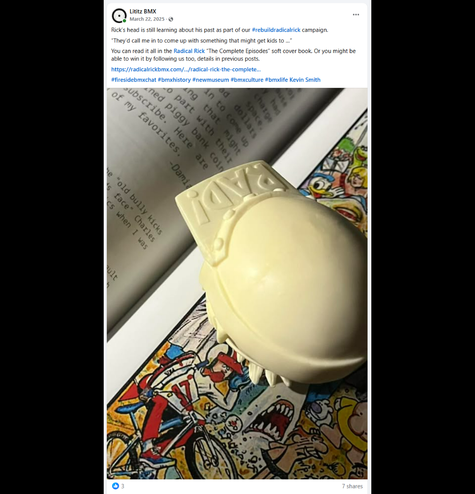
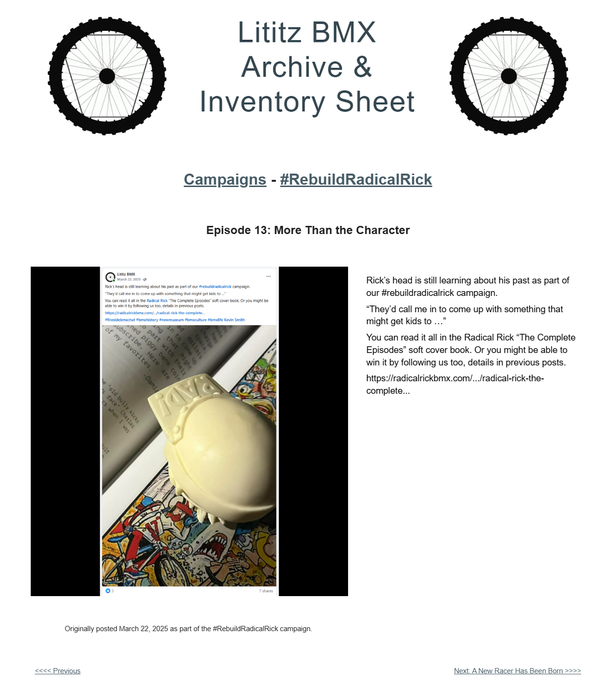

# Episode 13: More Than the Character

[← Episode 12](episode-12-inside-ricks-mind.md) | [Episode index](README.md) | [Episode 14 →](episode-14-a-new-racer-has-been-born.md)

## Episode Identification

**Campaign:** #RebuildRadicalRick  
**Official episode number:** 13  
**Official title:** More Than the Character  
**Publication date:** March 22, 2025  
**Chronological position:** 12  
**Record status:** Verified  
**Original platform:** Facebook  
**Produced by:** Lititz BMX  
**Archive display version:** 1.1

---

## Resource Structure

1. Preserved original social-media post image
2. Original published campaign text
3. Normalized episode summary and archival context
4. Full public archive-page capture
5. Source documentation and verification notes

---

## Public Archive Page

[View Episode 13 in the Lititz BMX Archive](https://sites.google.com/view/lititzbmxinventorylist/campaigns/rebuild-radical-rick-campaigns/episode-13-rebuild-radical-rick-campaigns)

**Original social-media post:** Not yet recovered as a stable direct-post permalink

---

## Episode Summary

Episode 13 presented the separate Radical Rick head component positioned over pages from *Radical Rick: The Complete Episodes*.

The post highlighted a brief passage describing part of Damian Fulton’s creative role in developing material intended to engage young BMX readers.

Rather than focusing only on the fictional character, the episode directed attention toward the creator, the work behind the comic, and the decisions involved in connecting Radical Rick with its original audience.

The post also continued promoting the campaign’s book giveaway.

---

## Published Social-Media Source Image

*The screenshot above is preserved as the visual source record for the published campaign post. The transcription below remains separate so the wording is searchable and accessible.*

---

## Original Published Text

> Rick’s head is still learning about his past as part of our #rebuildradicalrick campaign.
>
> “They’d call me in to come up with something that might get kids to …”
>
> You can read it all in the Radical Rick “The Complete Episodes” soft cover book. Or you might be able to win it by following us too, details in previous posts.
>
> https://radicalrickbmx.com/.../radical-rick-the-complete...

The wording above is preserved from the verified campaign page and supplied source screenshot.

---

## Archival Context

Episode 13 continued the sequence in which the unassembled head component appeared to study Radical Rick’s published history.

The episode shifted attention beyond the character itself and toward the creative work behind the comic. The excerpt suggested that Damian Fulton was asked to develop material that could attract and engage young readers.

Because the surviving campaign text includes only a partial quotation, the missing continuation has not been reconstructed or paraphrased as though it were known.

The image also connected the sculpted figure component with printed Radical Rick artwork, reinforcing the campaign’s larger relationship between a physical collectible, comic history, creator testimony, and published archival material.

The campaign giveaway remained part of the episode’s narrative, encouraging followers to continue participating as the reconstruction approached completion.

---

## Related Subjects

- Radical Rick
- Damian X. Fulton
- 40th Anniversary Radical Rick figure
- Radical Rick head component
- *Radical Rick: The Complete Episodes*
- Comic creation
- BMX comic history
- BMX youth culture
- Creator history
- Campaign giveaway
- Archival storytelling
- Lititz BMX

---

## Related Media and Resources

- [View the complete public campaign](https://sites.google.com/view/lititzbmxinventorylist/campaigns/rebuild-radical-rick-campaigns)
- [Watch the Fireside BMX Chat featuring Damian X. Fulton](https://youtu.be/vtVr6GBJtlM?feature=shared)
- [Visit the Radical Rick website](https://radicalrickbmx.com/)

---

## Preserved Public Archive Page Capture

*This full-page capture preserves the public Lititz BMX presentation, including layout, image placement, campaign text, and navigation as supplied during the July 2026 archive build.*

---

## Source Documentation

**Campaign ledger:**  
[Rebuild Radical Rick Campaign Ledger](../ledger/Rebuild-Radical-Rick-Campaign-Ledger-v1.0.md)

**Published-post screenshot:** [Open preserved source image](../source-images/episode-13-facebook-post.png)  
**Public-page capture:** [Open preserved page capture](../page-captures/episode-13-page-capture.png)  
**Image-evidence status:** Verified and visibly presented in this record

**Source-text status:** Verified from the supplied screenshot, campaign-page transcription, and public archive page

---

## Verification Notes

- The official episode number, title, publication date, image, and published text have been verified.
- Episode 13 was published on March 22, 2025.
- Episode 13 is the thirteenth officially numbered episode but twelfth in verified publication chronology.
- Episode 13 was published before Episode 11.
- The image shows the separate Radical Rick head component positioned over printed Radical Rick material.
- The quotation beginning “They’d call me in” is incomplete in the surviving campaign post and is preserved only to the extent shown.
- The missing continuation of the quotation has not been guessed, completed, or reconstructed.
- The shortened Radical Rick web address is preserved as displayed and has not been expanded through assumption.
- A stable direct permalink to the original Facebook post has not yet been recovered.
- No missing wording has been invented or reconstructed.

---

## Preservation Note

This episode record separates original campaign language from later archival explanation.

The verified post wording is preserved in the **Original Published Text** section, including the incomplete quotation and shortened web address.

The episode summary and archival context were written later to explain the surviving record and do not replace or alter the original source.

---

[← Episode 12](episode-12-inside-ricks-mind.md) | [Episode index](README.md) | [Episode 14 →](episode-14-a-new-racer-has-been-born.md)
